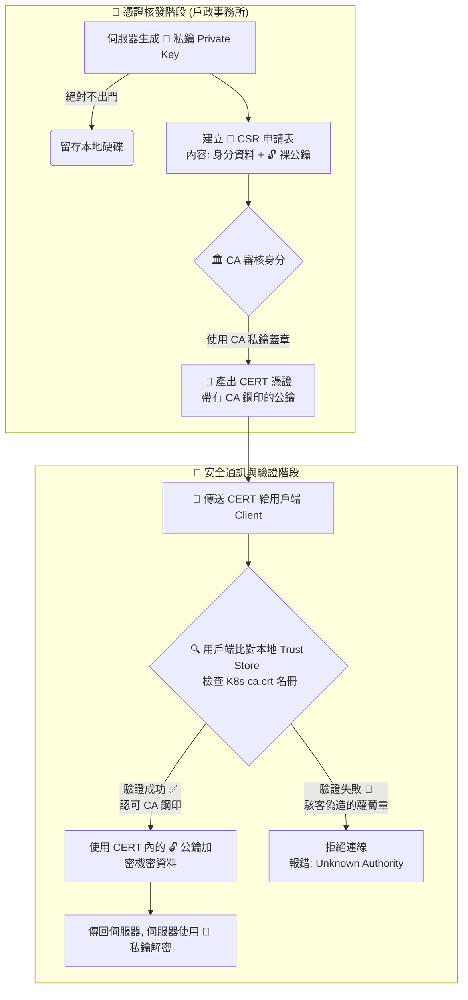

## 1. 🏷️ 課程定位
- **章節編號與名稱**：第 7 節： Security (觀念補強)
- **影片標題**：147-1. TLS Basics (課外延伸) - 加密比喻、信任機制與金鑰格式解密

## 2. 📌 核心概念摘要
非對稱加密的核心在於「公鑰（鎖頭）」可隨意公開發送，而「私鑰（鑰匙）」絕對不可外流。為了防止中間人攻擊（偽造鎖頭），K8s 依賴 CA (憑證機構) 替公鑰蓋上數位鋼印生成 CERT (憑證)，並搭配所有元件內建的信任清單 (Trust Store / ca.crt)，建立起叢集內部堅不可摧的通訊信任鏈。

## 3. 📊 流程圖與視覺化重現 (ASCII / Mermaid)
以下為結合「保險箱比喻」與「CA 信任機制」的完整 TLS 安全通訊生命週期：



## 4. 🔑 知識點擷取 (Detailed Notes)
**核心實體對應關係：**
- **私鑰 (Private Key / 鑰匙)**：唯一能解密的工具。必須嚴格設定權限死鎖在伺服器中，絕對不可透過網路傳輸。
- **公鑰 (Public Key / 鎖頭)**：用來把資料「上鎖」，一旦鎖上連自己都打不開。任何人皆可取得。
- **CA (Certificate Authority)**：大家共同信任的第三方權威（K8s 叢集通常自帶 Root CA）。
- **CSR (Certificate Signing Request)**：包含公鑰與身分資料的申請表，等待 CA 批准。
- **CERT (Certificate / 護照)**：經 CA 私鑰簽名（蓋鋼印）過的公鑰憑證。

**偽造防禦機制與限制條件 (Limitations)：**
- 任何人皆可自己架設假 CA 簽發憑證，但因為假 CA 的公鑰不在客戶端的「絕對信任清單 (Trust Store)」中，連線會立刻被作業系統或 Kubelet 攔截並阻斷。

**金鑰副檔名防呆指南：**
- `.crt`：已蓋章的公鑰憑證，可公開。
- `.key`：絕對機密的私鑰。
- `.pem`：Base64 純文字編碼格式。因可裝公鑰也可裝私鑰，實務上私鑰會刻意命名為 `*-key.pem` 以防呆。
- `.pub`：未經第三方認證的純裸公鑰（常見於 SSH 連線）。
- `.p12 / .pfx`：將公私鑰打包並「上密碼」的保險箱（K8s 自動化環境極少使用，因重啟需手動輸入密碼）。

## 5. 💻 CKA 必備實作指令 (Imperative Commands)
實務排錯與 CKA 考場中，面對一堆 `.crt` 和 `.key` 檔案，你需要有能力快速檢查其內容與屬性：

```bash
# 🎯 考場神技 1：檢查 .crt / .pem (公鑰憑證) 的核發者(Issuer)與有效期限
# 用來確認這張憑證是不是被對的 CA 蓋章的
openssl x509 -in /etc/kubernetes/pki/apiserver.crt -text -noout | grep -E "Issuer|Not After"

# 🎯 考場神技 2：確認私鑰 (.key) 的權限設定 (K8s 資安實務要求極嚴格)
ls -l /etc/kubernetes/pki/apiserver.key
# ⚠️ 如果發現權限過大(如 -rwxrwxrwx 或 777)，必須立刻收緊，否則元件拒絕啟動
chmod 600 /etc/kubernetes/pki/apiserver.key

# (補充常識) 若在真實工作遇到罕見的打包檔 .p12，如何提煉出 K8s 能用的 .key 私鑰
openssl pkcs12 -in bundle.p12 -nocerts -out private.key
```

## 6. 🚀 CKA 考試延伸與 Troubleshooting
- **🎯 考試情境預測：**
  - 考題可能會故意將 `kube-apiserver` 的啟動參數填錯副檔名路徑，導致 API Server 無法啟動。
  - **解題邏輯**：找尋 `/etc/kubernetes/manifests/kube-apiserver.yaml`，確認 `--tls-cert-file` 參數對應的是 `.crt` 或 `.pem`；而 `--tls-private-key-file` 對應的必須是 `.key`。

- **🛑 避坑指南：**
  - Kubernetes 的核心元件預設只接受 `.pem`, `.crt`, `.key` 這類 Base64 純文字格式。如果你試圖把二進位的 `.der` 或是需要密碼的 `.p12` 餵給 K8s，該 Pod 會立刻陷入 CrashLoopBackOff。

- **🔧 Troubleshooting：**
  - **致命報錯 `x509: certificate signed by unknown authority`**：
    當你執行 `kubectl` 指令或元件互連時看到這個錯誤，這代表「發送方的鎖頭（CERT）」無法被「接收方的信任清單（ca.crt）」解開。
  - **優先檢查**：請去檢查 `~/.kube/config` 檔案中的 `certificate-authority-data` 欄位，確認管理員是否有正確載入叢集正版的 `ca.crt` 內容。
