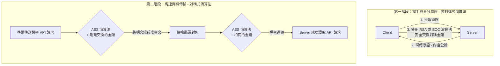

## 1. 🏷️ 課程定位
- **章節編號與名稱**：第 7 節： Security (底層密碼學補強)
- **影片標題**：147-3. Cipher Suites & Encryption Algorithms - 加密演算法的核心機制

## 2. 📌 核心概念摘要
加密演算法（Encryption Algorithm） 本質上是一套複雜的「數學公式與運算邏輯」。在 Kubernetes 叢集通訊中，它負責扮演「碎紙機與重組機」的角色，結合你手上的「金鑰（Key）」，將人類可讀的明文數據，瞬間轉換成駭客絕對看不懂的亂碼（密文），確保機密資料在網路傳輸過程中的絕對安全與完整性。

## 3. 📊 流程圖與視覺化重現 (ASCII / Mermaid)
在 TLS 安全通道中，其實是多種演算法「混合雙打」的結果。以下是真實通訊底層的演算法協作生命週期：



## 4. 🔑 知識點擷取 (Detailed Notes)
在實務與考場上，你只需要認識以下三大門派的演算法：

**1. 對稱式加密演算法 (Symmetric Encryption)**
- **代表選手**：AES (Advanced Encryption Standard)。
- **運作機制**：加密跟解密都用「同一把鑰匙」。
- **優缺點**：運算速度極快，非常適合用來加密大量資料（如 K8s 叢集內部每秒成千上萬的 API 請求）。缺點是如果金鑰在半路被偷就完了。

**2. 非對稱式加密演算法 (Asymmetric Encryption)**
- **代表選手**：RSA、ECC (橢圓曲線密碼學)。
- **運作機制**：產生一對公私鑰（我們之前聊的鎖頭與鑰匙）。公鑰加密，私鑰解密。
- **優缺點**：極度安全，不怕公鑰被攔截。缺點是運算速度非常慢、極度消耗 CPU。因此在 K8s 中，它只被用在最初的「身分驗證（看 CA 鋼印）」與「偷偷傳遞 AES 金鑰」的瞬間，隨後就會切換回 AES。

**3. 雜湊演算法 (Hashing Algorithms)**
- **代表選手**：SHA-256、SHA-384。
- **運作機制**：這是一種「單向碎紙機」。不管檔案多大，丟進去都會產出一串固定長度的亂碼（指紋）。而且絕對無法還原。
- **用途**：用來做「資料防篡改檢查」。如果駭客在傳輸過程中偷偷改了封包裡的一個字母，算出來的 Hash 指紋就會完全不同，系統會立刻報錯丟棄。

💡 **架構師重點**：當 Client 跟 Server 連線時，他們會協商出一組「密碼套件 (Cipher Suite)」。例如看到 `TLS_ECDHE_RSA_WITH_AES_128_GCM_SHA256` 這一長串，其實就是告訴你：
- **鑰匙交換**用 ECDHE
- **身分驗證**用 RSA
- **資料加密**用 AES-128
- **完整性檢查**用 SHA-256

## 5. 💻 CKA 必備實作指令 (Imperative Commands)
在進階的 K8s 資安強化實務中，我們有時必須強迫 API Server 只能使用最高級的演算法（禁止使用容易被破解的舊演算法）。

```bash
# 🎯 考場神技：檢查你的 Linux 系統目前支援哪些高強度的密碼套件
openssl ciphers -v 'HIGH'

# 🏗️ 實務設定：在 K8s API Server 的靜態 Pod YAML 中，強制指定演算法
# 編輯 /etc/kubernetes/manifests/kube-apiserver.yaml
# 在 command 區塊加入以下參數 (注意這只是範例，實際名稱非常長)：
# --tls-cipher-suites=TLS_ECDHE_RSA_WITH_AES_128_GCM_SHA256,TLS_ECDHE_RSA_WITH_AES_256_GCM_SHA384
```

## 6. 🚀 CKA 考試延伸與 Troubleshooting
- **🎯 考試情境預測：**
  - CKA 考題為了測試你的資安 Hardening 能力，可能會要求你修改 `kube-apiserver`，只允許特定的 Cipher Suite 進行連線。
  - **解題邏輯**：找到 API Server 的 YAML 檔，加入 `--tls-cipher-suites=` 參數並填入題目指定的演算法字串，存檔後等待 API Server 容器自動重啟。

- **🛑 避坑指南：**
  - **拼字致命傷**：`--tls-cipher-suites` 後面的演算法名稱又長又複雜，中間的底線 `_` 只要打錯一個字，API Server 啟動時解析失敗，就會直接崩潰（CrashLoopBackOff），整個 K8s 叢集會瞬間無回應。在考場上，請務必直接從題目複製貼上！

- **🔧 Troubleshooting：**
  - 如果你改完演算法參數後，發現 `kubectl get nodes` 噴出 `The connection to the server was refused`：
    - 這代表 API Server 已經死了。
    - 由於 kubectl 已經廢掉，你必須直接去 Master 節點上，使用底層容器工具查看死因：`crictl ps -a | grep kube-apiserver` 找到退出的容器 ID，然後 `crictl logs <container-id>`，裡面通常會告訴你「哪個 Cipher Suite 名稱不合法」。
