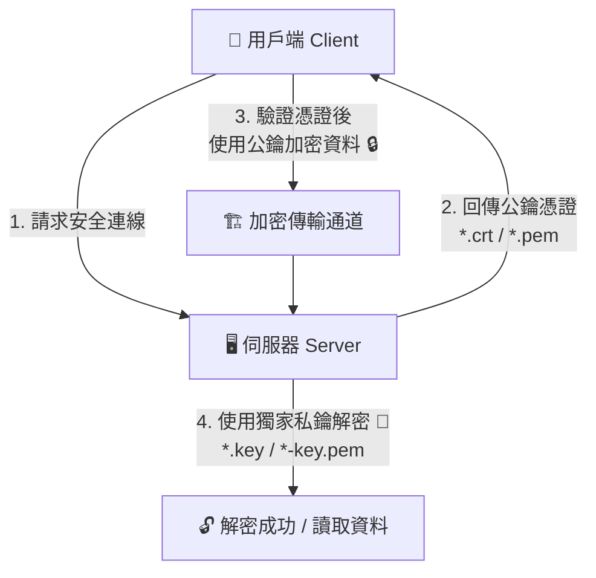

## 1. 🏷️ 課程定位
- **章節編號與名稱**：第 7 節： Security
- **影片標題**：147. TLS Basics

## 2. 📌 核心概念摘要
TLS (Transport Layer Security) 是整個 Kubernetes 叢集內部元件安全通訊的絕對基石。本控制堂課程聚焦於非對稱加密（Asymmetric Encryption）的底層運作原理，闡述憑證（Certificate/Public Key）與私鑰（Private Key）如何相互搭配，以達成傳輸加密與身份驗證（Authentication），這是防止 K8s 叢集內部通訊遭到中間人攻擊（MITM）的核心機制。

## 3. 📊 流程圖與視覺化重現 (ASCII / Mermaid)
以下為非對稱加密中，用戶端與伺服器利用「鎖（公鑰）」與「鑰匙（私鑰）」進行安全傳輸與解密的底層生命週期：



## 4. 🔑 知識點擷取 (Detailed Notes)
**加密機制定義 (Definitions)：**
- **對稱加密 (Symmetric Encryption)**：加密與解密使用同一把金鑰，速度快，但金鑰若在傳輸途中被竊聽則安全防線全毀。
- **非對稱加密 (Asymmetric Encryption)**：使用成對的金鑰。公鑰（Public Key）負責加密（鎖上），且可公開給大眾；私鑰（Private Key）負責解密（開鎖），必須由伺服器本地端絕對機密地保存。

**檔案命名與辨識慣例：**
- **公鑰 / 憑證**：常見副檔名為 `*.crt`、`*.pem`。範例：`server.crt`、`client.pem`。
- **私鑰 / 密鑰**：常見副檔名為 `*.key`、`*-key.pem`。範例：`server.key`、`client.key.pem`。

**觸發與運作機制：**
- 當用戶端想要傳送機密資料給伺服器時，必須先向伺服器索取公鑰憑證，在本地端將資料「鎖上」，再丟入網路傳輸。此時就算駭客攔截到封包，沒有伺服器手上的私鑰也絕對無法解密。

**限制條件 (Limitations)：**
- 非對稱加密的運算複雜度極高、耗費 CPU 資源。因此在真實世界（及 K8s 內部）的 TLS 握手中，非對稱加密僅用於「前期身分驗證」與「安全交換對稱金鑰」，一旦雙方確認身分並建立信任後，後續的大量資料傳輸會切換回速度較快的對稱加密。

## 5. 💻 CKA 必備實作指令 (Imperative Commands)
雖然本堂課偏向理論，但在 CKA 考場上，你必須具備在 Master 節點上直接對現有憑證檔案進行底層分析的通靈能力。請熟記以下萬用 `openssl` 工具指令：

```bash
# 🎯 考場救命神技：檢查 K8s API Server 公鑰憑證的過期時間與簽發者資訊
# 這是遭遇叢集元件因憑證過期崩潰時的第一步
openssl x509 -in /etc/kubernetes/pki/apiserver.crt -text -noout | grep -E "Not After|Issuer|Subject"

# 🔍 檢查 etcd 內部伺服器憑證的詳細欄位
openssl x509 -in /etc/kubernetes/pki/etcd/server.crt -text -noout

# 🏗️ 快速查看 K8s 靜態 Pod 定義檔中，各元件指定的憑證與私鑰路徑對照
cat /etc/kubernetes/manifests/kube-apiserver.yaml | grep -A 12 "tls-"
```

## 6. 🚀 CKA 考試延伸與 Troubleshooting
- **🎯 考試情境預測：**
  憑證排錯題（Troubleshooting）：考題通常會讓一整個叢集陷入「壞死狀態」（例如：執行 `kubectl get nodes` 提示 Connection refused 且 6443 埠口沒反應）。題目會要求你修復 Control Plane 機制。背後真正的死因通常是 `kube-apiserver` 或 `etcd` 的憑證路徑填錯、過期，或是公私鑰檔案不小心被調包。

- **🛑 避坑指南：**
  - **私鑰權限致命傷**：在 Linux 實務與考場中，私鑰（`*.key`）是非常敏感的物件。如果你手動生成或更換了金鑰，務必檢查其權限（通常要求 600 或 640）。如果權限設定成全開（如 777），etcd 在啟動時會出於安全保護機制直接拒絕啟動。
  - **YAML 欄位配對錯誤**：在修改 `/etc/kubernetes/manifests/` 下的靜態 Pod 時，注意參數名稱：
    - `--tls-cert-file` 必須配對給 `.crt` 或 `.pem`（公鑰）。
    - `--tls-private-key-file` 必須配對給 `.key`（私鑰）。要是填反了，Pod 會陷入 CrashLoopBackOff。

- **🔧 Troubleshooting 核心邏輯：**
  當 TLS 憑證出錯時，由於 `kube-apiserver` 無法運作，你絕對無法使用 `kubectl logs`。
  請依循以下講師不外傳的黃金排錯三步驟：
  1. **看系統日誌**：如果是 Kubelet 壞掉，請打 `journalctl -u kubelet -n 50 --no-pager`。
  2. **看底層容器日誌**：如果是 API Server 壞掉，直接用底層容器運行時工具（如 crictl）繞過 K8s 查看實體日誌：`crictl ps -a` 找出崩潰的容器，再下 `crictl logs <container-id>`。
  3. **檢查憑證合法性**：直接利用 `openssl x509` 指令去檢查 `/etc/kubernetes/pki/` 底下的憑證，確認 Subject 中的 Common Name (CN) 是否正確（例如：客戶端憑證是否具有 `O=system:masters` 權限）。
