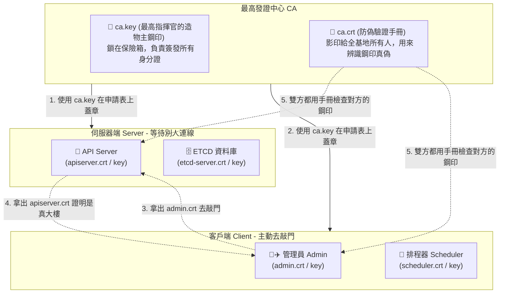

## 1. 🏷️ 課程定位
- **章節編號與名稱**：第 7 節： Security
- **影片標題**：148-1. TLS in Kubernetes (Kubernetes 憑證架構大解密)

## 2. 📌 核心概念摘要
這張圖完美展示了 Kubernetes 內部的 mTLS（雙向認證） 與 PKI（公開金鑰基礎建設） 架構。`ca.key` 是叢集造物主的「私有鋼印」，`ca.crt` 是所有人用來驗證鋼印真偽的「防偽手冊」。而圖中其他的每一個 `.crt` 與 `.key`，都是各個元件為了互相證明身分，而向 CA 申請的「專屬身分證」與「指紋」。

## 3. 📊 流程圖與視覺化重現 (ASCII / Mermaid)
請把這張圖想像成「機密軍事基地的門禁系統」：



## 4. 🔑 知識點擷取 (Detailed Notes)
這張圖想表達的核心邏輯，可以拆解為以下三大重點：

**1. 為什麼需要 ca.key 與 ca.crt？ (CA 的絕對權威)**
- **`ca.key` (造物主印章)**：全叢集只有一把，負責在所有元件的 `.crt` 上蓋章。如果這個被偷了，駭客就能自己印合法身分證，叢集宣告死亡。
- **`ca.crt` (信任名冊)**：這是 CA 的公鑰，會被複製發派給叢集內的「每一個元件」。當 Admin 去敲 API Server 的門時，API Server 就是用手邊的 `ca.crt` 來檢查 Admin 的身分證是不是真的。

**2. 為什麼每一個物件都有憑證？ (零信任架構)**
Kubernetes 採用「零信任 (Zero Trust)」機制。API Server 不會因為連線來自內部網路就相信你。
- `kube-scheduler` (排程器) 想要問 API Server 現在有哪些 Pod 需要調度，它必須出示 `scheduler.crt`。
- `kube-controller-manager` (控制器) 想要建立 ReplicaSet，它必須出示 `controller-manager.crt`。

**3. Server Certs 與 Client Certs 的差別？**
- **Server 憑證**：如圖右側，負責「開 Port 等待別人連線」的元件。如 API Server、ETCD、Kubelet。
- **Client 憑證**：如圖左側，負責「主動發起連線去要資料」的元件。如 Admin、Scheduler、Kube-Proxy。

## 5. 💻 CKA 必備實作指令 (Imperative Commands)
在考場上，你要知道去哪裡找這位「最高指揮官 (CA)」，以及如何檢查某張身分證是不是它發的：

```bash
# 🎯 考場神技 1：直接去 Master 節點的「保險箱目錄」查看所有憑證
ls -l /etc/kubernetes/pki/
# 你會在裡面看到最重要的 ca.crt 與 ca.key，以及 api-server 等元件的憑證。

# 🎯 考場神技 2：檢查 K8s 設定檔 (kubeconfig) 裡面，是不是裝著 CA 的防偽手冊？
# 任何想連上叢集的 Client 都必須有一份 CA 憑證資料 (certificate-authority-data) 來驗證 Server
cat ~/.kube/config | grep "certificate-authority-data"

# 🔍 實務排錯：確認 API Server 的身分證，真的是由這張 ca.crt 簽發的嗎？
# (驗證 Issuer 欄位是否為 Kubernetes Root CA)
openssl x509 -in /etc/kubernetes/pki/apiserver.crt -text -noout | grep "Issuer:"
```

## 6. 🚀 CKA 考試延伸與 Troubleshooting
- **🎯 考試情境預測：**
  - **元件死亡排錯**：考題可能會故意把 API Server 啟動參數裡的 `--client-ca-file` 路徑寫錯（例如指向了一個不存在的 CA 檔案）。
  - **解題邏輯**：當 `--client-ca-file` 找不到正確的 `ca.crt` 時，API Server 就會喪失驗證 Client 身分證的能力，導致所有連線（包含你敲的 kubectl）全部報錯 `Unauthorized`。請進到 `/etc/kubernetes/manifests/kube-apiserver.yaml` 將路徑修正回 `/etc/kubernetes/pki/ca.crt`。

- **🛑 避坑指南：**
  - 不要把 `ca.crt` 跟 `apiserver.crt` 搞混！`ca.crt` 是用來「驗證別人」的基準，`apiserver.crt` 是 API Server 用來「證明自己」的身分證。

- **🔧 Troubleshooting：**
  - 如果你在執行任何 `kubectl` 指令時，看到 `x509: certificate signed by unknown authority`：
    - 這代表你的 kubectl (Client) 拿到了一張 API Server 的身分證，但你手邊的防偽手冊 (`ca.crt` in kubeconfig) 無法辨識這張身分證上的鋼印。這通常是因為你拿到了錯誤叢集的 kubeconfig，請檢查你的 Context 設定！
