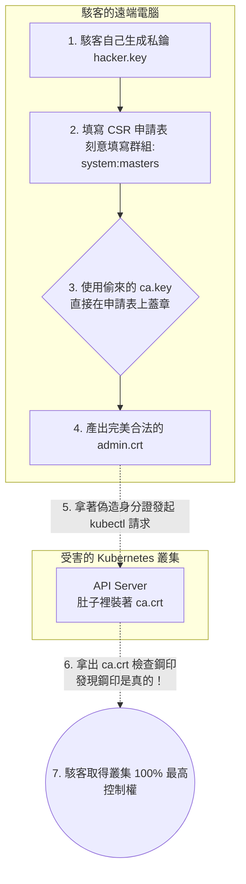

## 1. 🏷️ 課程定位
- **章節編號與名稱**：第 7 節： Security (資安威脅與災難防禦)
- **影片標題**：148-2. CA Compromise (當造物主印章被竊的終極災難)

## 2. 📌 核心概念摘要
在 PKI (公開金鑰基礎建設) 中，`ca.crt` 是公開的防偽手冊，外洩毫無影響；但 `ca.key` 是叢集的「絕對信任根源」。一旦 `ca.key` 外流，駭客就能繞過所有審核機制，無限量地為自己印製具有最高權限的合法身分證，API Server 會完全信任這些偽造的憑證，導致叢集瞬間淪陷。

## 3. 📊 流程圖與視覺化重現 (ASCII / Mermaid)
以下為駭客拿到 `ca.key` 後，如何「合法」接管你整個 K8s 叢集的底層攻擊流程：



## 4. 🔑 知識點擷取 (Detailed Notes)
**釐清兩者的外洩後果：**
- **拿到 `ca.crt` (防偽手冊)**：完全沒用。這本來就是要發給所有人（包含駭客）去驗證用的，就算駭客拿到也無法用來解密或偽造任何東西。
- **拿到 `ca.key` (造物主鋼印)**：Game Over。

**駭客的攻擊手法 (Privilege Escalation)：**
- Kubernetes 預設將 `system:masters` 這個群組綁定為 `cluster-admin` (最高管理員)。
- 駭客只要在自己家裡寫一張申請表（CSR），把自己的名字寫入 `system:masters` 群組，然後用偷來的 `ca.key` 蓋章。
- 當駭客拿著這張憑證連線時，API Server 會檢查鋼印，發現「哇！這真的是我們家 CA 蓋的章」，就會無條件放行，駭客甚至不需要知道你的任何帳號密碼。

**Kubernetes 如何死守這個命門？**
- K8s 架構中，**只有 Master Node 擁有 `ca.key`**。Worker Node 身上絕對不會有這個檔案。
- 這就是為什麼企業實務中，Master Node 的 SSH 登入權限會被極度嚴格管控（通常鎖在跳板機後方，甚至禁止人為登入）。

## 5. 💻 CKA 必備實作指令 (Imperative Commands)
在 CKA 考場與實務環境中，我們必須透過 Linux 底層的權限控管機制，來死守這把終極鑰匙：

```bash
# 🎯 考場/實務神技：檢查 ca.key 的檔案權限 (防禦第一線)
ls -la /etc/kubernetes/pki/ca.key

# ⚠️ 正確的輸出必須是：
# -rw------- 1 root root 1675 May 28 12:00 /etc/kubernetes/pki/ca.key

# 如果你發現權限不是 600 (只有 root 可以讀寫)，請立刻修正：
chmod 600 /etc/kubernetes/pki/ca.key
chown root:root /etc/kubernetes/pki/ca.key
```

## 6. 🚀 CKA 考試延伸與 Troubleshooting
- **🎯 考試情境預測：**
  - 考題不會考你「如何駭入叢集」，但會考你「資安意識」。題目可能會要求你：「找出叢集中權限設定錯誤的機密檔案，並將其修正為正確的權限。」
  - **解題邏輯**：巡視 `/etc/kubernetes/pki/` 目錄，確保所有的 `.key` 檔案（特別是 `ca.key`）權限都是 600。

- **🛑 避坑指南 (真實災難處理)：**
  - 如果在真實生產環境中，`ca.key` 真的不幸外洩了怎麼辦？
  - **沒有捷徑，只能「整組打掉重練」**。你必須執行 `kubeadm certs renew` 重新生成一套全新的 `ca.key` 與 `ca.crt`，然後將叢集內所有的 API Server, Kubelet, ETCD 的憑證全部重新簽發一次，並重啟所有核心元件。這是一項會導致服務中斷的超級大工程。
