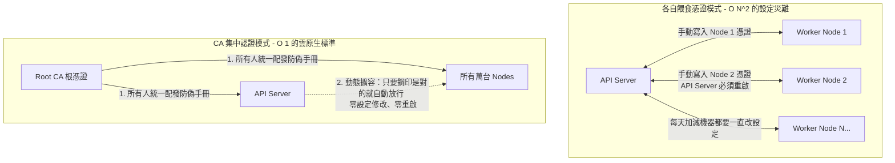

## 1. 🏷️ 課程定位
- **章節編號與名稱**：第 7 節： Security (架構思維探討)
- **影片標題**：148-3. PKI vs. Decentralized Trust - 為什麼 K8s 堅持使用集中式 CA

## 2. 📌 核心概念摘要
放棄「各自餵食憑證（點對點信任）」而選擇單一 CA（公開金鑰基礎建設 PKI），是為了在「極致的動態擴展性」與「單點故障風險」之間做出妥協。在 Kubernetes 這種隨時有成千上萬個節點與應用程式動態生滅的環境中，手動維護點對點的信任清單會導致運維災難，集中式 CA 才是實現「自動化零信任網路」的唯一解法。

## 3. 📊 流程圖與視覺化重現 (ASCII / Mermaid)
我們來比較一下你腦海中的「各自餵食（網狀信任）」與真實的「CA 集中認證」在架構上的巨大差異：



## 4. 🔑 知識點擷取 (Detailed Notes)
如果採用你提議的「各自餵食憑證」設計，雖然解決了單點外洩風險，但會引發三個致命的系統災難 (Limitations)：

**1. 無限重啟的災難 (Scalability Issue)：**
如果 API Server 的肚子裡必須「吃進」所有 Client 的憑證，這意味著每當有一名新員工加入、或叢集因為流量暴增自動擴展 (Auto-scaling) 出 50 台新伺服器時，管理員都必須去修改 API Server 的 YAML 設定檔，然後重啟 API Server。在生產環境中，這種中斷是絕對不被允許的。

**2. 爆炸的網狀複雜度 (N^2 Complexity)：**
K8s 內部不是只有 Client 對 Server 的單向溝通。各個元件（如 Scheduler, ETCD, Kubelet）會互相交談。如果有 100 個元件，你要「互相餵食」的憑證組合高達數千條，工程師光是設定憑證就會直接崩潰。

**3. 如何緩解 CA 的單點致命風險？ (業界真實解法)：**
你擔心的「一個洩漏，全叢集死」是絕對真實的風險！因此在銀行或頂級科技公司，真正的 Root CA 絕對不會放在 K8s 裡面。
- **中繼 CA 架構 (Intermediate CA)**：他們會在實體的「離線保險箱（如硬體安全模組 HSM）」裡生出 Root CA，然後用它簽發一張中繼 CA 給 K8s 使用。如果 K8s 的中繼 CA 被駭客偷了，管理員只要走進實體金庫，宣告中繼 CA 死亡（吊銷），再發一張新的就好，傷害就能被控制住。

## 5. 💻 CKA 必備實作指令 (Imperative Commands)
正是因為採用了集中式 CA 架構，K8s 才能發展出內建的 `CertificateSigningRequest` (CSR) 機制，讓新節點或新員工可以「自動化」地申請憑證，這也是 CKA 必考題：

```bash
# 🎯 考場神技：利用 CA 機制，動態批准新進元件的憑證 (無需重啟任何東西)
# 1. 查看目前有哪些人送出了 CSR 申請表
kubectl get csr

# 2. 以管理員身分，命令背後的 CA 幫這個新來的節點或員工蓋章
kubectl certificate approve <csr-name>

# 🏗️ 實務常識：Kubeadm 允許你在建叢集時，導入外部「極度安全」的自訂 CA
# 而不是讓 kubeadm 自己隨便生一個
# (考場不會考這麼深，但架構師要知道)
kubeadm init --cert-dir /path/to/your/hardware/vault/pki
```

## 6. 🚀 CKA 考試延伸與 Troubleshooting
- **🎯 考試情境預測：**
  - **動態核發憑證題**：CKA 會考你如何利用叢集內的 CA，發一張合法的憑證給新使用者 `john`。你必須建立 CSR 物件，並將其 `approve`。這就是考驗你是否理解集中式 CA 帶來的自動化優勢。

- **🛑 避坑指南：**
  - 在編輯元件 YAML 檔時，永遠不要試圖把別人的 `.crt` 加進你的設定檔裡！ 記住，除了自己的身分證（`--tls-cert-file`）之外，你唯一需要餵食的永遠只有防偽手冊（`--client-ca-file=ca.crt`）。

- **🔧 Troubleshooting：**
  - 當你要把一台新的 Worker Node 加入叢集時，`kubeadm join` 指令後面會跟著一長串 `--discovery-token-ca-cert-hash`。
  - 這個 Hash 值的作用，就是在新 Node 剛開機、什麼都不懂的時候，用來比對它從網路上抓下來的 `ca.crt` 是不是正版的！如果 Hash 值不對，Node 會拒絕加入，防止駭客架設假的 Master 節點來騙它。
