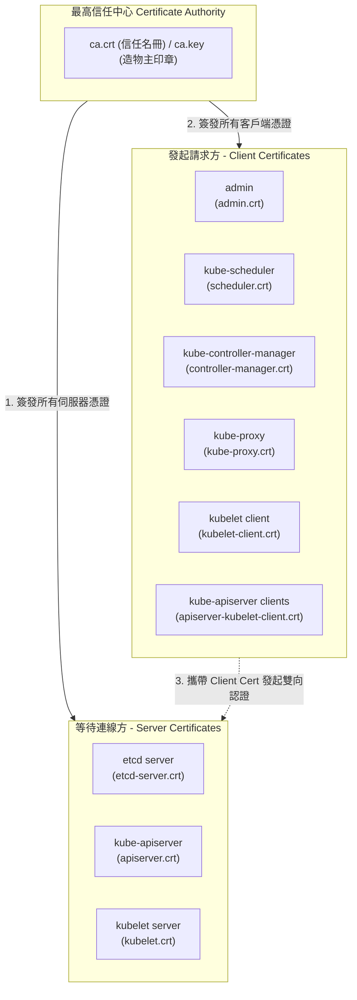

## 1. 🏷️ 課程定位
- **章節編號與名稱**：第 7 節： Security
- **影片標題**：148. TLS in Kubernetes (Kubernetes 叢集憑證架構總覽)

## 2. 📌 核心概念摘要
Kubernetes 內部全面採用 mTLS (雙向 TLS 認證)。這意味著叢集中的每一個元件，不僅需要身為 Server (伺服器) 提供公鑰證明自己，也需要在發起請求時身為 Client (客戶端) 出示數位識別證。而維繫這套龐大信任網路的唯一核心，就是叢集專屬的 Certificate Authority (CA)。

## 3. 📊 流程圖與視覺化重現 (ASCII / Mermaid)
根據您提供的課程截圖，我將其轉化為考場上必須印在腦海中的元件憑證分類圖 (已優化 Mermaid 語法確保高相容性)：



## 4. 🔑 知識點擷取 (Detailed Notes)
**1. Server 憑證 (伺服器端)：**
- **定義**：負責「監聽」Port 口等待別人連線的元件，必須擁有 Server Cert。
- **包含元件**：`kube-apiserver` (Port 6443)、`etcd` (Port 2379)、`kubelet` (Port 10250)。

**2. Client 憑證 (客戶端)：**
- **定義**：負責主動去「敲門」請求資料的元件，必須持有 Client Cert。
- **包含元件**：管理員 (`admin`)、`kube-scheduler`、`kube-controller-manager`、`kube-proxy`。

**3. 雙重身分元件 (Dual Roles)：**
- **kube-apiserver**：它本身是最大的 Server（接納所有人連線），但當它需要去讀寫 etcd 或是去呼叫 kubelet 拿 Log 時，它就會切換成 Client 角色，此時它必須出示 `apiserver-etcd-client.crt` 或 `apiserver-kubelet-client.crt`。
- **kubelet**：同理，當它啟動時向 API Server 註冊節點，它是 Client (`kubelet-client.crt`)；但當 API Server 來找它拿 Container 日誌時，它就變成了 Server (`kubelet.crt`)。

**4. 限制條件與核心規則 (Limitations)：**
- **同源政策**：這張圖裡出現的所有 `.crt`，必須且只能由頂端的**同一個** `ca.key` 簽發。否則雙向認證必定失敗。

## 5. 💻 CKA 必備實作指令 (Imperative Commands)
在考場上，如果你遇到元件崩潰，你必須具備「順藤摸瓜」找到這些憑證的本能。

```bash
# 🎯 考場神技 1：查看 K8s 預設存放憑證的黃金目錄
# Master Node 上的所有 Server Cert 與 CA 都存放在這 (強烈建議考場上先 ls 看過一遍)
ls -l /etc/kubernetes/pki/

# 🎯 考場神技 2：查看 etcd 專屬的憑證目錄
ls -l /etc/kubernetes/pki/etcd/

# 🎯 考場神技 3：找出 Client (如 scheduler) 的憑證在哪裡？
# 核心元件的 Client Cert 通常被打包進它們專屬的 kubeconfig 中！
cat /etc/kubernetes/scheduler.conf | grep "client-certificate-data"

# 🔍 實務排錯：確認某張憑證的簽發者(Issuer)是不是我們的 Root CA
openssl x509 -in /etc/kubernetes/pki/apiserver.crt -text -noout | grep "Issuer:"
```

## 6. 🚀 CKA 考試延伸與 Troubleshooting
- **🎯 考試情境預測：**
  - **憑證路徑修復題**：題目可能會故意把 `kube-apiserver` 或 `etcd` 靜態 Pod 裡的 `--client-ca-file` 或 `--tls-cert-file` 路徑寫錯（例如把 `.crt` 寫成 `.key`，或指向不存在的檔案）。
  - **解題邏輯**：進入 `/etc/kubernetes/manifests/` 編輯 YAML，根據檔名規則與目錄位置 (`/etc/kubernetes/pki/`)，把錯誤的副檔名或路徑改回正確值。

- **🛑 避坑指南：**
  - **Kubeconfig 的盲點**：新手常以為 `kube-scheduler.crt` 應該也在 `/etc/kubernetes/pki/` 裡面。實際上，K8s 為了方便管理，像 Scheduler 與 Controller-Manager 這類 Client，它們的憑證已經被 Base64 編碼並**直接寫死在它們的 `.conf` (Kubeconfig) 檔案中**（位於 `/etc/kubernetes/` 目錄下）。

- **🔧 Troubleshooting：**
  - 若你發現 `kube-scheduler` 一直處於 CrashLoopBackOff，查看其日誌：
    - `kubectl logs -n kube-system kube-scheduler-<node-name>` (如果 API Server 還活著)
  - 若日誌顯示 `x509: certificate has expired or is not yet valid`，這代表它的 Client Cert 過期了。在實務上，你必須使用 `kubeadm certs renew` 指令來更新憑證；若在考場，通常是設定檔指錯了憑證路徑，請去檢查對應的 Kubeconfig 檔。
