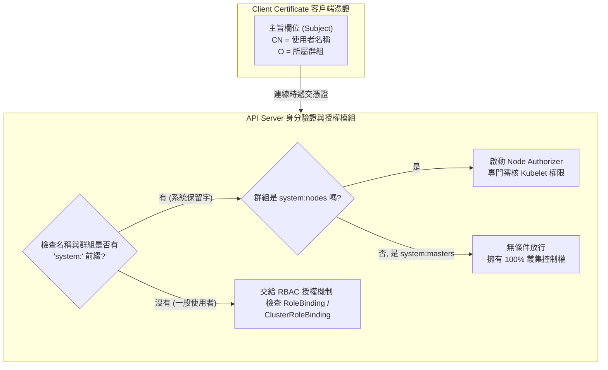

## 1. 🏷️ 課程定位
- **章節編號與名稱**：第 7 節： Security (身分認證與授權底層解析)
- **影片標題**：149-1. TLS in Kubernetes - Certificate Creation (憑證欄位與群組映射機制)

## 2. 📌 核心概念摘要
Kubernetes 透過解析 X.509 憑證中的 CN (Common Name) 作為「使用者名稱」，並透過 O (Organization) 作為「所屬群組」。其中，帶有 `system:` 前綴的名稱與群組，是 K8s 預留給「系統核心元件」與「超級管理員」的專屬 VIP 通道，享有硬編碼 (Hardcoded) 的特殊權限與獨立的授權檢查機制；而一般開發者則不使用這個前綴。

## 3. 📊 流程圖與視覺化重現 (ASCII / Mermaid)
以下是 API Server 收到憑證後，如何拆解欄位並區分「系統權限」與「一般權限」的底層決策樹：



## 4. 🔑 知識點擷取 (Detailed Notes)
這正是你疑惑的「為什麼有些要 `system:`，有些不用」的核心原因，請熟記以下三大分類：

**1. 終極 VIP：`system:masters` (超級管理員群組)**
- **定義**：只要你的憑證裡有 `O=system:masters` 這個群組，API Server 就會直接把你當作「造物主」。
- **特權**：它會完全繞過所有的 RBAC 權限檢查。這就是為什麼我們前面說，如果駭客偷了 `ca.key` 並為自己簽發一張帶有這個群組的憑證，叢集就直接淪陷的原因。

**2. 系統核心元件：`system:node` / `system:nodes` (如截圖所示)**
- **定義**：K8s 為了保護 Worker Node 不被假冒，設計了專屬的 Node Authorizer (節點授權模組)。
- **嚴格規範**：如你在截圖中看到的，Kubelet 的憑證必須滿足兩個條件：
  1. 群組 (O) 必須是 `system:nodes`。
  2. 使用者名稱 (CN) 必須是 `system:node:<節點真實名稱>` (例如 `system:node:node01`)。
- **限制條件**：如果你的名字對不起來，API Server 就不會讓你以 Kubelet 的身分回報節點狀態。這也是 `kube-scheduler` (`system:kube-scheduler`)、`kube-proxy` 等核心元件的命名規則。

**3. 一般使用者：不帶 `system:` 前綴 (如約翰、開發團隊)**
- **定義**：當你想發憑證給新進工程師 john 時，你只會設定 `CN=john, O=developers`。
- **運作機制**：因為沒有 `system:`，API Server 會把它當作「凡人」，並將其轉交給 RBAC 機制。此時，你必須手動寫一份 RoleBinding 的 YAML 檔，把 `developers` 群組跟某個權限綁定，john 才能執行指令。

## 5. 💻 CKA 必備實作指令 (Imperative Commands)
在考場上，如果你遇到「幫新員工建立憑證」的考題，你必須知道如何在使用 `openssl` 時，正確地將這些「群組與名稱」寫入憑證申請表 (CSR) 中：

```bash
# 🎯 考場神技 1：用 openssl 產生私鑰與申請表，並指定 CN (使用者) 與 O (群組)
# 注意 -subj 後面的參數，這就是決定他身分與群組的關鍵！
openssl req -new -key john.key -subj "/CN=john/O=developers" -out john.csr

# 🎯 考場神技 2：如果不確定手上這張憑證到底是誰、哪個群組的？
# 直接解析憑證的主旨 (Subject) 欄位
openssl x509 -in my-cert.crt -text -noout | grep "Subject:"
# 輸出範例：Subject: O = system:masters, CN = kubernetes-admin
```

## 6. 🚀 CKA 考試延伸與 Troubleshooting
- **🎯 考試情境預測：**
  - **RBAC 權限掛鉤題**：CKA 通常會給你一個已經建立好的使用者憑證（例如 `CN=jane, O=dev`），接著要求你：「為使用者 jane 建立一個 RoleBinding，讓她能在 default namespace 建立 Pod。」
  - **解題邏輯**：你不需要去動憑證，因為憑證已經決定了她是 jane。你只需要用指令 `kubectl create rolebinding jane-bind --clusterrole=edit --user=jane --namespace=default`，把權限跟她綁在一起即可。

- **🛑 避坑指南：**
  - **千萬不要亂用 `system:`**：在實務中，為一般員工發放憑證時，絕對不要將他們的 CN 或 O 加上 `system:` 前綴。這不僅會擾亂 K8s 的內部授權機制，還可能不小心讓他們繼承到系統底層的特權。

- **🔧 Troubleshooting：**
  - 當 Node 一直處於 NotReady，且 Kubelet 日誌顯示 `Forbidden: node "node01" is not allowed to modify node "node02"`。
  - **原因**：這通常是因為你把 Node01 的憑證不小心複製給 Node02 用了！Node Authorizer 檢查到憑證上的 `CN=system:node:node01` 與當前機器的真實 hostname 不符，就會基於資安機制拒絕它的請求。請重新為 Node02 簽發專屬的憑證。
