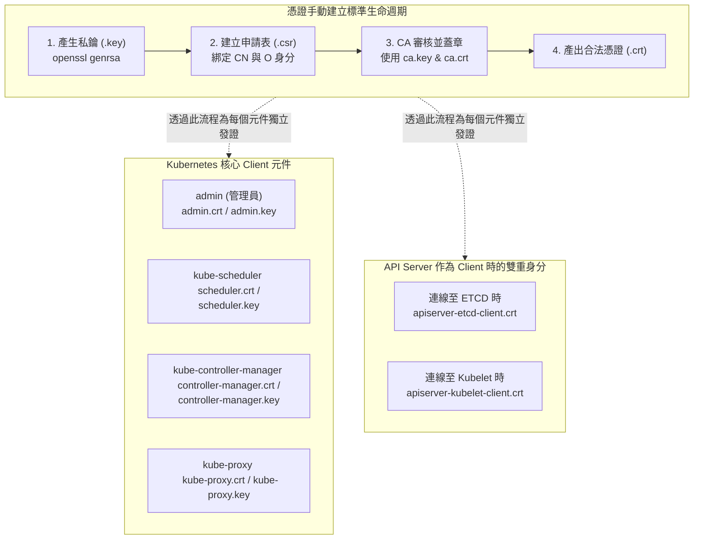

## 1. 🏷️ 課程定位
- **章節編號與名稱**：第 7 節： Security
- **影片標題**：149. TLS in Kubernetes - Certificate Creation (K8s 客戶端憑證建立與核心元件解析)

## 2. 📌 核心概念摘要
在 Kubernetes 叢集中，不僅僅是人類管理者，所有主動向 API Server 發起請求的系統核心元件（如 Scheduler、Controller-Manager、Kube-Proxy）都扮演著「Client (客戶端)」的角色。本堂課詳細解析了如何透過 OpenSSL 建立這些元件專屬的私鑰 (.key) 與憑證簽發請求 (.csr)，並嚴格規定其主旨（CN 與 O 欄位），最終由叢集 CA 簽發出合法的身分憑證 (.crt) 以實現零信任雙向認證。

## 3. 📊 流程圖與視覺化重現 (ASCII / Mermaid)
以下為影片中展示的 Client Certificate 生成流程，以及各核心元件作為 Client 時的憑證關聯圖 (已優化 Mermaid 語法確保 GitHub 高相容性)：



## 4. 🔑 知識點擷取 (Detailed Notes)
**核心 Client 元件盤點：**
- **admin**：最高權限管理者，操作 kubectl 時使用。
- **kube-scheduler**：負責監聽 API Server 以調度 Pod。
- **kube-controller-manager**：負責監聽 API Server 以維持叢集狀態（如 ReplicaSet）。
- **kube-proxy**：負責在 Node 上設定網路規則。

**身分識別的核心欄位 (CN 與 O)：**
- **CN (Common Name)**：對應 Kubernetes 中的「User (使用者名稱)」。例如：`CN=kube-scheduler`。
- **O (Organization)**：對應 Kubernetes 中的「Group (所屬群組)」。系統核心元件通常帶有 `system:` 前綴，例如管理員必須是 `O=system:masters`。

**API Server 的「雙重身分」機制：**
- API Server 平常是 Server（接收連線），但當它需要把資料存入 etcd，或是去 kubelet 撈取容器日誌 (kubectl logs) 時，API Server 就變成了 Client。
- 此時它必須拿出專屬的 Client 憑證（如 `apiserver-etcd-client.crt`）來向對方證明自己的合法性。

**限制條件 (Limitations)：**
- 核心元件的憑證名稱與群組是硬編碼 (Hardcoded) 在 Kubernetes 原始碼中的授權模組裡的。如果在產生 CSR 時，CN 或 O 拼錯任何一個字母，API Server 就會拒絕該元件的連線請求。

## 5. 💻 CKA 必備實作指令 (Imperative Commands)
在了解了 Kubernetes 原理後，你必須熟練掌握使用 openssl 手動模擬這套「生鑰匙 -> 寫表單 -> 蓋鋼印」的底層流程：

```bash
# 🎯 考場神技 1：為新使用者 (john) 產生專屬私鑰 (Private Key)
openssl genrsa -out john.key 2048

# 🎯 考場神技 2：建立憑證簽發請求 (CSR)
# ⚠️ 致命細節：-subj 參數是決定他在 K8s 裡是神還是凡人的關鍵！
# 這裡將 john 歸類為 developer 群組
openssl req -new -key john.key -subj "/CN=john/O=developer" -out john.csr

# 🎯 考場神技 3：化身為 CA，使用叢集的 Root CA 來簽發這張憑證 (CERT)
# 實務上這步通常交由 K8s 內建的 Certificates API 處理，但架構師需懂底層指令
openssl x509 -req -in john.csr \
  -CA /etc/kubernetes/pki/ca.crt \
  -CAkey /etc/kubernetes/pki/ca.key \
  -CAcreateserial \
  -out john.crt -days 365
```

## 6. 🚀 CKA 考試延伸與 Troubleshooting
- **🎯 考試情境預測：**
  - CKA 考試極少要求你直接用 `openssl` 敲出完整的 CA 簽發流程（因為字數太多容易背錯），但絕對會考你：給你一個已經做好的 `.csr` 檔案，要求你建立一個 Kubernetes 的 `CertificateSigningRequest` 物件，並使用 `kubectl certificate approve` 來完成簽發。

- **🛑 避坑指南：**
  - **系統保留字陷阱**：在實務上為一般工程師建立憑證時，絕對禁止在 O (Organization) 欄位填寫 `system:masters`。一旦填寫，該員工將直接獲得叢集的最高控制權，完全無視任何 RBAC 權限限制。

- **🔧 Troubleshooting：**
  - 若 `kube-scheduler` 或 `kube-controller-manager` 容器不斷重啟，且日誌中顯示 `Unauthorized` 或 `Forbidden`。
  - **排錯步驟**：這通常意味著設定檔中憑證指錯了，或是該憑證在生成時 CN 欄位打錯字了。請使用指令 `openssl x509 -in /etc/kubernetes/pki/kube-scheduler.crt -text -noout | grep "Subject:"` 檢查其身分是否為正確的系統保留名稱。
