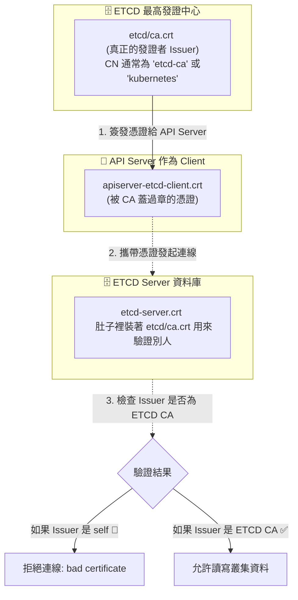

## 1. 🏷️ 課程定位
- **章節編號與名稱**：第 7 節： Security (觀念勘誤與底層防禦)
- **影片標題**：150-1. View Certificate Details (抓出簡報中的致命錯誤)

## 2. 📌 核心概念摘要
簡報上將 `apiserver-etcd-client.crt` 的 Issuer 寫成 `self` 是一個明顯的錯誤。在 Kubernetes 的零信任架構中，只有「最高權威的 Root CA」才有資格自己簽發給自己（Self-signed）。作為 Client 的 API Server 想要連線進高度機密的 ETCD 資料庫，其憑證必須由 ETCD 專屬的 CA 中心來簽發，否則連線會被瞬間拒絕。

## 3. 📊 流程圖與視覺化重現 (ASCII / Mermaid)
以下是 API Server 與 ETCD 之間，真實世界的憑證簽發與驗證生命週期：



## 4. 🔑 知識點擷取 (Detailed Notes)
**什麼是真正的 self (Self-signed 自簽發)？**
- 在密碼學中，自簽發代表「自己當自己的保證人」，也就是憑證的 Subject (申請人) 與 Issuer (發證人) 是同一個名字。
- 在 K8s 叢集中，只有 `/etc/kubernetes/pki/ca.crt` 以及 `/etc/kubernetes/pki/etcd/ca.crt` 這種「造物主」級別的 Root CA，才會是 self。

**為什麼簡報是錯的？**
- ETCD 是一個極度嚴格的資料庫。當 API Server 想要讀寫 ETCD 時，API Server 必須出示 `apiserver-etcd-client.crt`。
- ETCD Server 會檢查這張憑證的鋼印（Issuer）。如果發現是 API Server「自己印給自己 (self)」的假證件，ETCD 會立刻觸發資安防禦機制阻斷連線。

**那簡報上正確的 Issuer 應該寫什麼？**
- 根據標準的 kubeadm 安裝流程，這張憑證是由 `/etc/kubernetes/pki/etcd/ca.crt` 簽發的。
- 觀察簡報下方 ETCD CA 的那一行，它的 CN 叫作 `kubernetes`。因此，`apiserver-etcd-client.crt` 的 Issuer 欄位應該要寫 `kubernetes` 才合理（或是寫 `etcd-ca`，取決於安裝版本的命名規則）。

## 5. 💻 CKA 必備實作指令 (Imperative Commands)
在真實的企業環境或考場上，我們絕對不相信肉眼看簡報，我們只相信 Linux 底層的 `openssl` 檢驗結果。你可以用以下指令去「打臉」這張簡報：

```bash
# 🎯 考場神技：印出憑證的「申請人 (Subject)」與「發證人 (Issuer)」
# 去真實的 K8s Master 節點上敲下這行指令
openssl x509 -in /etc/kubernetes/pki/apiserver-etcd-client.crt -noout -subject -issuer

# 💡 真實世界的正確輸出範例 (絕對不可能是 self)：
# subject= /CN=kube-apiserver-etcd-client /O=system:masters
# issuer= /CN=etcd-ca  <-- 這才是背後真正簽發它的老大！
```

## 6. 🚀 CKA 考試延伸與 Troubleshooting
- **🎯 考試情境預測：**
  - 考試中並不會直接考你「這張憑證的 Issuer 是誰」，但會考驗你憑證不匹配時的排錯能力。

- **🛑 避坑指南：**
  - 如果你不小心手動生成了一張「自簽發 (self-signed)」的憑證，並把它設定給 API Server 當作連線 ETCD 的 Client Cert，你的 API Server 將會陷入無窮盡的 CrashLoopBackOff，因為它根本無法連上 ETCD 讀取叢集狀態。

- **🔧 Troubleshooting：**
  - 當叢集完全崩潰，且 API Server 的日誌（`crictl logs <apiserver-container-id>`）中出現 `remote error: tls: bad certificate` 或 `connection refused` (針對 2379 Port)：
    - **核心死因**：這 100% 代表 API Server 拿去敲 ETCD 門的 `apiserver-etcd-client.crt` 出事了（可能是過期、路徑填錯、或是真的是一張無效的 self 憑證）。
    - **解法**：去檢查 `/etc/kubernetes/manifests/kube-apiserver.yaml` 裡面的 `--etcd-certfile` 參數是否指向正確的路徑。
