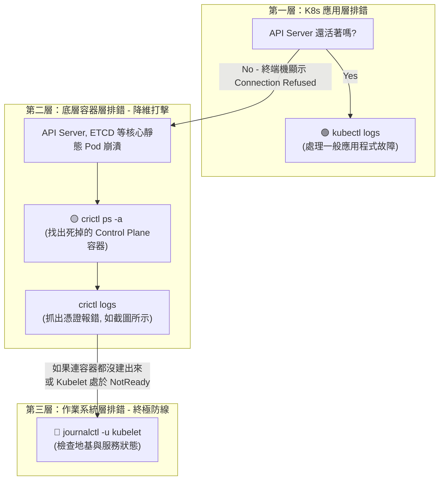

## 1. 🏷️ 課程定位
- **章節編號與名稱**：第 14 節： Troubleshooting (進階排錯架構)
- **影片標題**：150-2. View Certificate Details (結合截圖：crictl 與 K8s 降維排錯黃金順序)

## 2. 📌 核心概念摘要
在 Kubernetes 捨棄 Docker 之後，`crictl` (Container Runtime Interface CLI) 成為了考場與實務上用來與底層容器引擎（如 containerd）溝通的唯一標準工具。當 API Server 或 ETCD 等核心「靜態 Pod (Static Pods)」因為憑證錯誤而崩潰、導致 kubectl 斷線時，我們必須依賴「由上而下（K8s ➡️ 容器 ➡️ OS）」的黃金排錯順序，使用 `crictl` 來抓出最底層的死亡日誌。

## 3. 📊 流程圖與視覺化重現 (ASCII / Mermaid)
請把這張圖當作你在 CKA 考場上的「排錯大腦決策樹」。面對任何壞掉的元件，嚴格遵守這個降維打擊的順序：



## 4. 🔑 知識點擷取 (Detailed Notes)
**排錯黃金順序的核心邏輯 (Trigger Mechanism)：**
- **Level 1 (`kubectl`)**：只要 API Server 還有回應，永遠優先使用 K8s 原生指令。
- **Level 2 (`crictl`)**：專門用來對付「靜態 Pod (Static Pods)」。因為 `kube-apiserver`, `etcd`, `kube-scheduler` 都是跑在 Master 節點上的實體容器，當它們壞掉時 API Server 通常也死了，只能靠 `crictl` 繞過 K8s 直接看容器屍體。
- **Level 3 (`journalctl`)**：如果連容器都沒跑起來（crictl 找不到），代表地基 kubelet 根本沒在做事，直接去翻 Linux 系統日誌。

**什麼是 crictl？**
- K8s 專屬的底層容器除錯工具。你可以把它完全當作以前的 docker 指令來用（例如 `docker ps` 變成 `crictl ps`）。

**限制條件 (Limitations)：**
- `crictl` 是「節點級別 (Node-level)」的工具。如果你想看 Master 節點上 API Server 的容器日誌，你必須先 SSH 登入到 Master 節點，在外面是敲不到的。
- `crictl` 主要是拿來「看（Debug）」的，**絕對不要**在 K8s 環境裡用 `crictl rm` 去手動刪除或建立容器，這會跟 Kubelet 發生嚴重的狀態衝突。

## 5. 💻 CKA 必備實作指令 (Imperative Commands)
在考場上遇到 API Server 死亡的題目，請立刻 SSH 進入 Master 節點，並流暢地敲出以下連招：

```bash
# 🎯 考場神技 1：找出不斷崩潰（退出）的核心元件容器
# 就像你截圖中找到 87fc 那個 etcd 容器一樣
sudo crictl ps -a | grep Exited

# 🎯 考場神技 2：查看該死亡容器的臨終日誌
# 這是抓出 "tls: bad certificate" 這種致命錯誤的唯一方法
sudo crictl logs <container-id>

# 🔍 實務常識：如果日誌太長，可以限制輸出行數
sudo crictl logs --tail=50 <container-id>

# (備用) 如果你想看看某個 Pod 到底在哪個容器 ID 裡運行
sudo crictl pods
```

## 6. 🚀 CKA 考試延伸與 Troubleshooting
- **🎯 考試情境預測：**
  - **核心元件癱瘓題**：考題給你一個壞掉的叢集，執行任何 `kubectl` 都顯示 `The connection to the server 10.0.0.1:6443 was refused`。
  - **解題思路**：
    1. SSH 進入 Master 節點。
    2. 下達 `sudo crictl ps -a`，你會發現 `kube-apiserver` 或 `etcd` 不斷處於 `Exited`。
    3. 下達 `sudo crictl logs <ID>`，發現報錯 `no such file or directory` 或 `bad certificate`。
    4. 進入 `/etc/kubernetes/manifests/` 修正 YAML 檔中的憑證路徑，存檔後等待 Kubelet 自動重啟該容器即可拿分！

- **🛑 避坑指南 (考場致命傷)：**
  - **忘記 Docker 已經死了**：在目前的 CKA 考場環境中，底層幾乎全面採用 containerd。如果你習慣性地敲下 `docker ps`，系統會報錯找不到指令，或是印出空蕩蕩的列表。請強制自己的肌肉記憶：在 K8s 節點上除錯，一律使用 `crictl`！

- **🔧 Troubleshooting：**
  - 結合你的截圖：當你在 `crictl logs` 中看到 `tls: bad certificate`，這代表 YAML 設定檔中指派的憑證是錯的（例如把 Server 憑證塞給了 Client，或是 Issuer 不對）。修復方法永遠是去檢查 `/etc/kubernetes/manifests/` 對應的設定檔。
