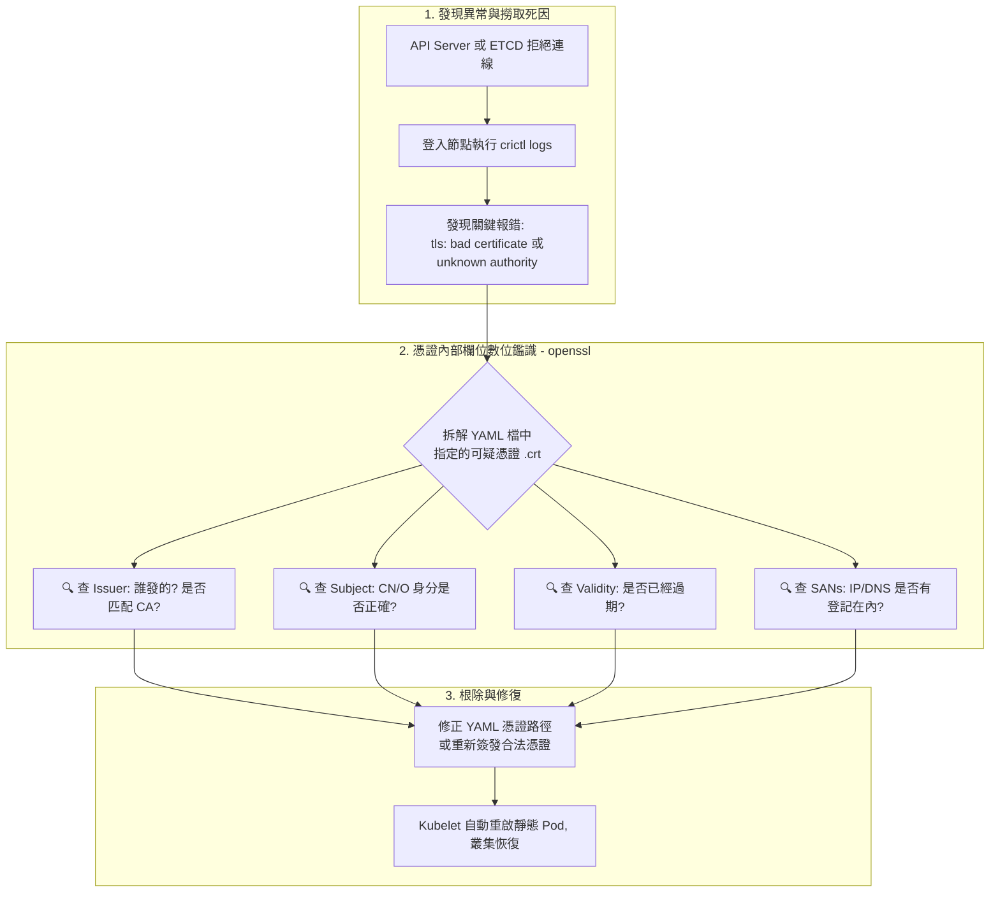

## 1. 🏷️ 課程定位
- **章節編號與名稱**：第 7 節： Security
- **影片標題**：150. View Certificate Details (憑證細節鑑識與降維排錯實戰完整版)

## 2. 📌 核心概念摘要
在 Kubernetes 的零信任架構中，當元件互連失敗時，我們不能盲目猜測。本節核心在於教導學員如何化身「數位鑑識專家」，利用 `openssl` 深入拆解憑證的內部欄位（如核發者、主旨、有效期限與 SANs），並結合底層容器日誌 (`crictl logs`)，精準抓出導致 Control Plane 癱瘓的「憑證不匹配」、「過期」或「設定檔指錯路徑」的真正死因。

## 3. 📊 流程圖與視覺化重現 (ASCII / Mermaid)
以下為處理核心元件癱瘓時，從「發現異常」到「憑證解剖鑑識」的完整 Troubleshooting 決策樹：



## 4. 🔑 知識點擷取 (Detailed Notes)
進行數位鑑識時，請死死盯住憑證內的這 **四大黃金欄位 (Definitions)**：

**1. Issuer (發證者)：**
- 證明這張憑證是誰蓋的章。
- **排錯重點**：這必須與接收方（Server 或 Client）設定檔中的 `ca.crt` 完全吻合。若不匹配，就會引發 `x509: certificate signed by unknown authority` 錯誤。

**2. Subject (主旨/申請人)：**
- 證明這張憑證屬於誰 (CN) 以及它的權限群組 (O)。
- **排錯重點**：檢查是否帶有正確的系統前綴（如 `system:nodes`），防止 Node Authorizer 拒絕存取。

**3. Validity (有效期限)：**
- 包含 Not Before 與 Not After。
- **排錯重點**：K8s 預設的憑證效期通常是 1 年。如果看到 `certificate has expired`，請立刻檢查此欄位確認死亡時間。

**4. Subject Alternative Name (SANs, 主旨備用名稱)：**
- 這是 API Server 等伺服器憑證的靈魂。因為 API Server 會被多個 IP（如實體 Node IP、虛擬 Cluster IP `10.96.0.1`）與 DNS（如 `kubernetes.default.svc`）呼叫。
- **排錯重點**：如果憑證裡的 SANs 沒有包含你連線時使用的 IP，終端機會直接報錯 `certificate is valid for X, not Y`。

## 5. 💻 CKA 必備實作指令 (Imperative Commands)
在考場上，用 cat 看 Base64 亂碼是沒有意義的。請把 `openssl` 當成你的 X 光機，熟記以下這幾組能夠大幅提升解題速度的參數：

```bash
# 🎯 考場神技 1：全面透視憑證細節 (考場上最常用)
# 透過 grep 快速抓出四大黃金欄位，不要自己用眼睛在幾百行裡找
openssl x509 -in /etc/kubernetes/pki/apiserver.crt -text -noout | grep -E "Issuer:|Subject:|Not After|Alternative" -A 1

# 🎯 考場神技 2：超快速「精準鑑識」參數 (不輸出廢話)
# 直接指定要看 subject, issuer, 和 dates (有效期)
openssl x509 -in /etc/kubernetes/pki/etcd/server.crt -noout -subject -issuer -dates

# 🎯 結合截圖情境：抓出死掉的 ETCD 並看臨終日誌
# 這是你在截圖中敲的指令，這就是找憑證死因的第一步！
crictl ps -a | grep etcd
crictl logs 87fc
```

## 6. 🚀 CKA 考試延伸與 Troubleshooting
- **🎯 考試情境預測：**
  - **靜態 Pod 癱瘓排錯題**：題目提示 `kube-apiserver` 無法啟動。你去看 `/etc/kubernetes/manifests/kube-apiserver.yaml`，發現裡面有五六個憑證參數。
  - **解題邏輯**：先用 `crictl logs` 看是哪個憑證出錯，接著用 `openssl x509` 去檢查那個檔案，你通常會發現考官故意把 `--tls-cert-file` 的路徑指到了一把 `.key` (私鑰)，或者是名為 `apiserver.crt` 但其實裡面裝的是 etcd 的憑證。將路徑修正即可。

- **🛑 避坑指南：**
  - **`tls: bad certificate` 的盲點**：就像你截圖中看到的報錯。這句話的意思是「對方看懂了這是一張憑證，但裡面的格式、內容或發證者是錯的」。在編輯 YAML 時，如果你把公鑰和私鑰的檔案路徑寫反了，就會 100% 觸發這個錯誤。

- **🔧 Troubleshooting 核心邏輯總結：**
  - 只要碰到安全與連線問題，背誦這個口訣：
    1. **看現象**：`kubectl get nodes / pods` 是否報錯。
    2. **挖屍體**：用 `crictl logs` 或 `journalctl -u kubelet` 找出是哪一個 `.crt` 被點名。
    3. **照 X 光**：用 `openssl x509 -in xxx.crt -text -noout` 檢查該憑證的 Issuer 與 Validity。
    4. **改設定**：回到 `/etc/kubernetes/manifests/` 修正靜態 Pod 的路徑。
