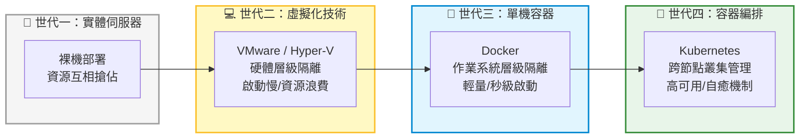

# 1. Course Introduction (課程與架構總覽)

## 🎯 核心觀念

- **分散式作業系統**：Kubernetes (K8s) 不是單純的容器執行引擎，而是一個強大的「分散式作業系統」，專為解決大規模企業級生產環境的調度痛點而生。
- **從 Docker 到 K8s 的鴻溝**：當你有 10 個容器，Docker 足矣；但若有 1000 個微服務散佈在 50 台機器上，機器壞了誰來重啟？誰來決定放在哪台？這正是 **Orchestration (容器編排)** 存在的終極意義。
- **K8s 的三大核心承諾**：
  - **自我修復 (Self-healing)**：容器崩潰即刻自動重啟，節點死機即刻將 Pod 轉移至健康節點。
  - **自動發布與回滾 (Rollouts/Rollbacks)**：服務不中斷的 Rolling Update，以及出錯時的秒級復原。
  - **水平擴展 (Horizontal Scaling)**：根據資源吃緊程度，動態且瞬間地增減實例數量。

## 📊 視覺化重現：基礎架構演進生命週期



## 💻 必考實戰指令 (初見叢集起手式)

身為叢集管理員，接手一個全新 Kubernetes 環境時，確認「大腦與四肢」是否健康是第一要務：

```bash
# 1. 👁️ 檢查控制平面 (Control Plane) 的健康狀態與 API Server 入口
kubectl cluster-info

# 2. 🦾 檢視叢集所有節點 (Nodes) 的狀態與版本
# 考場上，第一時間確認你擁有幾個 Master、幾個 Worker，以及它們是否都是 Ready 狀態
kubectl get nodes -o wide

# 3. 🔍 檢查客戶端與伺服器端的 K8s 版本 (Version Skew 檢查)
# 確保 kubectl 的版本與 API Server 版本落差沒有超過 1 個次要版本限制
kubectl version --short
```

> [!WARNING]
> **思維陷阱：K8s 不是「高級版的 Docker」**
> 很多初學者會帶著單機容器的思維來學 K8s，這會導致後續碰到 Network Policy 網路隔離或 RBAC 權限時嚴重卡關。請從第一天起，就把 K8s 視為一個**「宣告式 (Declarative) 的基礎架構 API 平台」**。

> [!TIP]
> **Troubleshooting 破局：連線被拒絕**
> 當你剛登入考場終端機，發現敲任何 `kubectl` 指令都顯示 `The connection to the server localhost:8080 was refused` 時，請不要慌。這通常代表你的 `kubeconfig` 檔案沒有被正確加載，或者你根本還沒切換到正確的 Context 叢集。此時下達 `kubectl config view` 來檢視配置是破局的第一步。

## 📝 YAML 骨架範例 (宣告式思維初探)

雖然第一堂課還沒有深入撰寫 Code，但理解 K8s 的「宣告式」哲學至關重要。以下這份極簡的 Pod YAML，就是你在對 K8s 大腦下達期望狀態 (Desired State)：

```yaml
apiVersion: v1
kind: Pod
metadata:
  name: hello-k8s
spec:
  containers:
  - name: web
    image: nginx:alpine
# K8s 大腦會讀取這份藍圖，自動安排機器並確保這個 Nginx 永遠活著
```

## 🧠 自我測驗

<details>
<summary>在 CKA 考場中，面對多個獨立的 Cluster 環境（例如 k8s-dev, k8s-prod），你發現下達指令後出現 <code>localhost:8080 was refused</code>。請問背後的原因為何，你該如何排查？</summary>

**可能原因**：
API Server 預設會去讀取 `~/.kube/config` 中的憑證與叢集資訊。出現 `localhost:8080 was refused` 拒絕連線，代表 `kubectl` 沒有找到合法的 Config 檔案，導致指令退回向預設的 localhost 尋找大腦，因而無人回應。

**排查步驟**：
1. 執行 `kubectl config view` 檢查是否有讀取到正確的叢集與憑證資訊。
2. 考場通常會在每一題的開頭提供切換 Context 的指令（如 `kubectl config use-context <cluster-name>`），請仔細檢查題目提示並重新切換到該題對應的正確叢集環境中。
</details>
