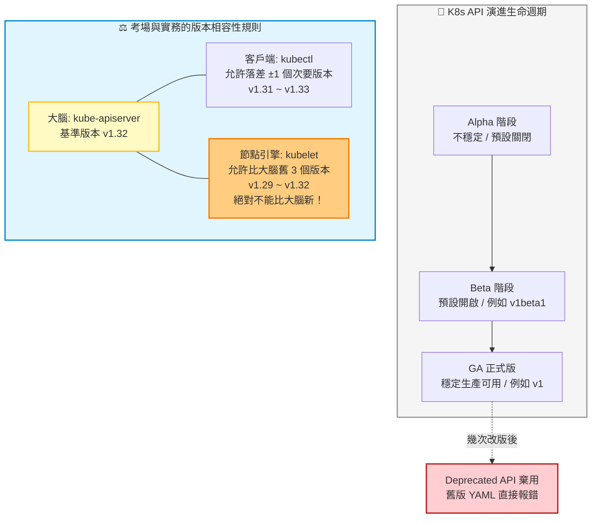

# 3. Course Release Notes (版本演進與 API 棄用機制)

## 🎯 核心觀念

- **環境同步的重要性**：Kubernetes 是一個高速發展的開源專案（約每 4 個月釋出一個次要版本）。CKA 考場永遠採用最新或次新穩定版本（目前約為 v1.32/v1.33）。關注 Release Notes 不是為了死背版號，而是要掌握「API 棄用機制」與「組件版本偏差規則」。
- **API 棄用機制 (API Deprecation)**：為了保持系統輕量與現代化，K8s 會無情地拔除過期的 API（經歷 Alpha ➡️ Beta ➡️ GA ➡️ Deprecated 的週期）。若你在考場上抄襲過時網路文章中的 YAML，部署時會直接報錯癱瘓。
- **版本偏差策略 (Version Skew Policy) 🌟**：這是 CKA 叢集升級大題的底層邏輯：
  - **大腦基準**：叢集以控制平面的 `kube-apiserver` 版本為最高指導原則。
  - **客戶端 (`kubectl`)**：允許與大腦落差 ±1 個 Minor 版號。
  - **工作節點 (`kubelet`)**：為了支援百台機器的「滾動式升級」，允許比大腦舊 3 個 Minor 版號，但**絕對不能比大腦新**！

## 📊 視覺化重現：API 演進與版本偏差防護網



## 💻 必考實戰指令 (化解版本焦慮的神器)

在考場上面對不熟悉的 API 版本，這三個指令能讓你在茫茫網海中精準定位：

```bash
# 1. 👁️ 考前/實務接手叢集第一步：精確確認大腦與客戶端的版號
kubectl version

# 2. 🔍 考場救命技：忘記某個物件該用哪個 apiVersion 嗎？查它就對了！
# 這會列出當前考場叢集「唯一合法支援」的 API 群組與版本 (例如 Deployment)
kubectl api-resources | grep deployment

# 3. 📖 深入檢查該版本下的特定 YAML 欄位結構是否改變
# 當網路上抄來的 YAML 報錯時，用 explain 確認當前新版本正確的縮排與欄位名稱
kubectl explain deployment.spec
```

> [!CAUTION]
> **升級大題陷阱：踩到版本偏差的紅線**
> Cluster Upgrade (叢集升級) 是佔分極重的大題。若題目要求將 Node 從 v1.31 升級到 v1.32，你必須遵循相容性規則：**先升級 Master，再升級 Worker**。如果你急躁地先升級了 Worker 的 `kubelet`，導致它比大腦 `kube-apiserver` 還新，該節點會在考場上瞬間崩潰斷聯！

> [!WARNING]
> **考古題陷阱：被拋棄的指令與 YAML**
> 考前切忌死背 3 年前的舊題庫！例如舊版好用的 `kubectl run --generator` 參數已被徹底移除；若在 YAML 頂端手打 `apiVersion: extensions/v1beta1` 來建 Deployment，會被 API Server 直接退件。

> [!TIP]
> **Troubleshooting 破局：API 被棄用報錯**
> 當執行 `kubectl apply` 時出現 `no matches for kind "Ingress" in version "extensions/v1beta1"`。這代表你的 YAML 使用了被當前叢集淘汰的舊版 API。
> **解法**：立刻輸入 `kubectl api-resources | grep ingress` 找出當前合法的群組名稱（通常會演進為 `networking.k8s.io/v1`），然後用 `vim` 直接改掉 YAML 的第一行即可。

## 📝 YAML 骨架範例 (API 演進對比)

以下為 Deployment 宣告的 API 版本演進。考場上請永遠使用最新的 GA 版本寫法：

**❌ 舊版棄用寫法 (會直接報錯)**：
```yaml
apiVersion: extensions/v1beta1
kind: Deployment
metadata:
  name: old-deployment
# ...
```

**✅ 現代標準寫法 (考場必用)**：
```yaml
apiVersion: apps/v1
kind: Deployment
metadata:
  name: modern-deployment
spec:
  # 注意：從 apps/v1 進入 GA 開始，selector 成為了嚴格要求的強制性欄位！
  selector:
    matchLabels:
      app: web
# ...
```

## 🧠 自我測驗

<details>
<summary>在考場中，你從網路上複製了一段 <code>Ingress</code> 的 YAML 範本並執行 <code>kubectl apply -f ingress.yaml</code>，但系統毫不留情地回報 <code>error: unable to recognize "ingress.yaml": no matches for kind "Ingress" in version "networking.k8s.io/v1beta1"</code>。請列出你的排障 SOP。</summary>

**排障與修復 SOP：**
1. **確認錯誤**：錯誤訊息明確指出當前的叢集大腦（API Server）已經不認識且拒絕了 `networking.k8s.io/v1beta1` 這個舊版 Ingress API。
2. **查詢合法版本**：立刻下達指令 `kubectl api-resources | grep ingress`。系統會回傳當前叢集官方支援的唯一正確群組名稱與版本，現代版本應為 `networking.k8s.io/v1`。
3. **驗證結構變更**（強烈建議）：API 版號升級通常伴隨內部屬性的強制變更，下達 `kubectl explain ingress.spec` 檢查新規範（例如 backend 的寫法差異）。
4. **修改並套用**：使用 `vim ingress.yaml`，將第一行的 `apiVersion` 更新為查到的合法版本，並修正內部的縮排格式，最後再次執行 `kubectl apply -f ingress.yaml` 即可闖關成功。
</details>
