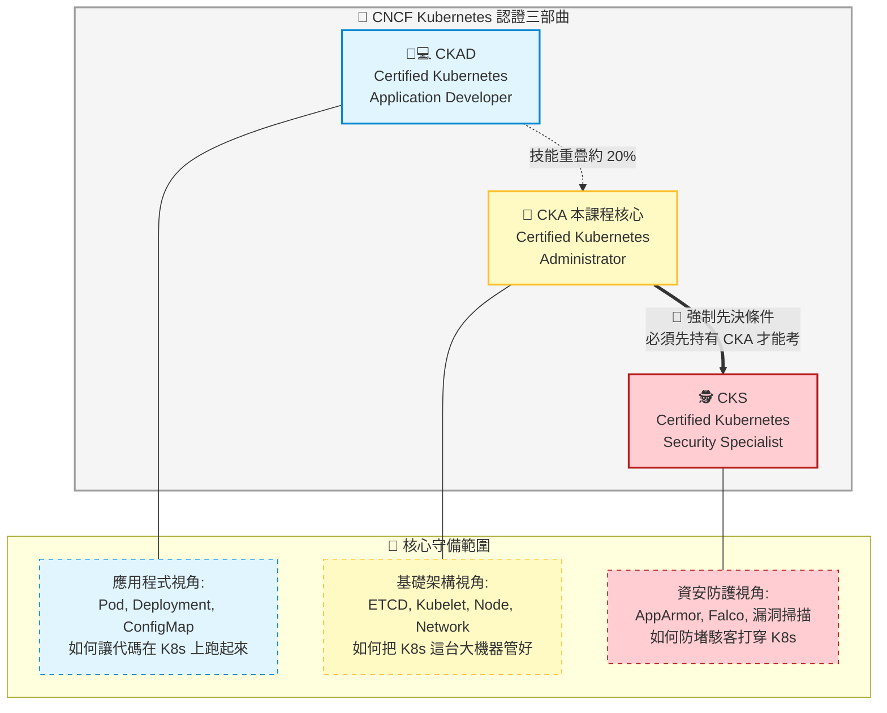

# 4. The Kubernetes Trilogy (K8s 認證三部曲)

## 🎯 核心觀念

- **K8s 認證三部曲**：CNCF 官方推出了三張核心的 Kubernetes 專業認證：CKAD（開發者）、CKA（管理員）與 CKS（資安專家），各自擁有明確的守備範圍。
- **CKAD (開發者認證)**：專注於「如何讓代碼在 K8s 上跑起來」。核心考點包含 Pod 設計模式、環境變數注入、Job 排程等。完全不會考底層的安裝或節點維護。
- **CKA (管理員認證 - 🌟 本課程核心)**：專注於「如何把 K8s 這台大機器管好」。除了包含基礎部署能力，更著重於控制平面排查、ETCD 備份還原、Kubeadm 叢集升級與節點維護 (Cordon/Drain)。是三者中含金量與實用性最廣的認證。
- **CKS (資安專家認證)**：專注於「如何防堵駭客打穿 K8s」。涉及 Trivy、Falco 等第三方工具。**硬性先決條件：必須先擁有未過期的 CKA 證書** 才能報考。

## 📊 視覺化重現：認證路線與能力地圖



## 💻 必考實戰指令 (CKA 管理員專屬領域)

為了凸顯 CKA 的管理員獨有職責，以下指令是 CKAD 考生不需要碰，但 CKA 考生必須滾瓜爛熟的叢集級操作：

```bash
# 1. 🛡️ CKA 專屬：標記節點為不可調度 (Cordon)
# 阻止新的 Pod 被分配到這個有問題或即將維修的節點上
kubectl cordon <node-name>

# 2. 🛡️ CKA 專屬：抽離節點進行維護 (Node Maintenance)
# 當 Node 需要升級或維修時，安全地驅逐上面的所有 Pod
kubectl drain <node-name> --ignore-daemonsets --force

# 3. 🧠 CKA 專屬：ETCD 備份與還原 (叢集災難復原)
# 這是 CKA 必考大題！利用 etcdctl 直接對底層資料庫進行快照備份
ETCDCTL_API=3 etcdctl --endpoints=https://127.0.0.1:2379 \
  --cacert=/etc/kubernetes/pki/etcd/ca.crt \
  --cert=/etc/kubernetes/pki/etcd/server.crt \
  --key=/etc/kubernetes/pki/etcd/server.key \
  snapshot save /opt/snapshot-pre-boot.db
```

> [!CAUTION]
> **避坑指南：過度準備的陷阱**
> 很多考生在準備 CKA 時，會不小心鑽牛角尖去讀太深奧的底層資安工具（例如 AppArmor profile 或 Seccomp）。請冷靜，那是 CKS 的範圍！在 CKA 考試中，資安部分只需要專注於 **RBAC (角色權限綁定)** 與 **NetworkPolicy (網路通訊策略)** 即可。

> [!TIP]
> **上帝視角與心智模式切換**
> 在解 CKA 題目時，你必須切換到「上帝視角」。如果一個 Deployment 跑不起來，CKAD 的思維只會去查 YAML 有沒有寫錯；但 CKA 的你必須具備聯想力，去懷疑「是不是 Kube-Scheduler 掛了？」或是「這個 Node 上的 Kubelet 憑證過期了？」。這正是管理員的價值所在。

## 📝 YAML 骨架範例 (CKA 管理員獨有的 Static Pod 領域)

CKA 考生必須深刻理解 Kubernetes 控制平面的核心元件。這些維持叢集運作的「大腦」，其實是以 `Static Pod` 的形式運行在 Master 節點上，且不由任何 Deployment 所控制：

```yaml
# 檔案位置通常深藏在 Master 節點的作業系統中：/etc/kubernetes/manifests/kube-apiserver.yaml
apiVersion: v1
kind: Pod
metadata:
  name: kube-apiserver
  namespace: kube-system
spec:
  containers:
  - command:
    - kube-apiserver
    - --advertise-address=192.168.1.10
    - --allow-privileged=true
    # 🔴 CKA 考點：若此檔案的 command 參數寫錯一個字，整個叢集會瞬間斷聯癱瘓！
    image: registry.k8s.io/kube-apiserver:v1.32.0
```

## 🧠 自我測驗

<details>
<summary>當你下達 <code>kubectl get pods</code> 指令時，終端機報錯 <code>The connection to the server was refused</code>。請問以 CKAD (開發者) 與 CKA (管理員) 的視角，兩者的應對方式有何根本上的不同？</summary>

- **CKAD (開發者) 視角**：可能會束手無策，或是只能檢查自己電腦上的 `~/.kube/config` 檔案是否寫錯，若確認配置無誤，只能將問題回報給 IT 基礎架構部門。
- **CKA (管理員) 視角**：除了檢查 config 之外，管理員的第一反應會立刻透過 `ssh` 登入 Master 節點，執行 `systemctl status kubelet` 檢查節點引擎是否崩潰，或是進入 `/etc/kubernetes/manifests` 目錄檢查 `kube-apiserver.yaml` 的配置參數是否被不當修改。具備這種底層穿透能力，就是 CKA 的核心精神。
</details>
