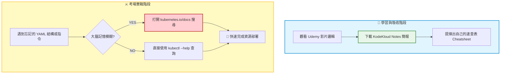

# 5. Notes available at KodeKloud Notes (學習資源與檢索策略)

## 🎯 核心觀念

- **大腦減壓法則 (Offloading Memory)**：Kubernetes 的 API 資源高達數十種，欄位更是成千上萬。即使是資深的雲端架構師，也不可能（也不需要）記住所有的 YAML 縮排與精確結構。請將大腦記憶體用來記憶「底層邏輯」與「應用場景」，細節請交給文檔檢索。
- **高效率學習法**：不要花時間去截圖每一頁課程影片！直接下載官方專屬的 KodeKloud Notes，並在旁邊加上自己的實作踩坑紀錄，這才是最高效的個人化知識提煉法。
- **理解大於死背**：學習 CKA 的重點請放在：「什麼情境該用什麼資源？」（例如：何時該用 DaemonSet 而不是 Deployment？），至於「這個資源的 YAML 怎麼寫」，請交給您強大的檢索能力。

## 📊 視覺化重現：知識儲存與檢索工作流



## 💻 必考實戰指令 (考場最強的離線筆記)

在無法訪問 KodeKloud 筆記與個人整理庫的考場上，終端機內建的說明文件就是你最強大的武器：

```bash
# 1. 📖 考場離線筆記：最快速的指令語法查詢
# 當你忘記怎麼用 Imperative 指令建立資源時，--help 裡面通常會直接附帶「可直接複製的完美範例」
kubectl run --help
kubectl create secret --help

# 2. 🔍 考場離線字典：精準查詢 YAML 欄位結構與定義
# 如果你不確定 livenessProbe 應該放在 pod.spec 的哪一層，用 explain 查最準確
kubectl explain pod.spec.containers.livenessProbe

# 3. 📝 實務除錯神技：將錯誤日誌存成臨時筆記以利比對
# 在 troubleshooting 時，把複雜冗長的報錯先重導向到文字檔，用 vim 慢慢看
kubectl describe pod broken-pod > /tmp/pod-error.txt
```

> [!CAUTION]
> **致命雷區：書籤禁令與外部資源**
> 考場上**絕對禁止**訪問 KodeKloud Notes、個人的 GitHub 筆記或是任何外部技術部落格。請注意：過去 CKA 考試允許攜帶瀏覽器書籤，但現在的考場系統（PSI Secure Browser）已經**全面封殺自訂書籤功能**。你必須學會直接在官方文檔 (`kubernetes.io/docs`) 的搜尋框中輸入精準關鍵字。

> [!TIP]
> **Troubleshooting：官方 YAML 貼上報錯的排查順序**
> 當你在官方文檔複製了一段 YAML，滿懷信心地貼到考場終端機卻發生語法錯誤時，請優先檢查：
> 1. 該官方範例的 `apiVersion` 是否符合目前考場叢集的版本？
> 2. 複製貼上時，第一行的縮排是否跑掉了？（在終端機使用 `vim` 時，請務必善用 `:set paste` 再行貼上）。

## 📝 實戰演練範例 (文件導向的紀錄法)

考場上常有 Troubleshooting 大題，考官會要求你將某個崩潰物件的原因找出來，並存到指定的文字檔中。你可以透過指令重導向 (`>`)，這等同於在考場製作一份「臨時病歷筆記」：

```bash
# 題目要求：請找出 db-pod 無法啟動的原因，並將相關 Events 紀錄寫入 /opt/db-error.txt
kubectl describe pod db-pod -n database > /opt/db-error.txt

# 驗證內容：使用 cat 搭配 grep 快速確認你的答案是否寫進去
cat /opt/db-error.txt | grep -A 5 "Events:"
```
*這是一個常見且必拿的取分技巧：將終端機畫面無法一次看完的巨量日誌，轉化為靜態檔案以便利用 `vim` 或 `grep` 進行深度搜索分析。*

## 🧠 自我測驗

<details>
<summary>在考場中，題目要求你設定一個具有 <code>hostPath</code> 的 Persistent Volume (PV)。你突然忘記了 <code>hostPath</code> 這個屬性的精確大小寫與所在的 YAML 縮排層級，在沒有書籤的情況下，你該如何快速自救？</summary>

**快速自救 SOP：**
1. **內部檢索 (最快，首選)**：直接在終端機輸入 `kubectl explain pv.spec.hostPath`，它會立刻告訴你該欄位的精確大小寫、型別以及擺放位置。
2. **外部檢索 (最穩，次選)**：打開官方文件 `kubernetes.io/docs`，在右上角搜尋框輸入 `hostpath` 或 `persistent volume`。點進第一篇文章，按下 `Ctrl+F` 搜尋關鍵字 `hostPath:`，通常能在 10 秒內找到可直接複製的完整 YAML 範例。
3. **注意事項**：從官方複製範例前，請特別留意該範例是否參雜了題目未要求的額外設定（如 nodeAffinity），貼上至 `vim` 編輯器前請記得開啟 `:set paste`。
</details>
