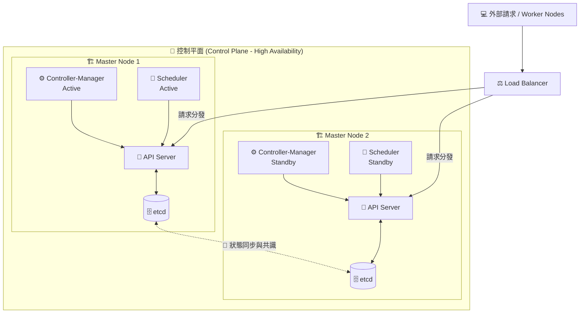

# 241. Design a Kubernetes Cluster

## 🧠 核心觀念：打造不落的叢集大腦 (High Availability)
- **消除單點故障 (SPOF)**：在生產環境中，如果叢集只有一個 Master Node（大腦），一旦這台機器硬體毀損，整個叢集將陷入癱瘓，無法進行任何調度或修復。
- **高可用性 (High Availability)**：設計 HA 叢集的核心目標，就是透過部署「多個 Master Node」，將控制平面 (Control Plane) 的元件進行分散與備援。
- **分工與共識**：即使部分大腦受損，叢集仍能依靠健康的節點持續穩定運作，這就像是擁有多個副駕駛的飛機，確保航行絕對安全。

## 📊 高可用架構 (Multi-Master) 內部運作流



## 🔑 核心知識點：控制平面元件的部署特性

### 1. API Server (無狀態守門員)
- **無狀態 (Stateless)**：它可以同時存在多個實體且同時處理請求 (**Active-Active**)。
- **負載均衡**：在多 Master 架構下，前方**必須**放置一個 Load Balancer（如 HAProxy 或 Nginx），將 Worker Node 的 `kubelet` 流量與管理員的 `kubectl` 指令平均分發給不同的 API Server。

### 2. etcd (叢集的絕對真理)
- **存放狀態**：它是分散式鍵值資料庫，存放叢集所有的設定與絕對狀態。
- **部署拓樸**：可以與 Master 同節點部署 (Stacked Topology)，或獨立架設於外部伺服器 (External Topology) 以提高安全性與效能。
- **⚠️ 奇數限制**：為了確保 Raft 共識演算法能正常運作（發生網路割裂時能以多數決選出 Leader），etcd 節點數量**強烈建議為奇數**（如 3, 5, 7 個）。

### 3. Controller Manager & Scheduler (選主機制)
- **避免衝突**：為了避免「兩個 Scheduler 同時把同一個 Pod 分配給兩個不同的 Node」等衝突，這兩個元件只能運行於 **Active-Standby (主從)** 模式。
- **Leader Election**：它們會透過 Kubernetes 的 Lease API 進行「選主」。同一時間只有一個實體是 Active，如果 Active 節點當機，Standby 節點會立刻接手繼續工作。

## 💻 必考實戰指令 (Imperative Commands)

考場上遇到叢集架構或節點狀態排障時，這幾個指令能讓你快速掌握大局：

```bash
# 🔍 快速列出叢集中所有的 Control Plane (Master) 節點
# 考場叢集可能有多個 Master，排障前先確認你在哪台機器上
kubectl get nodes -l node-role.kubernetes.io/control-plane

# 📂 [極重要] 查看 Master Node 上核心元件的 Static Pod YAML 定義檔
# 舉凡 API Server, etcd 等設定參數 (如憑證路徑) 都在這裡
ls -l /etc/kubernetes/manifests/

# 🔄 檢查 kubelet 狀態 (如果某個 Master Node 一直呈現 NotReady)
systemctl status kubelet
journalctl -u kubelet | tail -n 20
```

## 🔧 實戰 SOP 與 Troubleshooting

> [!IMPORTANT]
> **考試情境預測**
> 1. **叢集升級 (Cluster Upgrade)**：CKA 必考題！升級時必須先升級主節點，再升級工作節點。如果是多 Master 架構，必須「逐一」進行 (`cordon` -> `drain` -> `kubeadm upgrade` -> `uncordon`)，**絕不能一次把所有 Master 都關掉**。
> 2. **etcd 備份與還原**：了解 etcd 的重要性後，考場必定會考 `etcdctl snapshot save` 與 `restore`。

> [!CAUTION]
> **避坑指南：修改 Static Pod 導致的災難**
> 在 `/etc/kubernetes/manifests/` 下修改任何元件（如 `kube-apiserver.yaml`），kubelet 會自動偵測並重啟該 Pod。
> 如果你不小心打錯一個字（例如縮排錯了、憑證路徑拼錯），該元件會「默默地消失（無法啟動）」，此時你用 `kubectl` 只會得到 *The connection to the server was refused* 的絕望回應。
> **💡 唯一解法 SOP：修改前務必先將 YAML 備份到其他目錄 (如 `/tmp`)！**

> [!WARNING]
> **Troubleshooting：當 API Server 徹底掛掉時怎麼辦？**
> 當 `kubectl` 完全沒反應時，你無法依賴 `kubectl get pods` 進行排障。
> **急救步驟：**
> 1. 直接 SSH 進入該 Master Node。
> 2. 使用 `crictl ps` 或 `docker ps`（依考場容器運行時而定）尋找 `kube-apiserver` 的容器。
> 3. 如果容器不斷重啟或消失，立刻使用 `crictl logs <container-id>` 揪出設定檔中的錯誤語法或憑證遺失問題。

## 📝 YAML 骨架 (Static Pod 範例：kube-apiserver)

*（僅供參考結構，實務上由 kubeadm 自動生成，位於 `/etc/kubernetes/manifests/`，是 CKA 修改設定的重鎮）*
```yaml
apiVersion: v1
kind: Pod
metadata:
  name: kube-apiserver
  namespace: kube-system
spec:
  containers:
  - command:
    - kube-apiserver
    - --advertise-address=192.168.1.10
    - --allow-privileged=true
    - --authorization-mode=Node,RBAC
    # ...其他參數配置
    image: registry.k8s.io/kube-apiserver:v1.30.0
    name: kube-apiserver
  hostNetwork: true # 關鍵：直接使用宿主機網路，不走 CNI
```

## ❓ 自我測驗

<details>
<summary>為什麼在高可用叢集中，<code>etcd</code> 的節點數量強烈建議設定為奇數（例如 3, 5, 7 個），而不是偶數？</summary>

**解答：**
為了防止「腦裂 (Split-Brain)」現象。
`etcd` 依賴 Raft 共識演算法來決定叢集狀態。當發生網路中斷導致節點被一分為二時，必須有一方能夠取得「過半數（多數決）」的票數才能繼續運作。如果是偶數節點（例如 4 個拆成 2 和 2），兩邊都無法取得絕對多數，整個叢集將陷入停擺。
</details>
