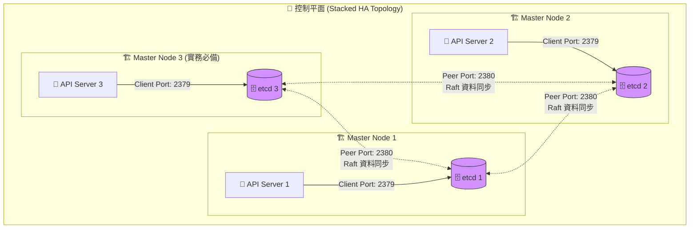

# 244. ETCD in HA

## 🧠 核心觀念：守護大腦的絕對記憶
- **分散式大腦**：在 HA 架構中，etcd 本身也必須組成一個具備容錯能力的分散式叢集。
- **Raft 共識演算法**：它的底層運作目標是透過 Raft 共識演算法，讓多個實體節點上的 etcd 實例（Instances）能即時同步資料，確保狀態的絕對一致性。
- **堅如磐石的介面**：它必須提供穩定的介面，讓上層唯一的客戶 (API Server) 能隨時讀寫叢集狀態，確保 Kubernetes 的「大腦記憶」即使在節點重啟後也絕對不會遺失。

## 📊 etcd 內部通訊機制 (Stacked Topology)



## 🔑 核心知識點：通訊埠與叢集配置

### 1. 核心通訊埠 (Ports) 的職責拆分
- **Port 2379 (Client URL)**：專門用來服務「客戶端」。在 K8s 中，唯一的客戶端就是 `kube-apiserver`。如果 API Server 壞了，你要手動下 `etcdctl` 指令排障，也是打這個 Port。
- **Port 2380 (Peer URL)**：專門用來服務「自己人」。etcd 節點之間透過這個 Port 進行 Raft 選舉、心跳檢測與資料同步。

### 2. 底層對象限制與 Static Pod 配置 (`etcd.yaml`)
要讓多個獨立的 etcd 實例互相認識並組建叢集，`kubeadm` 會在 `/etc/kubernetes/manifests/etcd.yaml` 中自動注入以下關鍵參數：
- `--initial-cluster`：宣告叢集初始成員清單（例如 `master1=https://10.0.0.1:2380,master2=https://10.0.0.2:2380`）。**限制**：如果這裡少寫一台，或者 IP 打錯，etcd 叢集會無法成功建立。
- `--listen-peer-urls` / `--initial-advertise-peer-urls`：綁定並廣播自己的 2380 端口。
- `--listen-client-urls` / `--advertise-client-urls`：綁定並廣播自己的 2379 端口。

### 3. 安全性 (TLS Certificates)
- **雙向認證 (mTLS)**：etcd 叢集內部的通訊 (Peer) 與外部的連線 (Client) 都是**完全加密且需要雙向認證**的。這就是為什麼考場上操作 `etcdctl` 時，永遠要帶上一大串憑證路徑。

## 💻 必考實戰指令 (Imperative Commands)

在 CKA 考場上，操作 etcd 之前必須先宣告使用 API Version 3，並且熟記如何帶入憑證：

```bash
# 🎯 [考場神技] 先匯入環境變數，強迫 etcdctl 使用 v3 API (沒加這個很多指令會報錯)
export ETCDCTL_API=3

# 🔍 查看 etcd 叢集成員清單 (確認 HA 狀態)
# 注意：必須帶入 CA、Cert 和 Key，預設路徑通常在 /etc/kubernetes/pki/etcd/ 之下
etcdctl member list \
  --endpoints=https://127.0.0.1:2379 \
  --cacert=/etc/kubernetes/pki/etcd/ca.crt \
  --cert=/etc/kubernetes/pki/etcd/server.crt \
  --key=/etc/kubernetes/pki/etcd/server.key

# 🩺 檢查 etcd 叢集的健康狀態與當前 Leader 是誰
etcdctl endpoint health \
  --endpoints=https://127.0.0.1:2379 \
  --cacert=/etc/kubernetes/pki/etcd/ca.crt \
  --cert=/etc/kubernetes/pki/etcd/server.crt \
  --key=/etc/kubernetes/pki/etcd/server.key
```

## 🔧 實戰 SOP 與 Troubleshooting

> [!IMPORTANT]
> **考試情境預測：etcd 備份與還原 (佔分極重)**
> 這題通常佔分 8-10%。題目會要求你備份某個叢集的 etcd 到指定路徑，然後將其還原。
> 操作時，你必須精準使用 `etcdctl snapshot save` 與 `etcdctl snapshot restore`，且**絕對不能漏掉** `--cacert`, `--cert`, `--key` 三個安全參數。

> [!WARNING]
> **避坑指南：Restore 後的靜態路徑變更陷阱**
> 使用 `etcdctl snapshot restore` 還原資料庫後，它會產生一個新的資料夾（例如 `--data-dir=/var/lib/etcd-backup`）。
> **最常死在這裡**：你成功還原了，但忘記去 `/etc/kubernetes/manifests/etcd.yaml` 裡面，把 `hostPath` 的路徑改成這個新生成的資料夾。如果不改，etcd Pod 重啟後還是會讀取舊的壞資料！

> [!TIP]
> **Troubleshooting：etcd 不斷 CrashLoopBackOff**
> **排查步驟**：etcd 一旦掛掉，`kubectl` 就會完全失效。此時請直接 SSH 登入 Master 節點，去查看底層 etcd 的容器日誌。
> **指令**：先用 `crictl ps -a | grep etcd` 找到 Container ID，然後執行 `crictl logs <container-id>`。
> **常見死因**：通常是 `/etc/kubernetes/manifests/etcd.yaml` 被人不小心改壞了（例如 YAML 縮排錯誤，或是憑證掛載路徑被改錯），導致容器啟動失敗。

## 📝 YAML 骨架 (etcd.yaml 陷阱區)

*(這是在考場執行 etcd Restore 後，必須手動修改的關鍵區塊：)*
```yaml
apiVersion: v1
kind: Pod
metadata:
  name: etcd
  namespace: kube-system
spec:
  containers:
  - command:
    - etcd
    # ...其他配置...
  volumes:
  - hostPath:
      # ⚠️ 考場致命陷阱：Restore 後，這裡必須改成你新產生的備份資料夾路徑！
      path: /var/lib/etcd-backup 
      type: DirectoryOrCreate
    name: etcd-data
```

## ❓ 自我測驗

<details>
<summary>當你發現 Kubernetes 叢集狀態異常，需要手動使用 <code>etcdctl</code> 進行排障時，你應該連線到 etcd 的哪一個 Port (2379 還是 2380)？為什麼？</summary>

**解答：**
應該連線到 **2379 (Client Port)**。
因為 2379 是專門開放給客戶端（包含 API Server 以及手動執行的 `etcdctl` 指令）讀寫資料庫的通訊埠。而 2380 (Peer Port) 僅限於 etcd 叢集內部節點互相溝通、選舉 Leader 與同步 Raft 資料使用，並不接受外部的操作請求。
</details>
