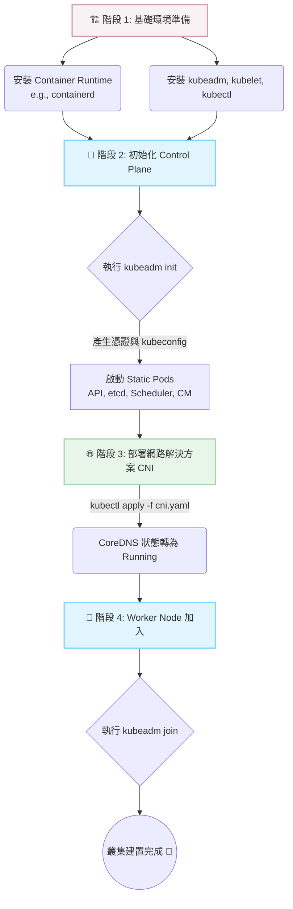

# 部署與 kubeadm 簡介 (Deployment With kubeadm - Introduction)

## 📌 核心觀念摘要
* **單一職責原則**：`kubeadm` 是官方推薦的叢集引導建置標準工具。就像是**大樓的發包中心**，它只負責把大樓的主體骨架（Control Plane 組件、憑證）搭好，不負責鋪設水管（網路 CNI）或安裝電梯（Container Runtime）。
* **自動憑證與組態管理**：自動為叢集簽發所有必要的 TLS 憑證，並建立 `kubeconfig`，讓管理者省去繁瑣的手動憑證設定，降低資安風險。
* **Static Pods 的運用**：`kubeadm` 透過 `kubelet` 讀取特定的目錄 (`/etc/kubernetes/manifests`)，以 Static Pod 的形式拉起 API Server、etcd 等核心組件。
* **網路與運行時分離**：如同**插座與電器**的關係——`kubeadm` 準備好介面（插座），但你需要自己帶網路解決方案（CNI）和容器運行時（CRI）來插上使用。

## 📊 叢集建置生命週期流程圖



## 💻 必考指令 (Imperative Commands)

```bash
# 1. 查找 kubeadm init 的可用參數與選項
kubeadm init --help | grep network

# 2. 初始化控制平面 (Control Plane)
# 🚨 關鍵參數：必須與後續安裝的 CNI 網段匹配
sudo kubeadm init --pod-network-cidr=10.244.0.0/16 

# 3. 配置管理者的 Kubeconfig (解決 localhost:8080 was refused)
mkdir -p $HOME/.kube
sudo cp -i /etc/kubernetes/admin.conf $HOME/.kube/config
sudo chown $(id -u):$(id -g) $HOME/.kube/config

# 4. 重新生成 Worker Node 加入叢集的指令
# 當考題要求加入新 Node，且遺失 token 時必備：
kubeadm token create --print-join-command

# 5. 節點重置與清理環境 (Troubleshooting 必備)
sudo kubeadm reset -f

# 6. 檢查節點狀態與驗證
kubectl get nodes -o wide
```

## 🛠️ 實戰與最佳實踐

> [!WARNING]
> **備份機制與安全提示**
> 執行 `kubeadm reset` 或升級前，強烈建議備份 `/etc/kubernetes/` 目錄及 `/var/lib/etcd`。
> 若要修改 Static Pod 的 YAML，一定要先拷貝一份到其他目錄：`cp /etc/kubernetes/manifests/kube-apiserver.yaml /root/kube-apiserver.yaml.bak`

> [!TIP]
> **SOP：加入新的 Worker Node**
> 1. 確認 Worker Node 已關閉 Swap (`swapoff -a`)。
> 2. 在 Master Node 執行 `kubeadm token create --print-join-command`。
> 3. 複製輸出的指令到 Worker Node 執行。
> 4. 回到 Master Node 執行 `kubectl get nodes` 驗證狀態是否從 `NotReady` 轉為 `Ready`。

> [!CAUTION]
> **Troubleshooting 必殺技**
> - **init 卡住/失敗**：第一時間查看 Kubelet 日誌：`journalctl -u kubelet -f`。
> - **節點維持 NotReady**：使用 `kubectl describe node <node-name>` 檢查，最底下通常會顯示 `NetworkPluginNotReady`，代表忘記安裝 CNI 或 CNI 崩潰。
> - **網段衝突 (路由黑洞)**：確保 `--pod-network-cidr` 的網段絕對不能與節點實體網路的 IP 網段重疊。

## 📜 YAML 骨架 (叢集設定檔)

在進階考題中，可能會要求透過設定檔而非指令參數來初始化。

```yaml
# kubeadm-config.yaml
apiVersion: kubeadm.k8s.io/v1beta3
kind: ClusterConfiguration
kubernetesVersion: "v1.30.0" # ⚠️ 確保與要求版本相符
networking:
  podSubnet: "10.244.0.0/16" # 🚨 CNI 對應網段
---
apiVersion: kubeadm.k8s.io/v1beta3
kind: InitConfiguration
localAPIEndpoint:
  advertiseAddress: "192.168.1.100" # 替換為 Master 節點真實 IP
  bindPort: 6443
```
* **執行指令**：`sudo kubeadm init --config kubeadm-config.yaml`

## 🧠 自我測驗

<details>
<summary>Q1: kubeadm 會幫忙安裝並配置 Flannel 或 Calico 等網路插件嗎？</summary>

**解答：不會。** 
`kubeadm` 遵循單一職責原則，不負責部署 CNI。必須在 init 完成後，手動透過 `kubectl apply -f <cni.yaml>` 部署 CNI。若未安裝，節點狀態將永遠卡在 `NotReady`，CoreDNS 也會停在 `Pending`。
</details>

<details>
<summary>Q2: 在考場中，如果需要把一台全新的機器加入現有叢集，卻找不到 Token，該輸入什麼指令？</summary>

**解答：** 
請先在控制平面 (Master Node) 上執行：
`kubeadm token create --print-join-command`
然後將生成的完整 `kubeadm join ...` 指令貼到 Worker 節點上執行。
</details>

<details>
<summary>Q3: 如果 kubeadm init 失敗中斷，第一步的 Troubleshooting 應該做什麼？</summary>

**解答：檢查 kubelet 服務日誌。** 
因為 kubeadm 本身不負責維持組件運行，它高度依賴底層的 kubelet 來拉起控制平面的 Static Pods。排錯指令為：
`journalctl -u kubelet -f`
</details>
