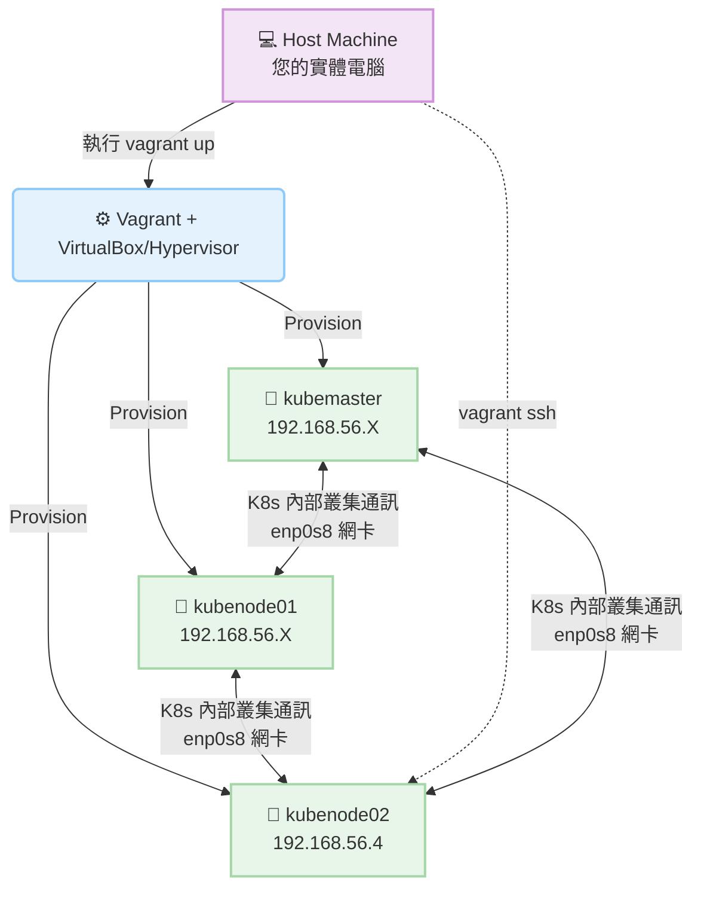

# 使用 Vagrant 建置 VM 環境 (Deployment With Kubeadm - Provision VMs With Vagrant)

## 📌 核心觀念摘要
* **基礎設施即代碼 (IaC)**：在正式使用 kubeadm 建置叢集前，我們需要多台乾淨的機器。Vagrant 就像是**預製房屋的模具**，透過設定檔確保每次產出的測試環境（如 OS、CPU、RAM）都是完全一致的，避免「在我的電腦上可以跑」的窘境。
* **雙網卡架構 (Dual-NIC Setup)**：
  * **NAT 網卡 (對外大門)**：預設 IP 通常為 `10.0.2.15`，負責讓 VM 連上網際網路下載套件或映像檔。**絕對不可用於 K8s 內部通訊**。
  * **Host-Only 網卡 (內部專屬通道)**：例如 `192.168.56.x`，專供本機與各個 VM 之間互相溝通的私有網路。這也是未來 API Server 必須綁定的網段。
* **節點身分切換 (Context & SSH)**：在多節點環境中，我們就像是**維修員**，需要頻繁透過 SSH 登入不同主機進行維護，完成任務後務必記得退出 (`logout` 或 `exit`) 回到主要控制台，避免後續指令下錯位置。

## 📊 基礎設施網路拓撲流程圖



## 💻 必考指令 (Imperative Commands)

雖然考場不會考 Vagrant 本身，但必須極度熟悉類似考場的網路與連線驗證操作：

```bash
# 1. 確認目前所在節點名稱 (防止在錯誤的 Node 上下指令，極度重要)
hostname

# 2. 確認節點的網卡與 IP 分配狀況 (排查 Node NotReady 的第一步)
ip addr show
# 或精簡查看 IPv4
ip -4 a

# 3. 測試跨節點網路連通性 (在 Master 上 Ping Worker 節點的內網 IP)
ping -c 3 192.168.56.4

# 4. SSH 登入其他節點執行任務 (考場必備切換節點方式)
ssh node01

# 5. 退出當前 SSH 會話回到上一層 (極高頻使用)
exit
# 或
logout
```

## 🛠️ 實戰與最佳實踐

> [!WARNING]
> **IP 綁定致命錯誤 (API Server)**
> 執行 `kubeadm init` 時，若未明確指定 `--apiserver-advertise-address`，系統可能錯誤抓取 NAT 網卡 IP (`10.0.2.15`)，導致 Worker Node 完全無法連線。務必明確指定為 `192.168.56.x` 等私有網段！

> [!TIP]
> **SOP：切換與檢查環境**
> 在考場介面中，每次更換考題都會要求您切換 Context 或 SSH 登入 Node。
> **SOP：**
> 1. 確認並執行題目給定的 `kubectl config use-context <name>`。
> 2. 若要登入節點修復問題，執行 `ssh <node-name>`。
> 3. 登入後第一步打 `hostname` 確認自己在哪台機器。
> 4. 任務完成後，**立刻打 `exit` 退回原本的主控台**。

> [!CAUTION]
> **Troubleshooting 必殺技：localhost:8080 was refused**
> 如果下 `kubectl` 指令時出現 `The connection to the server localhost:8080 was refused`：
> 1. **是否忘記 exit？** 檢查你是否還卡在 Worker Node 裡。Worker Node 預設是沒有 admin kubeconfig 的，請 `exit` 回到 Master。
> 2. **Master 異常？** 若確實在 Master 節點，請檢查容器運行時狀態 `crictl ps` 或 kubelet 日誌 `journalctl -u kubelet -f`。

## 📜 骨架配置 (Vagrantfile 核心概念)

這裡提供對應此架構的 `Vagrantfile` 網路配置片段，幫助您理解 IaC 的底層邏輯：

```ruby
# Vagrantfile 範例片段
Vagrant.configure("2") do |config|
  # 定義 Master 節點
  config.vm.define "kubemaster" do |node|
    node.vm.box = "ubuntu/bionic64"
    node.vm.hostname = "kubemaster"
    # 🚨 關鍵：配置 Host-Only 專屬內網 IP，這將是 K8s 叢集通訊的基石
    node.vm.network "private_network", ip: "192.168.56.2"
    node.vm.provider "virtualbox" do |v|
      v.memory = 2048
      v.cpus = 2
    end
  end
end
```

## 🧠 自我測驗

<details>
<summary>Q1: 在雙網卡架構中，哪一張網卡的 IP 應該作為 kubeadm init 時的 --apiserver-advertise-address？</summary>

**解答：** 
應該使用 **Host-Only 網卡** (如本例中的 `192.168.56.x`)。絕不能使用 NAT 網卡 (`10.0.2.15`)，否則叢集內的其他節點將無法透過該 IP 與 Master 互相通訊。
</details>

<details>
<summary>Q2: 在考場實作題中，我剛 SSH 進入 Worker Node 修復了 kubelet，接著直接輸入 `kubectl get nodes` 卻出現 "localhost:8080 was refused"，為什麼？</summary>

**解答：** 
因為您**忘記退出 (exit)** Worker Node。Worker Node 預設並未配置管理者的 kubeconfig (`~/.kube/config`)，因此無法直接執行 `kubectl`。正確做法是先輸入 `exit` 回到 Master Node 再下指令。
</details>

<details>
<summary>Q3: 如果發現節點處於 NotReady 狀態，我要檢查節點本身的 IP 配置是否正確，應該下哪個指令？</summary>

**解答：** 
使用 `ip addr show` 或 `ip -4 a` 來檢查節點所有的網卡名稱與 IP 對應關係，確認內網 IP 是否有順利分配且未衝突。
</details>
