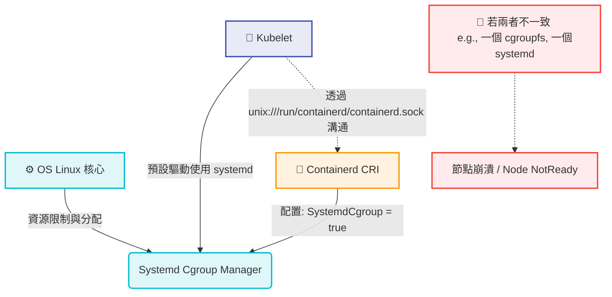

# 實戰：kubeadm 部署與 Containerd 核心配置 (Demo - Deployment with Kubeadm)

## 📌 核心觀念摘要
* **資源管理的單一窗口 (Cgroup)**：在 Kubernetes 中，作業系統核心負責分配資源（CPU/RAM）。如果 Kubelet 和 Containerd 使用不同的 Cgroup 管理器（一個用 systemd，一個用 cgroupfs），就像是**一家公司有兩個老闆下達不同指令**，會導致資源分配視圖衝突，最終造成節點崩潰。
* **統一使用 Systemd**：由於多數 Linux 發行版預設使用 `systemd` 作為 init 系統並管理 cgroups，我們必須強制將 Containerd 的 `SystemdCgroup` 設為 `true`，讓所有組件都聽命於同一個「資源大管家」。
* **預設配置的覆寫**：Containerd 剛安裝好時配置是空的或極簡的，必須手動導出完整的預設配置檔（`config.toml`），才能進行進階與底層修改。

## 📊 Containerd 與 Kubelet Cgroup 互動架構圖



## 💻 必考指令 (Imperative Commands)

在考場或實務上手動配置新 Node 時，這套 Containerd 處理連招必須極度熟練，能大幅節省時間：

```bash
# 1. 導出 containerd 完整預設配置檔
sudo containerd config default | sudo tee /etc/containerd/config.toml

# 2. 考場加速技巧：使用 sed 直接將 false 替換為 true
sudo sed -i 's/SystemdCgroup = false/SystemdCgroup = true/g' /etc/containerd/config.toml

# 3. 驗證修改是否成功 (必須看到結果包含 true)
cat /etc/containerd/config.toml | grep SystemdCgroup

# 4. 重啟服務並設定開機自啟 (極度重要，忘記做等同沒設定！)
sudo systemctl restart containerd
sudo systemctl enable containerd
```

## 🛠️ 實戰與最佳實踐

> [!WARNING]
> **忘記重啟的致命傷**
> 修改完 `/etc/containerd/config.toml` 後，絕對不能急著執行 `kubeadm init` 或 `join`！必須先執行 `systemctl restart containerd` 讓設定載入記憶體生效，否則 kubeadm 的 pre-flight 檢查會直接報錯中斷。

> [!TIP]
> **SOP：crictl 的端點配置**
> 如果在節點上直接打 `crictl ps` 報錯說找不到 endpoint，請手動建立或修改 `/etc/crictl.yaml`，補上 Containerd 的 Socket 位置：
> ```yaml
> runtime-endpoint: unix:///run/containerd/containerd.sock
> image-endpoint: unix:///run/containerd/containerd.sock
> ```

> [!CAUTION]
> **Troubleshooting 必殺技：container runtime is not running**
> - **第一步查狀態**：執行 `systemctl status containerd`，確認服務是否掛點。
> - **第二步查 Kubelet 日誌**：執行 `journalctl -u kubelet -f`。若看到 `failed to get container runtime status` 的字眼，通常代表 Cgroup 沒對齊或是 socket 沒接通。

## 📜 骨架配置 (config.toml 核心片段)

修改完畢後的 `/etc/containerd/config.toml` 中，最關鍵的片段位於 `[plugins."io.containerd.grpc.v1.cri".containerd.runtimes.runc.options]` 節點之下：

```toml
[plugins."io.containerd.grpc.v1.cri".containerd.runtimes.runc.options]
  BinaryName = ""
  CriuImagePath = ""
  CriuPath = ""
  CriuWorkPath = ""
  IoGid = 0
  IoUid = 0
  NoNewKeyring = false
  NoPivotRoot = false
  Root = ""
  ShimCgroup = ""
  # 🚨 K8s 穩定運行的絕對關鍵參數，必須為 true
  SystemdCgroup = true
```

## 🧠 自我測驗

<details>
<summary>Q1: 為什麼我們需要手動將 Containerd 的 SystemdCgroup 參數改為 true？</summary>

**解答：** 
因為多數 Linux 系統與 Kubelet 預設都是使用 `systemd` 作為 Cgroup 管理器。若不將 Containerd 改為 `true`，它預設會使用 `cgroupfs`。同一個節點上出現兩套不同的資源管理機制會導致視圖衝突，最終讓節點無法順利分配資源而陷入 `NotReady` 狀態。
</details>

<details>
<summary>Q2: 在考場中，如果我已經使用 sed 修改了 config.toml 檔案，接下來最關鍵的一步指令是什麼？</summary>

**解答：** 
必須是 **重啟 Containerd 服務**：`sudo systemctl restart containerd`。若未重啟，設定檔的修改不會套用，後續所有的 kubeadm 操作都會報錯。
</details>

<details>
<summary>Q3: 當我在節點上執行 crictl ps 卻提示無法連線到 runtime，Containerd 預設的 Socket 路徑是什麼？</summary>

**解答：** 
預設路徑為 `unix:///run/containerd/containerd.sock`。可透過設定 `/etc/crictl.yaml` 讓 crictl 知道對接目標。
</details>
