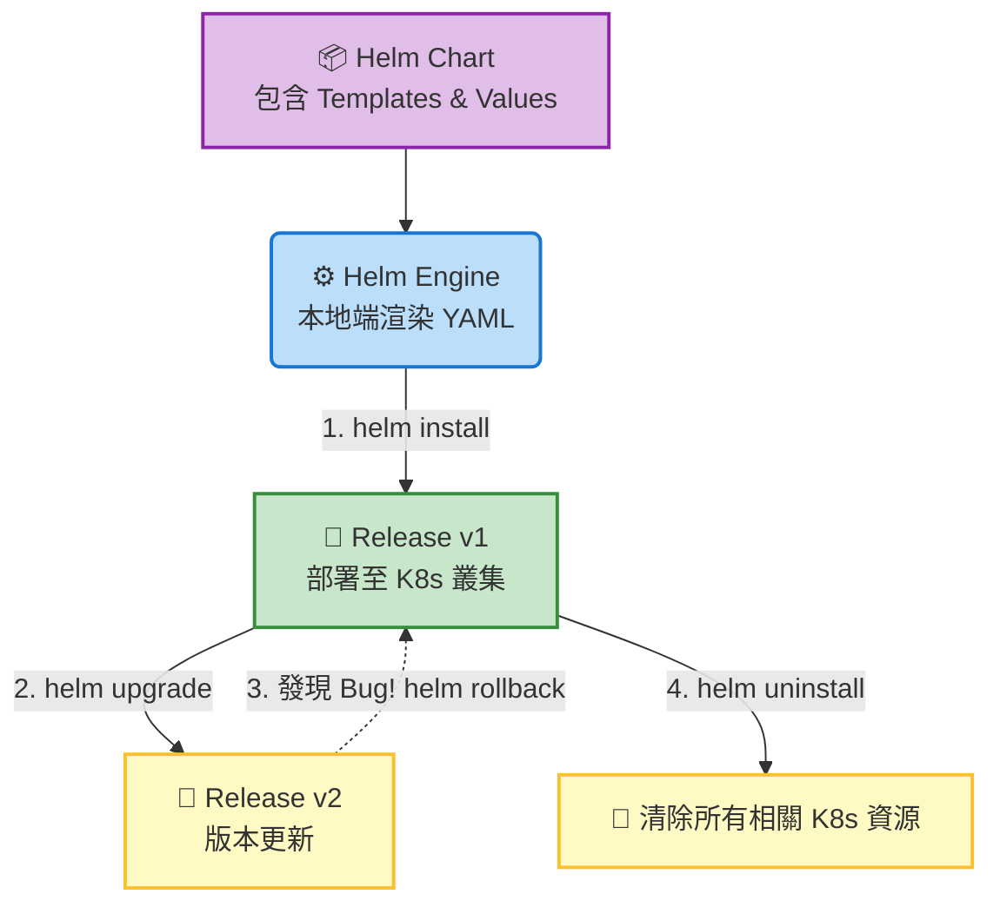

# Helm 基礎介紹 (Helm - Introduction)

## 📌 核心觀念摘要
* **K8s 的套件管理員**：Helm 相當於 Ubuntu 的 `apt` 或 CentOS 的 `yum`。它能將由數十個甚至數百個 YAML 檔案組成的複雜微服務應用程式，打包成單一標準化模組，大幅降低部署與維運的成本。
* **Chart 與 Release 的關係**：可以想像成**藍圖與實體建築**。`Chart` 是靜態的安裝包或模板（藍圖），而 `Release` 是該 Chart 在叢集中運行產生的一個實例（建築物）。同一個 Chart 可以被安裝多次，產生多個名稱與設定不同的 Release。
* **參數化渲染 (Templating)**：Helm 將 YAML 中容易變動的參數（如 Image Tag、Replicas 數量、Port）抽離到獨立的 `values.yaml` 中。安裝時，引擎會將 `values` 注入 `Templates` 中，動態合成出最終要交給 API Server 的 K8s Manifest。

## 📊 Helm 應用程式生命週期流程圖



## 💻 必考指令 (Imperative Commands)

在 CKA 考場中，關於 Helm 的考題通常要求您快速尋找、安裝或升級特定 Release。請務必熟練以下連招：

```bash
# 0. 考場必備：列出目前所有的 Helm Releases 
# 🚨 -A 代表所有 Namespace，有助於快速找到考題指定的隱藏 Release
helm ls -A

# 1. 部署應用程式 (語法: helm install <自定義Release名稱> <Chart名稱>)
# ⚠️ 考場技巧: 務必加上 -n 指定 Namespace，否則預設會裝在 default
helm install wordpress bitnami/wordpress -n my-namespace

# 2. 升級應用程式
# 實務上通常會搭配 --set 參數來動態修改設定 (如更改 Image 標籤)
helm upgrade wordpress bitnami/wordpress --set image.tag=2.0.0 -n my-namespace

# 3. 版本回滾 (救命指令)
# 將應用程式退回到上一個穩定版本 (例如從 v2 退回 v1)
# 語法: helm rollback <Release 名稱> [版本號]
helm rollback wordpress 1 -n my-namespace

# 4. 移除應用程式
# 會將該 Release 關聯的所有 Deployment, Pods, Services 一次性乾淨刪除
helm uninstall wordpress -n my-namespace
```

## 🛠️ 實戰與最佳實踐

> [!WARNING]
> **Namespace 盲區**
> Helm 指令極度依賴 Namespace！如果您執行 `helm ls` 卻什麼都沒看到，通常是因為您忘記加上 `-n <namespace>` 或 `-A`。請永遠記住，Helm 預設只會尋找 `default` namespace 中的 Release。

> [!TIP]
> **SOP：名稱順序搞混的避坑指南**
> 在指令 `helm install my-app nginx` 中，`my-app` 是你自己取的實例名稱 (Release)，後面的 `nginx` 才是來源套件 (Chart)。絕對不要把兩者寫反，否則系統會報錯表示找不到指定的 Chart。

> [!CAUTION]
> **Troubleshooting 必殺技**
> - **部署卡在 Pending**：使用 `helm status <release-name> -n <namespace>` 查看詳細狀態與事件日誌。
> - **忘記上一次改了什麼**：執行 `helm history <release-name> -n <namespace>` 檢查部署的修訂版本紀錄 (REVISION)，這對於決定要 `rollback` 回哪一個正確版本至關重要。

## 📜 骨架配置 (values.yaml 核心片段)

雖然 Helm 最終產出的是 K8s YAML，但管理者實際操作的靈魂在於 `values.yaml`。以下是修改設定檔參數的典型骨架：

```yaml
# values.yaml
replicaCount: 3

image:
  repository: nginx
  pullPolicy: IfNotPresent
  # 🚨 使用 helm upgrade --set image.tag=xxx 就是在覆寫這個欄位
  tag: "1.19.0"

service:
  type: ClusterIP
  port: 80
```

## 🧠 自我測驗

<details>
<summary>Q1: Helm Chart 與 Release 最大的差異是什麼？</summary>

**解答：** 
`Chart` 是一組靜態的檔案集合（包含 Templates 模板與 Values 預設值），相當於建築的藍圖。而 `Release` 是將該 Chart 安裝到 Kubernetes 叢集後，所產生的一個正在運行的實體應用程式實例。
</details>

<details>
<summary>Q2: 在考場中，如果我明明知道某個套件已經安裝，但輸入 helm ls 卻顯示為空，最可能的原因是什麼？</summary>

**解答：** 
忘記加上 Namespace 參數。Helm 預設只顯示 `default` namespace 中的 Release。請加上 `-A` 參數（顯示所有命名空間）或 `-n <特定的namespace>` 重新尋找。
</details>

<details>
<summary>Q3: 為什麼 Helm 能夠精準地將應用程式 rollback (回滾) 到前一個穩定的版本？</summary>

**解答：** 
因為每當我們執行 Helm 安裝或升級操作時，它會在對應的 Namespace 底下建立特殊的 K8s Secret 資源，將每一次部署的設定值與版本狀態完整記錄下來。`helm rollback` 便是依賴讀取這些紀錄的歷史快照來還原先前的叢集狀態。
</details>
