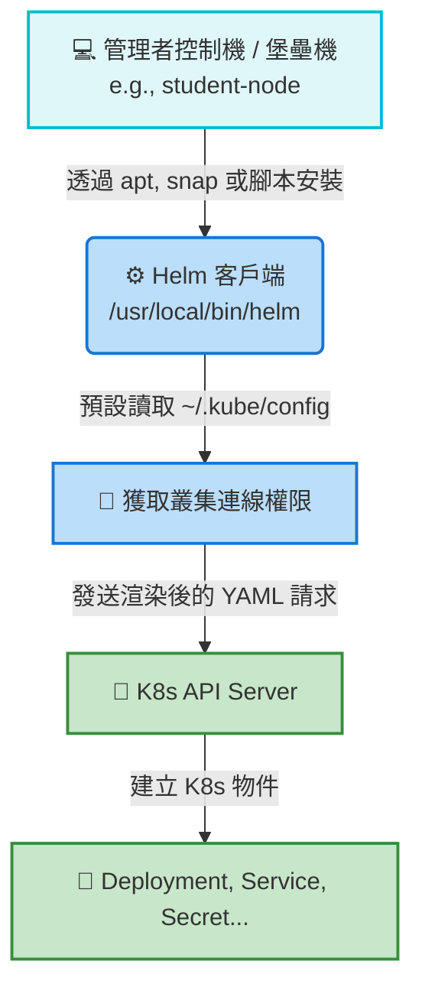

# Helm 安裝與配置 (Installation and Configuration)

## 📌 核心觀念摘要
* **純客戶端架構 (無痕工具人)**：Helm v3 移除了舊版的 Tiller 組件，轉變為輕量化的純客戶端架構。安裝 Helm 對 Kubernetes 叢集本身是「零侵入性」的，叢集內部**不會**因為你安裝了 Helm 而長出任何額外的 Pod 或 Controller。
* **共用通訊鑰匙 (kubeconfig)**：Helm 本身並沒有獨立的認證機制。它就像是借用 `kubectl` 的萬能鑰匙（預設為 `~/.kube/config`），藉此直接與 API Server 溝通並部署資源。若你的 `kubectl` 無法連線，Helm 也注定失敗。
* **OS 層級管理**：安裝過程單純是將一個二進制檔 (Binary) 放進作業系統中（透過 `apt`、`snap` 或官方腳本），這屬於 Linux 系統層級的管理，與 K8s 叢集內的設定無關。

## 📊 Helm 客戶端架構與通訊流程圖



## 💻 必考指令 (Imperative Commands)

在 CKA 考場中，環境通常已經預先安裝好 Helm。但若需要驗證環境或進行 Troubleshooting，這套指令依然至關重要：

```bash
# 1. 考場必備：驗證 Helm 是否存在並檢查版本
helm version

# 2. 檢查 Helm 的環境變數 (Troubleshooting 神器)
# 用於確認 Helm 目前讀取到的是哪一組 kubeconfig 權限配置
helm env | grep KUBECONFIG

# 3. 實務救命指令：官方腳本一鍵安裝 
# (若環境剛好遺漏，考場上千萬不要花時間去記 apt 的 source key 添加指令)
curl -fsSL -o get_helm.sh https://raw.githubusercontent.com/helm/helm/main/scripts/get-helm-3
chmod 700 get_helm.sh
./get_helm.sh
```

## 🛠️ 實戰與最佳實踐

> [!WARNING]
> **考試避坑指南：不要死背安裝指令**
> CKA 著重於「Kubernetes 叢集維運」，而非 Linux 系統維護。若真的遇到要求安裝 Helm 的考題，請直接打開考場允許存取的官方文件 (https://helm.sh/docs/intro/install/)，複製指令貼上即可，把珍貴的腦力留給後面的除錯題。

> [!TIP]
> **SOP：切換考題與確認環境**
> 考場的 Terminal（通常稱作 `student-node`）已預置好所需的工具。每次切換題目時，真正重要的動作是先執行考題給定的 `kubectl config use-context <name>`，確保你的 kubectl 和 Helm 都在預期正確的叢集上發號施令。

> [!CAUTION]
> **Troubleshooting 必殺技**
> - **`helm: command not found`**：代表二進制檔不在環境變數 `$PATH` 內。如果剛下載好執行檔，記得用 `sudo mv linux-amd64/helm /usr/local/bin/helm` 搬移到全域路徑。
> - **`Kubernetes cluster unreachable`**：這絕對不是 Helm 的問題，而是 kubeconfig 設定跑掉或憑證過期失效。請立刻使用 `kubectl cluster-info` 交叉比對並檢查 API Server 的連通性。

## 🧠 自我測驗

<details>
<summary>Q1: 在 Kubernetes 叢集中，安裝 Helm v3 會自動在背景新增哪些核心的 Pod 或 Controller？</summary>

**解答：** 
**完全不會。** Helm v3 採用「純客戶端架構」，它單純只是一個存在於你作業系統（如堡壘機）中的二進制執行檔。安裝 Helm 對叢集本身是零侵入性的。
</details>

<details>
<summary>Q2: Helm 是如何取得權限與 Kubernetes 叢集進行連線並部署資源的？</summary>

**解答：** 
Helm 本身沒有獨立的認證機制，它完全依賴所在作業環境中的 `kubeconfig` 檔案（預設為 `~/.kube/config`）。因此，只要你的 `kubectl` 能通，`helm` 就能通。
</details>

<details>
<summary>Q3: 當你滿懷信心地執行 helm install 時，終端機卻回傳 `Kubernetes cluster unreachable`，第一步 Troubleshooting 應該做什麼？</summary>

**解答：** 
馬上使用 `kubectl get nodes` 或 `kubectl cluster-info` 測試基礎連線。因為這個報錯代表連線通道（kubeconfig 或 API Server）出了問題，而非 Helm 軟體本身故障。解決了 kubectl 的連線，Helm 也就修好了。
</details>
