# Chart.yaml 結構與依賴管理 (Helm Charts)

## 📌 核心觀念摘要
* **身分證與設計圖**：`Chart.yaml` 是整個 Helm 套件的核心元數據中心。它宣告了這個軟體包的名字、版本、類型，以及它需要依賴哪些其他的「子套件」(Sub-charts) 才能順利運行，就如同建築的設計圖。
* **雙重版本控制 (Version vs AppVersion)**：這在實務上極容易混淆。`version` 指的是「這個 Helm 安裝包 (YAML 結構)」本身的版本號；而 `appVersion` 指的是裡面包裝的「真實應用程式」版本 (例如對應到的 Docker Image Tag)。
* **靈活的依賴開關**：透過宣告 `dependencies` 並結合 `condition: xxx.enabled` 語法，我們可以在部署時動態決定是否要連同資料庫（如 MariaDB）一起建立，還是要關閉它並切換使用外部的雲端資料庫。

## 📊 依賴解析與 Sub-charts 渲染架構圖

```mermaid
graph TD
    classDef main fill:#e3f2fd,stroke:#1565c0,stroke-width:2px;
    classDef dep fill:#fff3e0,stroke:#e65100,stroke-width:2px;
    classDef engine fill:#e8f5e9,stroke:#2e7d32,stroke-width:2px;
    classDef k8s fill:#f3e5f5,stroke:#7b1fa2,stroke-width:2px;

    A[📄 主 Chart: WordPress <br/> Chart.yaml]:::main -->|解析 dependencies| B{⚙️ Helm 依賴管理器};
    
    B -->|檢查條件 condition: <br/> mariadb.enabled=true| C[📥 從 Bitnami Repo <br/> 下載 MariaDB Chart]:::dep;
    B -->|若 enabled=false| D[🚫 略過安裝資料庫];
    
    C -->|放入 charts/ 目錄| E(⚙️ Helm 渲染引擎):::engine;
    A -->|載入 Templates| E;
    
    E -->|合併生成最終 Manifest| F[🧠 K8s API Server <br/> 同時建立 WP 與 DB]:::k8s;
```



## 💻 必考指令 (Imperative Commands)

在實務或考場上，操作 Chart 的依賴管理與元數據審查是非常重要的基本功：

```bash
# 1. 免下載預覽：直接查看遠端 Chart 的元數據 (Chart.yaml 內容)
# 考場技巧：當你想確認某個 Chart 裡面到底包的是哪一個 appVersion 時非常有用
helm show chart bitnami/wordpress

# 2. 處理依賴關係 (極度重要)
# 當你在本地修改 Chart.yaml 增加 dependency 後，必須執行此指令！
# Helm 才會去遠端把 MariaDB 等子套件拉回本地的 charts/ 目錄下。
helm dependency update ./my-wordpress-chart

# 3. 語法檢查工具 (開發與除錯用)
# 編輯完 Chart.yaml 後，確保縮排或必填欄位沒有寫錯
helm lint ./my-wordpress-chart

# 4. 覆寫依賴參數進行部署
# 實務上「關閉內建資料庫」的經典操作 (改用雲端託管的 RDS)
helm install my-blog bitnami/wordpress --set mariadb.enabled=false
```

## 🛠️ 實戰與最佳實踐

> [!WARNING]
> **考試情境預測：升級應用程式版本**
> 考官可能會提供一個既有的本地端 Chart，並要求您將該「應用程式版本」從 `1.0.0` 升級為 `2.0.0`。此時您必須清楚知道，是去編輯 `Chart.yaml` 中的 `appVersion` 欄位，而 **不是** 去修改 `values.yaml`。

> [!TIP]
> **SOP：大小寫的致命細節**
> `Chart.yaml` 的首字母 `C` **必須大寫**，這是硬性規定！若不小心寫成小寫 `chart.yaml`，Helm 引擎將無法識別該目錄為一個合法的 Helm 套件，並會直接拒絕安裝。

> [!CAUTION]
> **Troubleshooting 必殺技：缺少依賴檔案**
> **錯誤訊息**：`Error: found in requirements.yaml, but missing in charts/ directory`
> **排查步驟**：這明確指出您在 `Chart.yaml` 中宣告了需要依賴其他的子套件，但本地端的 `charts/` 目錄卻是空的。請立刻進入該資料夾，執行 `helm dependency update` 讓 Helm 幫您把缺少的子包下載回來。

## 📜 骨架配置 (Chart.yaml 核心片段)

以下是 `Chart.yaml` 在 Helm v3 中的標準寫法，請特別注意 `apiVersion` 與 `dependencies` 的結構：

```yaml
# Chart.yaml
apiVersion: v2        # 🚨 Helm 3 必須使用 v2
name: my-wordpress
description: A Helm chart for Kubernetes
type: application     # 類型: 可被部署的 application，或只提供共用範本的 library
version: 1.0.0        # Chart 本身 (這個 YAML 架構) 的版本號
appVersion: "5.8.1"   # 裡面包裝的真實軟體版本

dependencies:
  - name: mariadb
    version: "9.x.x"
    repository: "https://charts.bitnami.com/bitnami"
    condition: mariadb.enabled  # 綁定 values.yaml 裡的變數開關
```

## 🧠 自我測驗

<details>
<summary>Q1: 在 Chart.yaml 中，version 和 appVersion 有什麼根本上的區別？</summary>

**解答：** 
`version` 代表這個 Helm 套件（也就是這包 YAML 檔案與架構組合）本身的版本號，每當你修改了任何內部的配置，這個數字就該跳號。而 `appVersion` 代表的是這個套件內部真正要部署的軟體版本（例如 WordPress 的 5.8.1 版），它通常對應於 Docker Image 的 Tag。
</details>

<details>
<summary>Q2: 如果我在編寫 Chart 時，將 apiVersion 寫成了 v1，會發生什麼事？</summary>

**解答：** 
`apiVersion: v1` 是舊版 Helm 2 專用的宣告格式。如果您在 Helm 3 的環境下使用 v1，雖然系統具有向下相容性，但您將無法使用 Helm 3 的新特性（例如：Helm 3 允許將依賴管理 `dependencies` 直接寫在 `Chart.yaml` 內；而 Helm 2 是強迫寫在另一個獨立的 `requirements.yaml` 檔案中）。因此，新開發的 Chart 請一律宣告為 `v2`。
</details>

<details>
<summary>Q3: 當我在本地端修改完 Chart.yaml 加入了一個 Redis 作為 dependency 後，為什麼執行 helm install 卻噴出錯誤說 missing in charts/ directory？</summary>

**解答：** 
因為在 `Chart.yaml` 中宣告依賴，只是單純寫下了「需求清單」。您必須在執行安裝之前，先下達 `helm dependency update <chart-目錄>` 指令，指示 Helm 引擎根據這份清單，去遠端 Repo 將 Redis 的壓縮包下載並放進本地的 `charts/` 資料夾內，這樣安裝時才會有實體的檔案可以渲染並使用。
</details>
