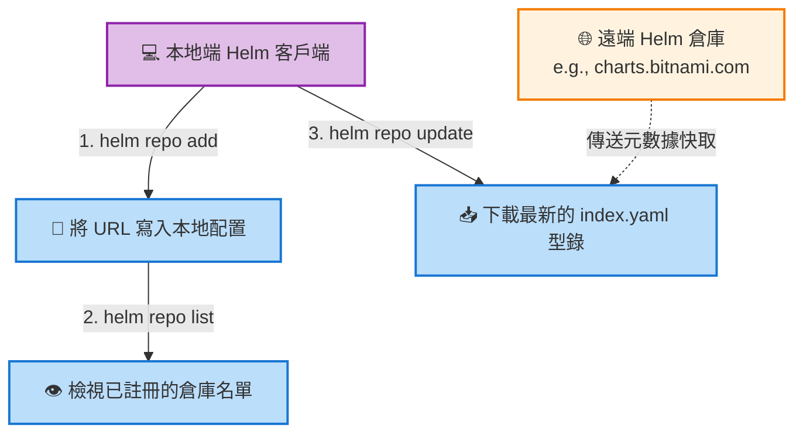

# 實戰操作：Helm 倉庫管理基礎 (Working With Helm - Basics)

## 📌 核心觀念摘要
* **遠端儲存，本地快取**：Helm 採用了極為輕量化的倉庫管理機制。當我們註冊一個外部倉庫時，Helm 並不會立刻把所有軟體包都下載回來塞爆您的硬碟，它只負責維護輕量的「索引型錄」。
* **同步最新菜單 (index.yaml)**：就像是去餐廳拿最新版的菜單，`helm repo update` 的底層動作是去遠端將名為 `index.yaml` 的型錄檔下載並快取到本地的資料夾中（通常位於 `~/.cache/helm/repository/`）。因為只下載菜單（知道有哪些軟體、什麼版本），而不下載好幾 MB 的 `.tgz` 實體安裝檔，所以同步速度非常快。
* **階層式指令設計**：`helm repo` 是一個父指令，底下掛載了 `add`, `list`, `update`, `remove` 等管理子行為。這種設計模式與我們熟知的 `kubectl` 高度一致，符合工程師的操作直覺。

## 📊 倉庫管理資料流與底層架構圖



## 💻 必考指令 (Imperative Commands)

影片中所演示的這四個指令，正是考場與實務中最常被使用的倉庫管理「三板斧」加一招：

```bash
# 1. 檢視目前已綁定的倉庫清單
# 考場技巧：用於確認考題要求的 Repo 是否已經存在，以及它的「別名 (Name)」究竟是什麼
helm repo list

# 2. 更新所有倉庫的本地快取 (極度重要)
# 實務鐵則：在下達 helm search repo 搜尋套件，或執行 helm install 前的「必備起手式」
helm repo update

# 3. 移除不再使用的倉庫 (環境清理與除錯用)
# 語法: helm repo remove <倉庫別名>
helm repo remove bitnami

# 4. 考場必考：新增遠端倉庫 (複習回顧)
helm repo add bitnami https://charts.bitnami.com/bitnami
```

## 🛠️ 實戰與最佳實踐

> [!WARNING]
> **考試情境預測：版本過舊的陷阱**
> 考題若提供一個已建置好的本地環境，要求您使用 `helm search repo` 找出 nginx 的特定版本並進行部署。如果您直接下達 `search` 卻發現版本太舊或找不到該版本，**千萬不要懷疑是考題出錯**！這是考官在考驗您是否具備要先下達 `helm repo update` 來獲取最新型錄的實務常識。

> [!TIP]
> **SOP：Repo 別名衝突的解法**
> 在企業共用機或考場環境中，其他人可能已經把 `bitnami` 這個別名綁定到另外一個無效的網址了。
> **SOP：** 若執行 `helm repo add` 時噴錯顯示 `repository name already exists`，請先用 `helm repo list` 檢查；確定發生衝突後，使用 `helm repo remove <別名>` 刪掉舊的配置，再重新執行 `add` 指令。

> [!CAUTION]
> **Troubleshooting 必殺技：Update 卡住逾時**
> **錯誤訊息**：執行 `helm repo update` 畫面卡住很久，最後噴出 `Unable to get an update from ... dial tcp: i/o timeout`。
> **排查步驟**：這 **100% 是底層的網路連線問題**。請立刻檢查主機是否有外網連線能力、或 DNS 解析是否正常。若身處企業地端環境，請聯絡網管確認防火牆是否擋住了通往該遠端倉庫的 HTTPS (443 Port) 外送流量。

## 🧠 自我測驗

<details>
<summary>Q1: 執行 helm repo update 的時候，Helm 會把倉庫裡所有幾百個 Chart 的 .tgz 壓縮檔都下載到我的電腦裡塞爆硬碟嗎？</summary>

**解答：** 
**不會。** `update` 指令只會去遠端倉庫下載最新的 `index.yaml`（也就是輕量化的軟體型錄索引檔），將其快取在本地端。只有當您真正執行 `helm install` 部署，或是 `helm pull` 抓取套件時，才會去下載對應的 `.tgz` 實體安裝檔。
</details>

<details>
<summary>Q2: 我在終端機輸入 helm repo add my-repo https://example.com 卻噴出錯誤 "repository name already exists"，這代表什麼？該如何解決？</summary>

**解答：** 
這代表在您的本地 Helm 配置中，已經有一個名叫 `my-repo` 的倉庫別名存在了（可能綁定到了其他不同的網址）。解決方法是先執行 `helm repo list` 確認目前的綁定狀況；如果不需要舊的綁定，可以先執行 `helm repo remove my-repo` 將其刪除，然後再重新下達 `add` 指令即可。
</details>

<details>
<summary>Q3: 在準備考場實作題時，如果題目要求從本地的快取倉庫中尋找最新版的 Redis，我該如何確保我找到的真的是「最新版」？</summary>

**解答：** 
在下達任何 `helm search repo` 尋找軟體，或執行 `helm install` 安裝最新版軟體之前，**第一步永遠是先手動執行 `helm repo update`**。強制 Helm 與遠端伺服器進行型錄同步，如此才能確保您搜尋到的版本資料是最即時、正確的，避免踩到「本地快照過期」的地雷。
</details>
