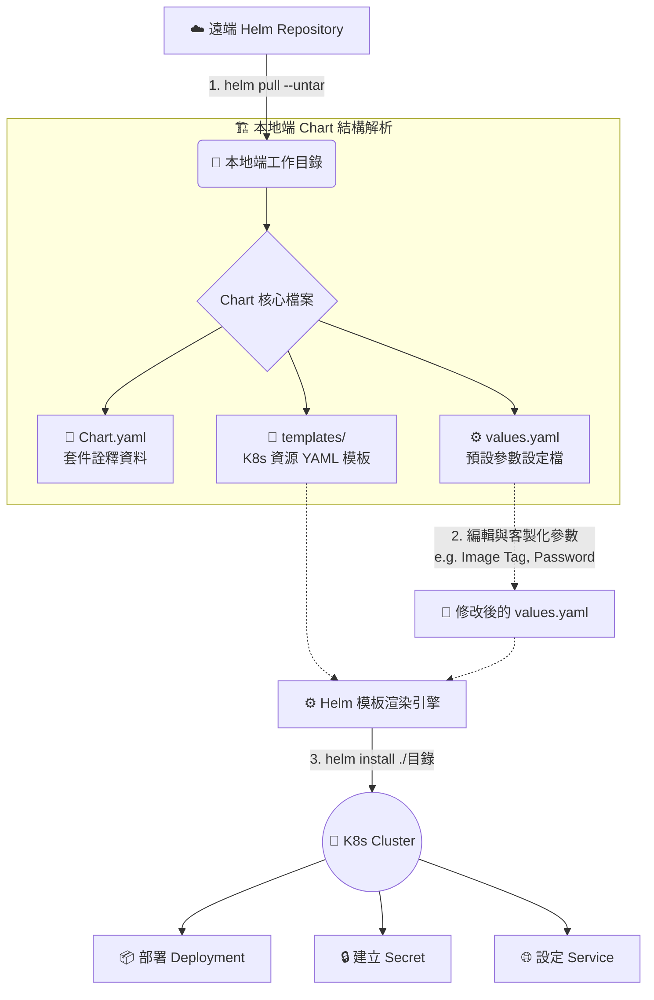

# 客製化 Chart 參數 (Customizing Chart Parameters)

## 1. 🏷️ 課程定位
- **章節編號與名稱**：第 12 節：(2025 Updates) Helm Basics
- **影片標題**：259. Customizing Chart Parameters

## 2. 📌 核心概念摘要
在 Kubernetes 叢集管理中，Helm 是實作應用程式模組化與可重複部署的核心工具。本節的底層運作目標在於：透過解開 (`--untar`) 遠端的 Chart 套件，將「環境設定 (`values.yaml`)」與「基礎架構資源範本 (`templates/`)」徹底解耦。

這就像是**將電器的「插座規格 (模板)」與實際插入的「插頭 (參數)」分開**。這允許管理者在不修改底層 YAML 邏輯的前提下，依據不同環境（Dev/QA/Prod）動態注入客製化參數（如 Image Tag、Resource Limits 或密碼），實現基礎架構即代碼 (IaC) 的高度重用性。

## 3. 📊 流程圖與視覺化重現


## 4. 🔑 知識點擷取 (Detailed Notes)
- **`helm pull` 機制與觸發行為**：
  - **定義**：將遠端 Repository 中的 Chart 打包檔 (`.tgz`) 下載至本地端。
  - **`--untar` 參數**：下載後立即解壓縮，建立對應資料夾。這對於需要深度審閱範本 (Audit) 或大幅度客製化預設 `values.yaml` 的情境極為重要。
- **Helm Chart 目錄核心結構解析**：
  - **`Chart.yaml`**：定義應用程式名稱、Chart 版本 (Version) 與應用程式版本 (AppVersion)。
  - **`values.yaml`**：提供 `templates/` 內部變數的預設值（如 `image.repository`）。**限制條件**：此處設定的變數層級最低，會被 `helm install --set` 指令覆蓋。
  - **`templates/` 目錄**：包含使用 Go Template 語法撰寫的 Kubernetes 資源 YAML 清單，是最終渲染的藍圖。
- **本地安裝模式 (Local Installation)**：
  - **觸發機制**：使用 `helm install [RELEASE_NAME] ./[CHART_DIR]` 指令。Helm 會讀取本地目錄的狀態進行渲染，而非直接向遠端 Repo 請求。

## 5. 💻 CKA 必備實作指令 (Imperative Commands)
```bash
# 🎯 考場必備：快速下載並解壓縮 Chart 準備客製化
helm pull bitnami/wordpress --untar

# 🎯 考場技巧：如果不需檢視範本，只想覆蓋參數，可用 show values 導出預設設定
# 這比 untar 整個目錄更快，適合只需要修改少數參數的情境
helm show values bitnami/wordpress > custom-values.yaml

# 🚀 實務部署：從本地目錄安裝，並指定發布名稱為 my-release
helm install my-release ./wordpress

# ⚡ 快速覆蓋：不修改檔案，直接透過 CLI 動態注入參數 (適合考試快速通關)
# --set 優先級高於 values.yaml
helm install my-release bitnami/wordpress --set image.tag=5.8.2-debian-10-r0 --set wordpressPassword=securepass

# 🔍 驗證與除錯：演練部署（不會實際建立 K8s 資源），檢查渲染後的 YAML 是否正確
helm install my-release ./wordpress --dry-run --debug

# 🔍 狀態檢查：尋找已部署的 Release 狀態與可用選項 (查找相關輔助指令)
helm ls -A
helm status my-release
helm --help | grep install
```

## 6. 🚀 CKA 考試延伸與 Troubleshooting
> [!TIP]
> **🎯 考試情境預測**：題目可能會要求你使用指定的 Helm Chart 部署應用，但必須將 Service Type 更改為 NodePort，或指定特定的 Image 版本。
> **解法**：最快的方式是使用 `helm install ... --set service.type=NodePort`。若參數過於複雜（巢狀結構），才使用 `helm show values > my-val.yaml` 修改後，透過 `-f my-val.yaml` 進行部署。

> [!WARNING]
> **🛑 避坑指南與備份機制**：
> - **路徑層級錯誤**：執行 `helm install ./wordpress` 時，確保你位於 `wordpress` 資料夾的**上一層**。若在資料夾內部執行 `helm install .` 也是可以的，但容易因為路徑混亂導致找不到 `Chart.yaml`。
> - **YAML 縮排陷阱**：在編輯 `values.yaml` 時，若破壞了原有的 YAML 縮排結構，Helm 渲染引擎在 install 階段會直接報錯崩潰。
> - **操作前備份**：如果是更新 (Upgrade) 既有的 Release 或修改關鍵配置（如連動 API Server 相關設定），強烈建議先執行 `helm get values my-release > backup-values.yaml` 備份當前設定。

> [!CAUTION]
> **🔧 Troubleshooting**：
> - **狀態卡在 Pending**：通常是底層 K8s 資源調度失敗（如 PVC 無法綁定、Node 資源不足）。請立刻使用 `kubectl get events --sort-by='.metadata.creationTimestamp'` 或 `kubectl describe pod -l app.kubernetes.io/instance=my-release` 來查看原生 K8s 層級的錯誤。
> - **復原狀態**：發佈失敗或參數給錯時，切勿手動刪除 Pod！請使用 `helm rollback my-release` 退回上一個版本，或直接使用 `helm uninstall my-release` 徹底清除該 Release 管理的所有關聯資源。

## 7. 📝 YAML 骨架 (YAML Skeleton)
以下展示 `values.yaml` 中的變數如何對應到 `templates/deployment.yaml` 骨架：

```yaml
# values.yaml (預設參數設定檔)
image:
  repository: bitnami/wordpress
  tag: "5.8.2-debian-10-r0"  # <- 將被注入的參數
service:
  type: ClusterIP
```

```yaml
# templates/deployment.yaml (K8s 資源 YAML 模板)
apiVersion: apps/v1
kind: Deployment
metadata:
  name: {{ include "wordpress.fullname" . }}
spec:
  template:
    spec:
      containers:
        - name: wordpress
          # Go Template 語法提取 values.yaml 的值
          image: "{{ .Values.image.repository }}:{{ .Values.image.tag }}"
```

## 8. 🧠 自我測驗
<details>
<summary>如果我在 <code>values.yaml</code> 內設定了 <code>service.type: ClusterIP</code>，但在執行部署時輸入 <code>helm install my-app ./chart --set service.type=NodePort</code>，最終建立出來的 Service 會是哪一種 Type？為什麼？</summary>

**解答：**
最終會是 **NodePort**。
因為 Helm 參數注入的優先級為：`--set` (命令列動態傳入) > `-f custom-values.yaml` (自訂檔案) > `values.yaml` (Chart 預設檔案)。命令列傳入的 `--set` 具有最高優先權，會無條件覆蓋 `values.yaml` 中的預設值。
</details>
