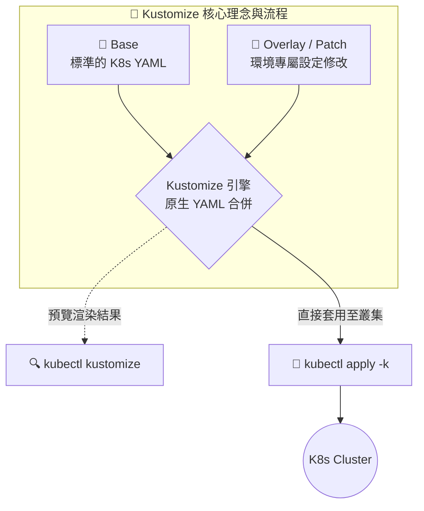

# Kustomize 核心理念與問題解決 (Kustomize Problem Statement and Ideology)

## 1. 🏷️ 課程定位
- **章節編號與名稱**：第 13 節：(2025 Updates) Kustomize Basics
- **影片標題**：263. Kustomize Problem Statement and Ideology

## 2. 📌 核心概念摘要
Kustomize 的核心理念在於「無模板 (Template-free) 的純 YAML 疊加 (Overlay) 管理」。它解決了跨環境（如 Dev/Prod）部署時 YAML 檔案高度重複的痛點。

這就像是**在投影機上疊加「透明投影片 (Patch)」**：你有一張不動的底圖 (Base)，當你需要修改某個數值時，不需要重繪底圖，只要加上一張寫了新設定的透明片蓋上去即可。這允許我們在不修改原始 Base YAML 的情況下精準抽換變數，徹底保留 Kubernetes 原生設定檔的高可讀性與驗證性。

## 3. 📊 流程圖與視覺化重現


## 4. 🔑 知識點擷取 (Detailed Notes)
- **開箱即用與原生整合 (Built-in)**：
  - **定義**：Kustomize 已經被原生整合進 `kubectl` 工具中。這意味著在任何標準的 K8s 環境中，你不需要安裝任何額外的套件就能直接使用它。
  - **限制條件 (Limitations)**：`kubectl` 內建的 Kustomize 版本通常會落後於社群獨立推出的最新版。如果需要最新的進階功能，實務上仍會額外安裝獨立的 `kustomize` CLI 工具。
- **捨棄複雜的模板語言 (No Complex Templating)**：
  - **定義**：有別於 Helm 使用複雜的 Go Template（如 `{{ if }}`、`{{ range }}` 等語法），Kustomize 拒絕破壞 YAML 的結構。
  - **重要性**：大幅降低了開發人員的學習曲線，不需要為了部署而去學一套新的模板語言。
- **純 YAML 工件 (Plain YAML Artifacts)**：
  - **定義**：Kustomize 操作的所有對象（無論是 Base 還是 Patch）都是 100% 合法的標準 YAML。
  - **重要性**：這代表你可以直接使用常規的 YAML Linter 或 IDE 語法檢查工具來驗證檔案，不會像 Helm 的模板在渲染前經常亮紅字報錯，確保了「所見即所得」。

## 5. 💻 CKA 必備實作指令 (Imperative Commands)
```bash
# 🎯 考場必備：直接透過 kustomization.yaml 所在的目錄部署資源
# 注意：這裡使用的是 -k (kustomize) 而不是傳統的 -f (file)
kubectl apply -k ./my-kustomize-dir

# 🔍 考場救命指令：在不部署的情況下，預覽 Kustomize 疊加渲染後的完整 YAML 內容
# 等同於執行 kustomize build ./my-kustomize-dir
kubectl kustomize ./my-kustomize-dir

# 🎯 搭配使用：將渲染後的 YAML 導出，方便進一步手動檢查或修改
kubectl kustomize ./my-kustomize-dir > final-manifest.yaml
```

## 6. 🚀 CKA 考試延伸與 Troubleshooting
> [!TIP]
> **🎯 考試情境預測**：
> 考題可能會給你一個準備好的 Kustomize 目錄結構（包含 Base 和 Overlays），要求你將某個特定環境（例如 `prod` 目錄）的資源部署到指定的 Namespace。
> **解法**：切換到正確的目錄後，直接使用 `kubectl apply -k .` 即可拿分。

> [!WARNING]
> **🛑 避坑指南**：
> - **參數混淆致命傷**：實作時最常犯的錯誤是忘記打 `-k`，習慣性地打成了 `kubectl apply -f .`。這會導致 K8s 嘗試把 `kustomization.yaml` 當作普通的資源清單來解析，進而引發無法識別 `kind: Kustomization` 的報錯。
> - **CLI 版本陷阱**：在真實考場中，請專注使用 `kubectl kustomize` 或 `kubectl apply -k`。絕對不要浪費寶貴的考試時間去嘗試 `apt-get install kustomize`。

> [!CAUTION]
> **🔧 Troubleshooting**：
> - **合併失敗或未生效**：如果部署後發現設定沒有被正確覆蓋（例如 Image 版本沒換，或是資源數量不對），請立刻執行 `kubectl kustomize <目錄>`。直接在終端機查看最終合併出的 YAML 結構，這能讓你在一秒內看出 Patch 的路徑、名稱或縮排是否寫錯。

## 7. 📝 YAML 骨架 (YAML Skeleton)
以下示範 Kustomize 運作時的核心控制檔案 `kustomization.yaml` 骨架：

```yaml
# kustomization.yaml
apiVersion: kustomize.config.k8s.io/v1beta1
kind: Kustomization

# 1. 引入基礎底圖 (Base YAML 檔案)
resources:
  - deployment.yaml
  - service.yaml

# 2. 注入全局變數 (如 Namespace 或 Label)
namespace: prod-env
commonLabels:
  env: production

# 3. 定義要覆蓋的參數 (Patch)
# 例如直接改變 Deployment 內定義的 Image Tag，而不需修改 deployment.yaml 內容
images:
  - name: my-app-image
    newTag: v2.0.0
```

## 8. 🧠 自我測驗
<details>
<summary>在 CKA 考場中，如果我對著一個包含 <code>kustomization.yaml</code> 的目錄執行 <code>kubectl apply -f .</code>，會發生什麼事？</summary>

**解答：**
會出現錯誤。
因為 Kubernetes API 無法識別 `kustomization.yaml` 中的 `kind: Kustomization`。要讓 Kubernetes 正確觸發 Kustomize 引擎去合併目錄下的檔案，**必須使用 `-k` 參數**（即 `kubectl apply -k .`）。
</details>
