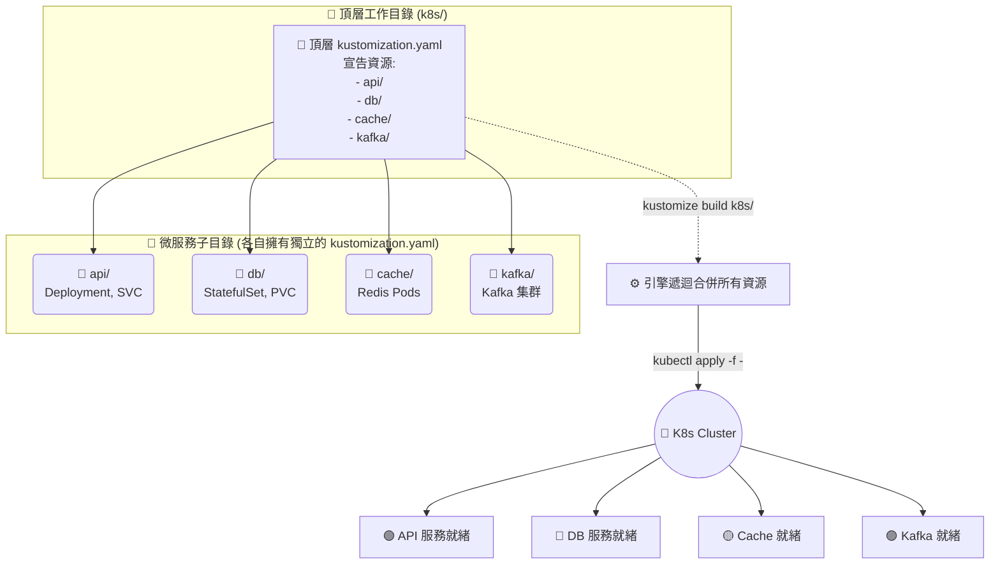

# 跨子目錄遞迴部署 (Managing Directories)

## 1. 🏷️ 課程定位
- **章節編號與名稱**：第 13 節：(2025 Updates) Kustomize Basics
- **影片標題**：269. Managing Directories (結合截圖重點：跨子目錄遞迴部署 API, DB, Cache, Kafka)

## 2. 📌 核心概念摘要
本節的底層運作目標在於展現 Kustomize 強大的「目錄階層管理 (Hierarchical Management)」能力。

這就像是**「總公司與子公司的層級架構」**：頂層的 `kustomization.yaml` 就像是執行長 (CEO)，它不自己執行細節，而是把命令下達給各個獨立的部門主管（子目錄）。透過在頂層設定檔中引用多個獨立的微服務子目錄，架構師可以將複雜的系統（如 API、DB、快取與消息佇列）徹底解耦與模組化，並實現一鍵建置與遞迴部署，完美解決大型應用資源清單過於龐大與難以維護的痛點。

## 3. 📊 流程圖與視覺化重現


## 4. 🔑 知識點擷取 (Detailed Notes)
- **目錄作為資源載體 (Directory as Resource)**：
  - **定義**：在 `kustomization.yaml` 的 `resources:` 列表下，我們不僅可以填寫 `.yaml` 檔案，更可以直接填寫「目錄路徑」（如截圖中的 API, DB, Cache 等子目錄）。
  - **觸發機制**：當 Kustomize 引擎讀取到資源項目是一個目錄時，它會自動進入該子目錄，尋找並優先渲染子目錄內部的 `kustomization.yaml`，最後再將所有渲染結果向上合併成一份巨型 YAML。
- **微服務模組化解耦 (Modular Decoupling)**：
  - **重要性**：這允許不同團隊獨立開發與維護。例如 DBA 團隊專心維護 `db/` 目錄下的設定檔，後端團隊維護 `api/`，而基礎架構工程師只需在頂層目錄下達一行指令，就能保證所有元件依照最新狀態同步部署。
- **限制條件 (Limitations)**：
  - **遞迴的必要條件**：被引用的子目錄內，絕對必須存在合法的 `kustomization.yaml` 檔案。如果該子目錄只是一堆普通的 Kubernetes YAML 檔案而沒有 Kustomize 設定檔，引擎會直接拋出錯誤並中斷渲染。

## 5. 💻 CKA 必備實作指令 (Imperative Commands)
從您的截圖中可以看到使用管線 (`|`) 的實務操作方式，但在考場上，我們通常會使用原生的捷徑：

```bash
# 🎯 考場首選捷徑：利用內建指令，直接對「包含多個子目錄」的頂層目錄進行一鍵遞迴部署
# 引擎會自動遍歷所有子目錄並將 API, DB, Cache, Kafka 一次性建立
kubectl apply -k k8s/

# 🔍 考場/實務驗證：在部署前，預覽所有子目錄資源被遞迴合併後的最終龐大 YAML
kubectl kustomize k8s/

# 🛠️ 實務管線做法 (影片截圖示範)：使用獨立版編譯，並重導向給 kubectl 進行部署
# 💡 這種做法常見於 CI/CD Pipeline，方便在 build 和 apply 之間插入其他資安掃描工具
kustomize build k8s/ | kubectl apply -f -
```

## 6. 🚀 CKA 考試延伸與 Troubleshooting
> [!TIP]
> **🎯 考試情境預測**：
> - **題型模擬**：題目給你一個主目錄 `/opt/app/`，裡面有子目錄 `/frontend/` 和 `/backend/`。考官要求你編輯主目錄的 `kustomization.yaml`，將這兩個子系統同時納入管理並部署。
> - **解法**：在主目錄的 `resources` 區塊加上 `- frontend/` 與 `- backend/`，接著執行 `kubectl apply -k /opt/app/` 即可拿分。

> [!WARNING]
> **🛑 避坑指南**：
> - **無窮迴圈陷阱 (Circular Reference)**：絕對不要在父目錄的設定中引用子目錄，同時又在子目錄的 `resources` 裡寫 `../` 引用回父目錄。這會導致 Kustomize 引擎陷入死迴圈而直接崩潰。
> - **相對路徑規範**：引用的目錄必須位於當前 `kustomization.yaml` 的「同一層或下層」。基於安全性與封裝原則，Kustomize 極度不建議大量使用 `../` 去參照工作目錄之外的資源。

> [!CAUTION]
> **🔧 Troubleshooting**：
> - **錯誤訊息**：`accumulating resources: ... must resolve to a file` 或 `no kustomization.yaml found in...`
> - **排解動作**：這個報錯非常直白，代表您在 `resources:` 寫的那個子目錄路徑拼寫錯誤，或者該子目錄裡面忘記建立 `kustomization.yaml`。請立刻使用 `ls -la <錯誤的子目錄路徑>` 檢查檔案結構是否完整。

## 7. 📝 YAML 骨架 (YAML Skeleton)
頂層 (CEO) 的 `kustomization.yaml` 會非常乾淨俐落，只負責指派任務給子目錄：

```yaml
# k8s/kustomization.yaml (頂層控制檔)
apiVersion: kustomize.config.k8s.io/v1beta1
kind: Kustomization

# 將各個微服務目錄視為獨立的 Resource 載入
resources:
  - api/     # 後端服務目錄
  - db/      # 資料庫目錄
  - cache/   # 快取層目錄
  - kafka/   # 訊息佇列目錄

# (可選) 在頂層下達全局指令，此標籤會同時遞迴注入到所有微服務的所有實體資源中
commonLabels:
  system: my-giant-application
```

## 8. 🧠 自我測驗
<details>
<summary>如果我的頂層 <code>kustomization.yaml</code> 引用了 <code>- db/</code> 子目錄，但是 <code>db/</code> 目錄下只有一個普通的 <code>statefulset.yaml</code>，沒有 <code>kustomization.yaml</code>。當我執行 <code>kubectl apply -k .</code> 時會發生什麼事？</summary>

**解答：**
**會報錯並中斷執行！**
Kustomize 規定，當你在 `resources` 中宣告一個「目錄路徑」時，該目錄內部**必須**存在一個屬於它自己的 `kustomization.yaml` (或是 `.yml`, `Kustomization`)。引擎需要它來得知該子目錄內的哪些檔案需要被處理。
如果子目錄沒有自己的設定檔，您只能在父目錄中明確指定單個檔案名稱（如 `- db/statefulset.yaml`）而不能只給目錄名稱。
</details>
