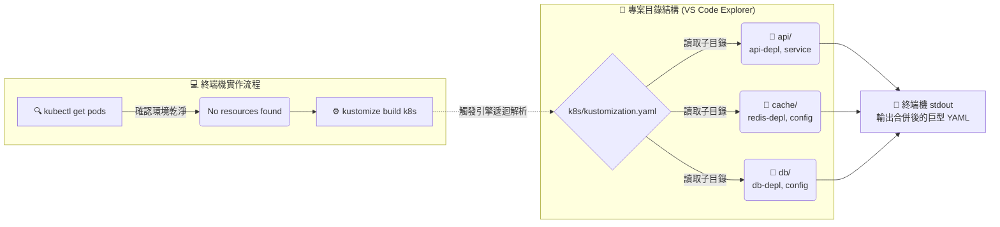

# 跨子目錄管理實作演練 (Managing Directories Demo)

## 1. 🏷️ 課程定位
- **章節編號與名稱**：第 13 節：(2025 Updates) Kustomize Basics
- **影片標題**：270. Managing Directories Demo

## 2. 📌 核心概念摘要
本節實作展示了 Kustomize 階層式目錄的「一鍵編譯與遞迴渲染」能力。

這就像是**「交響樂團的總指揮 (Conductor)」**：只要頂層目錄 (`k8s/`) 正確宣告了樂器分部的路徑，管理者只需對著頂層目錄下達單一揮拍指令，Kustomize 引擎就能自動深入 `api`、`cache` 與 `db` 等子目錄，將分散的微服務樂譜無縫組裝成一份可直接演奏（部署）的完整基礎架構交響樂。

## 3. 📊 流程圖與視覺化重現


## 4. 🔑 知識點擷取 (Detailed Notes)
- **環境狀態確認 (`kubectl get pods`)**：
  - **底層意義**：在進行任何大型架構部署前，先確認 Default Namespace 處於乾淨狀態（如截圖中的 `No resources found`），這能避免新舊資源名稱衝突或誤判部署結果。這也是架構師的標準防禦性操作。
- **頂層編譯指令 (`kustomize build k8s`)**：
  - **觸發機制**：指令最後的 `k8s` 是「目錄路徑」。引擎會去讀取該目錄下的 `kustomization.yaml`。
  - **底層對象變化**：因為 `k8s/kustomization.yaml` 內的 `resources` 區塊宣告了 `api`, `cache`, `db` 這三個目錄，引擎會依序進入這三個資料夾，各自渲染它們內部的 Deployment 與 Service YAML，最後在終端機畫面上（stdout）連續吐出所有資源的標準 K8s YAML。
- **VS Code 專案結構最佳實踐**：
  - **重要性**：從截圖左側的 EXPLORER 可以看到，`api`, `cache`, `db` 每一個子目錄底下都擁有自己獨立的 `kustomization.yaml`。這符合了「每個被引用的子目錄本身都必須是一個合法的 Kustomize 模組」的嚴格限制條件。

## 5. 💻 CKA 必備實作指令 (Imperative Commands)
影片中使用了獨立版指令進行 Demo 預覽，但在 CKA 考場實戰中，請將其轉換為 `kubectl` 原生語法：

```bash
# 🔍 實務除錯：純粹渲染 K8s 目錄下的所有資源，印在螢幕上檢查是否有語法錯誤
# 等同於影片截圖中的 kustomize build k8s
kubectl kustomize ./k8s

# 🚀 考場必備捷徑：跳過預覽，直接將 k8s 目錄下的所有微服務遞迴部署到叢集
kubectl apply -k ./k8s

# 🗑️ 考場還原捷徑：如果發現剛剛部署錯 Namespace，直接利用目錄反向刪除全部資源
kubectl delete -k ./k8s
```

## 6. 🚀 CKA 考試延伸與 Troubleshooting
> [!TIP]
> **🎯 考試情境預測**：
> - **考場真相**：考題極少會要求你從頭建立這麼多層的目錄結構，通常是已經建好如畫面中的 `api` 與 `db`，但要求你「只」部署 `db` 目錄，或者將整個 `k8s` 目錄部署到特定的 Namespace。
> - **解題策略**：仔細看清題目要求。如果是單一部署，請下 `kubectl apply -k ./k8s/db`；如果是全域部署，請下 `kubectl apply -k ./k8s -n <指定命名空間>`。

> [!WARNING]
> **🛑 避坑指南**：
> **打錯指令導致建立失敗**：在終端機中，`kustomize build` 是配上目錄名稱（如 `k8s`）；但如果你習慣用 `kubectl apply`，千萬記得參數是 `-k` 而不是 `-f`。如果打成 `kubectl apply -f k8s`，API Server 會抱怨它看不懂裡面那些 `kustomization.yaml` 檔案。

> [!CAUTION]
> **🔧 Troubleshooting**：
> **渲染崩潰**：如果執行 `kustomize build k8s` 時終端機立刻報錯：`Error: accumulating resources: accumulation err...`
> **除錯動作**：這通常代表某個子目錄（例如 `cache/`）裡面的 `kustomization.yaml` 寫錯了（例如引用了一個不存在的 `redis-service.yaml`）。此時不要在頂層除錯，請**直接進入有嫌疑的子目錄**執行 `kubectl kustomize ./cache`，把範圍縮小，錯誤訊息就會非常明確。

## 7. 📝 YAML 骨架 (YAML Skeleton)
為了實現影片中的 Demo，目錄結構與 YAML 對應關係必須如下（這也是實務專案的標準骨架）：

```text
k8s/
├── kustomization.yaml      <-- 頂層 (宣告 resources: [api, db])
├── api/
│   ├── kustomization.yaml  <-- 子模組 (宣告 resources: [api-depl.yaml])
│   └── api-depl.yaml
└── db/
    ├── kustomization.yaml  <-- 子模組 (宣告 resources: [db-depl.yaml])
    └── db-depl.yaml
```

## 8. 🧠 自我測驗
<details>
<summary>如果在 <code>api/</code> 目錄下的 <code>kustomization.yaml</code> 裡面寫了 <code>namePrefix: backend-</code>，這個 Prefix 會影響到 <code>db/</code> 目錄裡面的資源嗎？</summary>

**解答：**
**不會！**
Kustomize 的作用域是具有「封裝性」的。子目錄 `api/` 內設定的 Prefix 或 Labels，只會作用於 `api/` 自己載入的資源。頂層的 `k8s/kustomization.yaml` 只是將各個獨立渲染好的子模組收集起來而已。
*(💡 反之，如果 Prefix 是寫在頂層的 `k8s/kustomization.yaml` 中，就會由上往下套用到所有子目錄的資源上。)*
</details>
