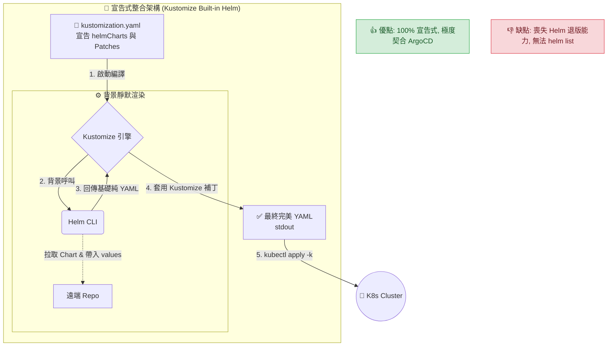

# 宣告式整合架構 (Advanced Architecture: Kustomize Built-in Helm)

## 1. 🏷️ 課程定位
- **章節編號與名稱**：第 13 節：(2025 Updates) Kustomize Basics (架構師實戰延伸篇)
- **影片標題**：272-2. Advanced Architecture: Kustomize Built-in Helm (宣告式整合模式的優缺點與版本規範)

## 2. 📌 核心概念摘要
本架構的底層運作目標在於：將 Helm 徹底降級為「純粹的 YAML 範本生成器」。

這就像是**「出版社與影子寫手 (Ghostwriter) 的發包代工模式」**：Kustomize 擔任總指揮（出版社），直接在設定檔中宣告需要的第三方套件。編譯時，它會在背景偷偷呼叫 Helm（影子寫手）去展開資源，接著立刻套用 Kustomize 的疊加補丁，最終輸出一份純淨的 Kubernetes YAML 清單。因為 K8s (讀者) 只看到最終的標準成品，所以它根本不知道 Helm 曾經參與其中。

## 3. 📊 流程圖與視覺化重現


## 4. 🔑 知識點擷取 (Detailed Notes)
- **嚴格版本要求 (Version Requirements)**：
  - **Kustomize 引擎**：必須是 **v4.1.0** 或以上版本（這是官方正式內建 `helmCharts` 支援的分水嶺）。
  - **Helm 執行檔**：執行環境中必須已經安裝 Helm v3.x 的 CLI 工具（因為 Kustomize 在底層是真的去呼叫這個二進位檔，它自己並不包含 Helm 的原始碼解析器）。
- **架構優點 (Pros)**：
  - **極致的宣告式 (Pure Declarative)**：不需要寫任何 Shell Script (如上一篇的 wrapper)，所有的來源、版本、預設值與補丁，全部集中在單一的 `kustomization.yaml` 檔案中，這就是單一真實來源 (Single Source of Truth)。
  - **GitOps 完美契合**：這套架構是 ArgoCD / FluxCD 的最愛。只要把這個目錄推上 Git，ArgoCD 會自動識別並渲染，完美結合了社群 Chart 的便利性與內部客製化需求。
- **架構缺點與限制 (Cons & Limitations)**：
  - **徹底喪失 Helm 生命週期**：因為最終送進叢集的是純 YAML，Kubernetes 根本不知道這是 Helm 部署的。因此，`helm list`, `helm history`, `helm rollback` 全部失效。您必須完全依賴 K8s 原生的 ReplicaSet 退版機制，或是依賴 ArgoCD 來進行退版。
  - **無法使用 Helm Hooks**：Helm Chart 中經常會有一些依賴生命週期的特殊 Hook（例如 `pre-install` 跑資料庫遷移）。當 Helm 被當成純渲染器時，這些 Hook 的執行順序可能會失效或被當成普通 Pod 建立，導致部署失敗。

## 5. 💻 CKA 必備實作指令 (Imperative Commands)
實務上，您的 `kustomization.yaml` 結構會長這樣（見下方 YAML 骨架），在終端機則需執行以下指令：

```bash
# 🎯 必須加上「允許 Helm」的安全參數
# Kustomize 預設基於安全考量，禁止呼叫外部程式。必須加上 --enable-helm 參數才能放行
kustomize build --enable-helm . 

# 🚀 實戰部署：透過管線直接套用
kustomize build --enable-helm . | kubectl apply -f -

# 💡 考場捷徑：在較新的 kubectl 版本中，也可直接使用內建指令整合
kubectl kustomize --enable-helm . | kubectl apply -f -
```

## 6. 🚀 CKA 考試延伸與 Troubleshooting
> [!TIP]
> **🎯 考試情境預測**：
> **考場真相**：這屬於企業級實務架構，CKA 考場中絕對不會考這題，請放心。但了解這點，能讓您在解讀實務題或未來工作中提供的 Kustomize 目錄時更有底氣。

> [!WARNING]
> **🛑 避坑指南**：
> - **忘記 `--enable-helm` 參數**：這是實務上 99% 工程師第一次用這個架構時會踩的坑。如果在 CI/CD 管線中忘記加這個參數，Kustomize 會報錯並拒絕執行背景呼叫。
> - **找不到 helm 執行檔**：如果您的 Jenkins / GitLab Runner 容器裡面只有裝 `kustomize` 而忘記裝 `helm`，執行時會拋出 `executable file not found in $PATH` 的錯誤。

> [!CAUTION]
> **🔧 Troubleshooting**：
> **Values 覆蓋無效**：在 `helmCharts` 區塊中使用 `valuesFile` 或 `valuesInline` 時，如果發現產出的 YAML 沒有吃到參數。
> **除錯動作**：請先使用原生的 `helm template` 指令，帶入相同的 values 檔案測試。確認是 Helm Chart 本身不支援該參數，還是 Kustomize YAML 縮排寫錯。通常是 YAML 的縮排層級與 Helm Chart 官方定義的不一致所導致。

## 7. 📝 YAML 骨架 (YAML Skeleton)
實現 100% 宣告式的終極 `kustomization.yaml` 寫法如下：

```yaml
# 檔案：kustomization.yaml
apiVersion: kustomize.config.k8s.io/v1beta1
kind: Kustomization

# 直接宣告要拉取的 Helm Chart (取代傳統的 resources)
helmCharts:
  - name: ingress-nginx
    repo: https://kubernetes.github.io/ingress-nginx
    releaseName: my-ingress
    namespace: ingress-system
    version: 4.8.3
    # 可以直接把 values.yaml 的內容寫在這裡
    valuesInline:
      controller:
        metrics:
          enabled: true

# 套用 Kustomize 補丁 (例如加上全域標籤)
commonLabels:
  managed-by: kustomize-helm
```

## 8. 🧠 自我測驗
<details>
<summary>如果我使用這個宣告式架構成功部署了 Nginx Ingress，接著我在終端機輸入 <code>helm list -A</code>，我會看到名為 <code>my-ingress</code> 的 Release 嗎？為什麼？</summary>

**解答：**
**絕對看不到！**
因為這個架構的核心精神是「把 Helm 當作純粹的文字產生器」。Kustomize 只是叫 Helm 在背景吐出純 YAML 文本，然後 Kustomize 自己拿著這些 YAML 去找 API Server 進行原生的建立。
在這個過程中，Helm 的「安裝引擎」從未與 Kubernetes API 溝通，也不會在叢集中寫入任何紀錄 Helm 狀態的 Secret。因此對 K8s 而言，這就只是一堆普通的 Deployment 和 Service，完全沒有 Helm 的存在痕跡。
</details>
