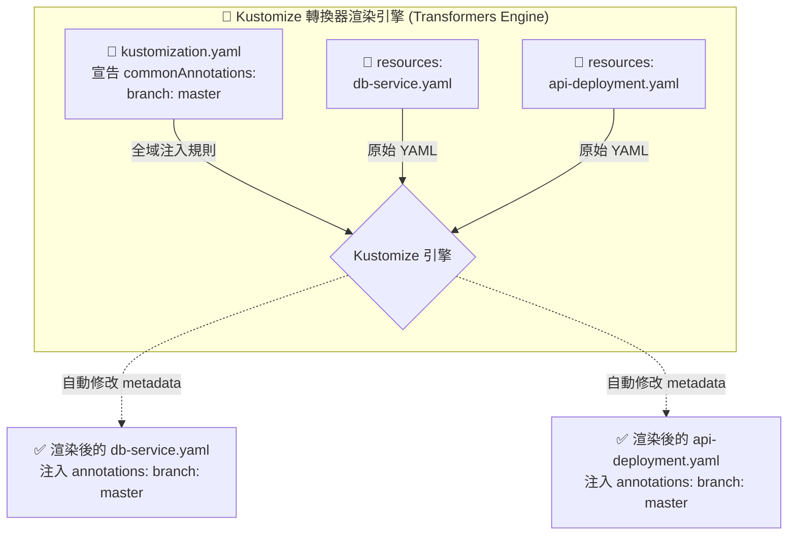

# 轉換器機制解析 (Common Transformers)

## 1. 🏷️ 課程定位
- **章節編號與名稱**：第 13 節：(2025 Updates) Kustomize Basics
- **影片標題**：272. Common Transformers

## 2. 📌 核心概念摘要
在微服務架構中，我們經常需要為成百上千個 Kubernetes 資源打上統一的管理標籤或追蹤資訊。本節的底層運作目標在於介紹 Transformers (轉換器) 機制。

這就像是一顆**「智慧型的魔法印章」**：透過在 `kustomization.yaml` 中宣告全域規則（如 `commonAnnotations`），Kustomize 引擎能在渲染階段「自動且智慧地」將這些詮釋資料 (Metadata) 蓋印到所有被納管的基礎 YAML 文件上。這徹底消除了手動打開每個檔案去修改所帶來的人為遺漏與維護成本。

## 3. 📊 流程圖與視覺化重現


## 4. 🔑 知識點擷取 (Detailed Notes)
- **轉換器 (Transformers) 的定義**：
  - **定義**：Kustomize 內建的自動化 YAML 修改規則。它不僅僅是簡單的「字串取代」，而是理解 Kubernetes 資源結構的智慧化引擎。
- **`commonAnnotations` 機制解析**：
  - **觸發行為**：在 `kustomization.yaml` 內加入 `commonAnnotations` 區塊並設定鍵值對（如 `branch: master`）。
  - **底層對象變化**：引擎會尋找 `resources` 清單下的所有檔案（如 `db-service.yaml`），並自動在其 `metadata` 區塊下新增或合併 annotations。
  - **智慧傳遞 (Smart Propagation)**：這是 Kustomize 最強大的地方！對於 Deployment 或 StatefulSet 這種帶有 Pod 模板的資源，轉換器不僅會把 Annotation 加在 Deployment 本身上，還會**自動往下層注入**到 `spec.template.metadata` 之中，確保底層真正運行起來的 Pod 也帶有相同的追蹤資訊。
- **限制條件 (Limitations)**：
  - **全域污染風險**：`commonAnnotations` 與 `commonLabels` 顧名思義是「全域 (Common)」的。它會無差別地套用到該目錄下宣告的所有資源。如果您只想針對「單一特定資源」（例如只幫 DB Service 加註解），則不該使用 Transformer，而必須改用 patches (補丁) 機制。

## 5. 💻 CKA 必備實作指令 (Imperative Commands)
在考場上，如果您不想手寫容易排版縮排錯誤的 YAML，可以使用命令列快速產生這些轉換器規則：

```bash
# 🎯 考場必備捷徑：透過 CLI 快速在當前目錄的 kustomization.yaml 中加入全域 Annotation
# 這比手動打開 vim 編輯檔案更快且不容易出錯
kustomize edit add annotation branch:master

# 🎯 同理，加入全域 Label 的快捷指令
kustomize edit add label env:production

# 🔍 考場驗證：執行完修改後，立刻預覽渲染結果，檢查 db-service.yaml 是否成功被注入
kubectl kustomize .

# 🚀 驗證無誤後，一鍵部署到叢集
kubectl apply -k .
```
*(備註：CKA 考場通常會提供 `kustomize` 獨立二進位檔供快速修改設定檔使用，但部署時建議還是使用 `kubectl apply -k`)*

## 6. 🚀 CKA 考試延伸與 Troubleshooting
> [!TIP]
> **🎯 考試情境預測**：
> 考官給您一個包含 Deployment、Service 與 ConfigMap 的目錄，要求您「確保該目錄下產生的所有資源以及底層的 Pod，都必須帶有 `release: v1.2` 的標籤 (Label)」。
> **解題策略**：千萬不要傻傻地一個個打開 YAML 去改！直接在目錄下的 `kustomization.yaml` 寫入 `commonLabels:` 並指定 `release: "v1.2"`，然後用 `kubectl apply -k .` 部署即可拿滿分。

> [!WARNING]
> **🛑 避坑指南：Labels vs Annotations 的致命差異**：
> - **Annotations (註解)**：不具有選擇器功能，只是純粹的元資料（如 Git Commit ID、負責人 Email）。可以**隨時動態修改**，不會阻擋部署。
> - **Labels (標籤)**：具有嚴格的選擇器綁定效力。如果您對一個「**已經在叢集中運作**」的 Deployment 使用 `commonLabels` 加上了新標籤並執行 `apply`，API Server 會直接拒絕更新並報錯。因為 Deployment 的 `selector.matchLabels` 在創建後是不可變的 (Immutable)。遇到這種情況，必須先刪除舊資源再重新部署。

> [!CAUTION]
> **🔧 Troubleshooting**：
> **發現某個資源沒有被注入 Annotation**：
> **除錯動作**：如果執行 `kubectl kustomize .` 預覽後，發現某個 YAML 檔（例如 `secret.yaml`）根本沒有出現 `branch: master`。這通常代表該 YAML 檔**根本沒有被列入** `kustomization.yaml` 的 `resources:` 清單中。Kustomize 引擎只會處理有被顯式宣告的檔案，請檢查清單是否有遺漏。

## 7. 📝 YAML 骨架 (YAML Skeleton)
展示魔法印章如何將 `kustomization.yaml` 內的設定注入到基礎資源中：

```yaml
# kustomization.yaml
apiVersion: kustomize.config.k8s.io/v1beta1
kind: Kustomization
resources:
  - deployment.yaml

# 宣告全域轉換器
commonAnnotations:
  branch: master
```

```yaml
# 渲染後的最終結果 (引擎會智慧推導)
apiVersion: apps/v1
kind: Deployment
metadata:
  name: my-app
  annotations:
    branch: master  # <-- 第一層：注入到 Deployment 頂層
spec:
  template:
    metadata:
      annotations:
        branch: master  # <-- 第二層：智慧注入到底層 Pod 模板！
```

## 8. 🧠 自我測驗
<details>
<summary>我的 <code>kustomization.yaml</code> 裡面設定了 <code>commonLabels: env: prod</code>。如果我原本的 <code>deployment.yaml</code> 裡面就已經寫了 <code>env: dev</code> 的 Label，Kustomize 在渲染時會如何處理？會報錯嗎？</summary>

**解答：**
**不會報錯，它會直接覆蓋！**
Kustomize 的轉換器機制在遇到衝突時，會以 `kustomization.yaml` 內定義的值為最高優先級。因此原本的 `env: dev` 會被無情地強行覆蓋成 `env: prod`。這正是 Kustomize 強大的地方，也是我們在操作全域污染 (Global Transformation) 時必須特別小心的地方。
</details>

---
💡 **來自架構師的 Follow-up**：
在您的實務環境中，團隊通常會使用哪些「全域 Annotation 或 Label」來追蹤資源呢？（例如：標示 Git 的分支名稱、負責單位的 Email，還是 CI/CD 的 Pipeline ID？）釐清這些實務需求，我們下一節討論進階補丁 (Patches) 時會更有感！
