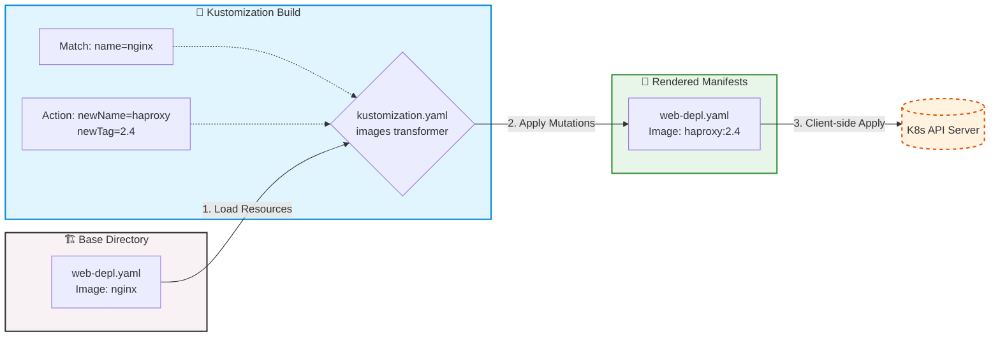

# 映像檔轉換器 (Image Transformers)

## 1. 🏷️ 課程定位
- **章節編號與名稱**：第 13 節：(2025 Updates) Kustomize Basics
- **影片標題**：273. Image Transformers

## 2. 📌 核心概念摘要
- **動態替換機制**：Image Transformer 允許工程師在**絕對不修改基底（Base）YAML 檔案**的前提下，動態宣告並精準覆寫 Pod Template 中的 `image` 欄位（包含 Registry 路徑、映像檔名稱與標籤）。
- **CI/CD 底層技術**：由於原生 Kubernetes API Server 並不知道 Kustomize 的存在，這種在 Client-side (kubectl 端) 進行轉換的技術，是多環境（Dev/QA/Prod）部署與版本迭代中不可或缺的核心。
- **💡 生動比喻**：就像是遊戲中角色的「換 Skin (造型)」系統。遊戲主程式（Base YAML）保持不變，但在載入關卡前（Kustomization Build），系統會攔截並套用你指定的造型配置（`kustomization.yaml`），讓同一個基礎組件展現出不同環境需要的樣貌。

## 3. 📊 流程圖與視覺化重現 (生命週期與覆寫邏輯)


## 4. 💻 CKA 必備實作指令
> **考場神技：在 CKA 考試中，時間就是分數。請熟記並善用以下指令驗證 Kustomize 結果。**

```bash
# 1. 👁️ 預覽渲染結果 (Dry-run 原理)
# 純粹在終端機印出替換後的 YAML，不會真正部署到叢集。用來檢查 Image 是否成功變成預期的版本。
kubectl kustomize ./

# 2. 🚀 正式部署 Kustomize 目錄
# ⚠️ 注意參數是 -k (Kustomize Directory) 而不是常用的 -f (File)
kubectl apply -k ./

# 3. 📝 快速輸出並轉存 YAML 
# 若考題要求將渲染結果存成實體檔案，直接重導向輸出即可
kubectl kustomize ./ > /opt/course/rendered-deployment.yaml

# 4. ⚡ 動態修改 kustomization.yaml 中的 image
# 若考場環境有安裝 kustomize CLI，這招能免去手動編輯 YAML 縮排的風險
kustomize edit set image nginx=haproxy:2.4

# 5. 🔍 尋找更多 kustomize 編輯選項
kustomize edit set image --help | grep -i new
```

## 5. 🛠️ 實戰與最佳實踐
> [!IMPORTANT]  
> **備份機制 SOP**：雖然 Kustomize 的精神是「不改動 Base」，但若 CKA 考題要求你建立或修改基底檔案，務必養成好習慣：先備份！例如 `cp deployment.yaml deployment.yaml.bak`。

> [!WARNING]  
> **YAML 縮排陷阱**：`images` 是一個物件列表 (List of objects)。在 `kustomization.yaml` 中，`- name: nginx` 前面必須有 `-` 符號，且 `newName` 與 `newTag` 必須與 `name` 精準對齊。縮排錯誤會導致解析失敗。

> [!TIP]  
> **Troubleshooting 降維排錯 SOP**
> - **問題情境：** 下達 `kubectl apply -k .` 後，Pod 依然跑舊的 nginx 映像檔？
> - **排查步驟 1 (確認轉換層)：** 執行 `kubectl kustomize .` 檢查終端機輸出。如果輸出的 `image` 沒變，代表你的 `kustomization.yaml` 規則寫錯（通常是 `name` 拼字錯誤或縮排不對）。
> - **排查步驟 2 (確認匹配條件)：** 檢查基底 YAML 中的 `image` 欄位是否包含完整的 Repository 路徑。若基底寫的是 `myrepo/nginx`，則 `kustomization.yaml` 裡的 `name` 必須寫完整的 `myrepo/nginx` 才能精準命中。

## 6. 📄 YAML 骨架
最簡潔、標準的 `kustomization.yaml` 替換範例：

```yaml
apiVersion: kustomize.config.k8s.io/v1beta1
kind: Kustomization

resources:
  - deployment.yaml # 確保 Base 資源有被載入

images:
  - name: nginx             # 🎯 【關鍵匹配】必須完全匹配 Base YAML 中的映像檔名稱 (不含 tag)
    newName: haproxy        # 替換成的新映像檔名稱 (含或不含 Registry 路徑皆可)
    newTag: "2.4"           # 替換成的新標籤 (建議加上引號，避免純數字版本號被解析為浮點數)
    
  # 補充：也可以透過 SHA digest 精確綁定版本
  # - name: busybox
  #   digest: sha256:1234567890abcdef...
```

## 7. 🧠 自我測驗
<details>
<summary>題目 1：在 kustomization.yaml 中設定了 <code>images</code> 替換規則，但為何執行 <code>kubectl apply -f .</code> 後卻沒有生效，依然部署了舊的 Image？</summary>
<b>解答：</b>因為錯用了參數。部署 Kustomize 目錄必須使用 <code>-k</code> (kustomize)，亦即 <code>kubectl apply -k .</code>。若誤用 <code>-f</code> (file)，kubectl 只會讀取目錄下的原始 Base YAML 檔，而完全忽略 <code>kustomization.yaml</code> 的覆寫邏輯。
</details>

<details>
<summary>題目 2：基底 YAML (Base) 中定義了 image 為 <code>nginx:alpine</code>。我在 <code>kustomization.yaml</code> 中的 images 規則，<code>name</code> 欄位應該填寫 <code>nginx:alpine</code> 才能匹配嗎？</summary>
<b>解答：</b>錯。<code>name</code> 欄位只能填寫<b>不含 tag</b> 的映像檔名稱（即 <code>nginx</code>）。Kustomize 攔截時，只比對名稱部分，原有的 <code>alpine</code> tag 會自動被 <code>newTag</code> 指定的值所覆寫。
</details>
