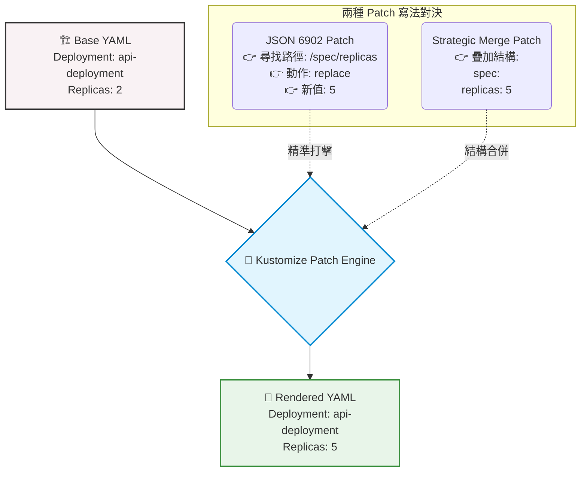

# 補丁簡介與策略對決 (Patches Intro)

## 1. 🏷️ 課程定位
- **章節編號與名稱**：第 13 節：(2025 Updates) Kustomize Basics
- **影片標題**：276. Patches Intro

## 2. 📌 核心概念摘要
- **外科手術式精準修改**：Patches (補丁) 賦予了我們在**絕對不更動原始 Base YAML** 的前提下，對 Kubernetes 資源進行局部、精確覆寫的能力。
- **兩大流派對決**：本堂課展示了兩種最主流的 Patch 寫法：`JSON 6902 Patch` (精確路徑替換) 與 `Strategic Merge Patch` (K8s 原生結構合併)。兩者皆能達成相同目的（如修改 replicas 數量），但底層邏輯與適用情境大不相同。
- **💡 生動比喻**：
  - **JSON 6902** 就像是「狙擊手」：給你精確座標（第幾行、第幾個元素），直接把那裡的東西換掉。缺點是如果目標移動了位置，狙擊手就會打錯人。
  - **Strategic Merge** 就像是「DNA 融合技術」：K8s 認得自己的原生結構，你只要給他一段新的局部基因（局部 YAML），它會自動透過名稱比對（Name Matching），聰明地將新設定完美融入宿主中。

## 3. 📊 流程圖與視覺化重現 (兩種 Patch 策略運作邏輯)


## 4. 💻 CKA 必備實作指令
> **考場神技：這兩種 Patch 概念不只存在於 Kustomize，在考場上使用原生 `kubectl patch` 進行緊急線上修復時也極度常見！**

```bash
# 1. 👁️ Kustomize 預覽與渲染
kubectl kustomize ./

# 2. ⚡ 原生 kubectl patch 實戰：使用 Strategic Merge Patch (預設)
# 直接疊加/修改屬性，是最常用、最安全的修復手段
kubectl patch deployment api-deployment -p '{"spec": {"replicas": 5}}'

# 3. 🎯 原生 kubectl patch 實戰：使用 JSON 6902 Patch
# 必須加上 --type='json'，並傳入包含 op, path, value 的陣列物件
kubectl patch deployment api-deployment --type='json' -p='[{"op": "replace", "path": "/spec/replicas", "value": 5}]'

# 4. 🔍 驗證結果
kubectl get deployment api-deployment
```

## 5. 🛠️ 實戰與最佳實踐
> [!IMPORTANT]  
> **實務優勢與考場建議**：強烈推薦在 Kustomize 與實務中優先使用 **Strategic Merge Patch 🌟**。因為 K8s 了解自身結構，在處理陣列（例如 `containers` 列表）時，它會自動透過 `name` 去比對並合併，不會依賴脆弱的陣列索引。

> [!WARNING]  
> **JSON 6902 的陣列陷阱 (Limitations)**：JSON 6902 處理陣列 (Array) 非常笨拙。例如想修改 Pod 裡面的第一個 Container Image，路徑必須寫死為 `/spec/template/spec/containers/0/image`。如果哪天 Base 檔案中 Container 順序變了，這個索引 `0` 的補丁就會改錯人，導致嚴重的故障！

> [!TIP]  
> **Troubleshooting 降維排錯 SOP**
> - **問題：** 執行 `kubectl kustomize .` 時，出現類似 `no matches for OriginalId...` 或找不到目標的錯誤？
> - **排查步驟：**
>   1. 這代表 Patch 宣告的目標找不到對應的 Base 資源。
>   2. 檢查 `kustomization.yaml` 中的 `target` 區塊（若是 JSON Patch）或局部 YAML 內的 `metadata.name`（若是 Strategic Merge），確認名稱、`kind` 是否與 Base 檔案完全一致。
>   3. 檢查是否有錯字或大小寫錯誤。

## 6. 📄 YAML 骨架
在 `kustomization.yaml` 中實作兩種 Patch 的標準寫法：

```yaml
apiVersion: kustomize.config.k8s.io/v1beta1
kind: Kustomization

resources:
  - deployment.yaml

patches:
  # 方案 A: Strategic Merge Patch (推薦🌟，直接寫內聯 YAML 結構)
  - patch: |-
      apiVersion: apps/v1
      kind: Deployment
      metadata:
        name: api-deployment
      spec:
        replicas: 5

  # 方案 B: JSON 6902 Patch (需明確鎖定 target 與定義動作路徑)
  - target:
      kind: Deployment
      name: api-deployment
    patch: |-
      - op: replace
        path: /spec/replicas
        value: 5
```

## 7. 🧠 自我測驗
<details>
<summary>題目 1：為什麼在處理 Pod 內包含多個 Container 的修改時，強烈建議不要使用 JSON 6902 Patch？</summary>
<b>解答：</b>因為 JSON 6902 必須依賴寫死的陣列索引 (Index) 來定位元素，例如 <code>/spec/template/spec/containers/0</code>。只要底層 Base YAML 改變了容器的排列順序，補丁就會修改到錯誤的目標。而 Strategic Merge Patch 會自動根據容器的 <code>name</code> 欄位進行聰明的比對合併，穩健度極高。
</details>

<details>
<summary>題目 2：Strategic Merge Patch 在 kustomization.yaml 中，需要像 JSON 6902 一樣設定 <code>target</code> 與 <code>op</code> (動作) 嗎？</summary>
<b>解答：</b>不需要。Strategic Merge 的寫法就像一般的 Kubernetes YAML 一樣，你只需要提供一份「只包含要異動的欄位」的局部結構片段，並填寫正確的 <code>kind</code> 與 <code>metadata.name</code>，Kustomize 引擎就會自動將它與 Base 資源「疊加」或「覆寫」。
</details>
