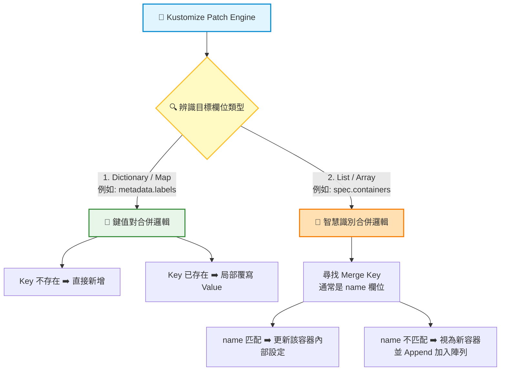

# 補丁資料結構的底層邏輯 (Different Types of Patches)

## 1. 🏷️ 課程定位
- **章節編號與名稱**：第 13 節：(2025 Updates) Kustomize Basics
- **影片標題**：277. Different Types of Patches

## 2. 📌 核心概念摘要
- **底層結構分支行為**：Kustomize Patches 在處理 Kubernetes 資源時，會依據資料結構是「Dictionary (鍵值對)」還是「List (陣列)」，而採用截然不同的底層合併邏輯。
- **精準合併的關鍵**：Strategic Merge Patch 在處理 List (陣列) 時，具備「智慧識別合併」能力。它強烈依賴一個特定的識別碼（通常是 `name` 欄位，稱為 Merge Key）來精準定位陣列中的個別元素，避免陣列被整陀覆蓋。
- **💡 生動比喻**：
  - **Dictionary 合併**就像是「更新個人資料表」：表單上有地址、電話。如果你送出新電話，舊電話就被無情蓋掉；如果有新欄位（如 Line ID），就直接補充上去。
  - **List 合併**就像是在「茫茫大海尋人」：你想把一件新制服交給一位名叫「王小明」的水手（代表 List 中的一個 Container）。如果你只給制服但不指名道姓，系統就不知道該發給誰。因此，你必須大聲喊出識別碼（`- name: 王小明`），系統才能精準把制服遞給他，而不會影響其他水手。

## 3. 📊 流程圖與視覺化重現 (資料結構合併邏輯)


## 4. 💻 CKA 必備實作指令
> **考場神技：在 CKA 考場上，若時間緊迫，熟練運用原生 `kubectl patch` 來處理這兩種結構的緊急修復，能大幅節省你編輯 YAML 的時間。**

```bash
# 1. 🛠️ 對 Dictionary 進行 Patch (例如修改 Replicas)
# 採用預設的 merge 模式，直接針對單一鍵值進行覆寫
kubectl patch deployment api-deployment --type='merge' -p '{"spec":{"replicas":5}}'

# 2. 🦾 對 List 進行精準 Patch (修改特定 Container 的 Image)
# ⚠️ 注意：底層 Strategic Merge 會依據 name: "api-container" 去精準定位陣列中的物件，並只修改該物件的 image
kubectl patch deployment api-deployment --type='strategic' -p '{
  "spec": {
    "template": {
      "spec": {
        "containers": [
          {
            "name": "api-container",
            "image": "haproxy:2.4"
          }
        ]
      }
    }
  }
}'

# 3. 👁️ 驗證 Kustomize 補丁後的結構是否如預期
kubectl kustomize ./
```

## 5. 🛠️ 實戰與最佳實踐
> [!IMPORTANT]  
> **考場情境預測 (List 類型考法)**：題目會給定一個包含多個 Sidecar 容器的 Deployment 基礎檔。要求你利用 Kustomize Patch，**在不更動其餘容器的情況下**，單獨為名為 `main-app` 的容器加上一個環境變數（如 `ENV=PROD`）。這就是測試你是否懂得運用 Merge Key (`name`) 的經典考題。

> [!WARNING]  
> **遺失 Name 識別碼的致命傷**：許多學員在幫 `containers` 陣列寫補丁時，直覺地寫了 `image: xxx` 或 `env: xxx`，卻漏寫了最重要的 `- name: my-container`。失去 `name` 識別碼會導致 Kustomize 無法對齊標的，進而引發報錯或不可預期的行為。

> [!TIP]  
> **Troubleshooting 降維排錯 SOP**
> - **問題情境：** 套用 Patch 後，發現原本 Deployment 裡的舊容器全部消失了，竟然只剩下 Patch 裡面寫的那一個新容器？
> - **原因排查：** 
>   1. 這代表你誤用了 **JSON 6902 Patch 的 replace 操作**，或者使用了不支援 Strategic Merge 的底層合併工具。
>   2. 這種結構錯誤會導致整個 List 陣列被無情地全面覆蓋（Overwrite）。
>   3. **解法：** 請確認在 `kustomization.yaml` 中使用的是標準的 Strategic Merge 語法（直接寫內聯 YAML），且陣列內部**絕對不能忘記補上 `name` 欄位**。

## 6. 📄 YAML 骨架
最標準的 List (陣列) 類型 Strategic Merge Patch 寫法範例（對應上述考場預測題型）：

```yaml
apiVersion: kustomize.config.k8s.io/v1beta1
kind: Kustomization

resources:
  - deployment.yaml

patches:
  - patch: |-
      apiVersion: apps/v1
      kind: Deployment
      metadata:
        name: multi-container-deployment
      spec:
        template:
          spec:
            containers:
              # 🎯 關鍵：必須使用 name 作為 Merge Key 進行精準定位！
              # Kustomize 會尋找原始 YAML 中名為 main-app 的容器，並將底下設定「疊加」進去，而不會影響其他 Sidecar 容器。
              - name: main-app
                env:
                  - name: ENV
                    value: "PROD"
```

## 7. 🧠 自我測驗
<details>
<summary>題目 1：在針對 Deployment 內的 <code>spec.template.spec.containers</code> 寫 Kustomize Strategic Merge Patch 時，如果我的補丁陣列裡忘記寫 <code>name</code> 欄位，會發生什麼事？</summary>
<b>解答：</b>因為 <code>containers</code> 是一個陣列 (List)，Strategic Merge 必須依賴 Merge Key（即 <code>name</code> 欄位）來尋找目標。如果沒有指定 <code>name</code>，Kustomize 無法對齊底層資源，將無法正確覆寫目標容器設定，甚至會直接報錯導致渲染失敗。
</details>

<details>
<summary>題目 2：在修改 <code>metadata.labels</code> (屬於 Dictionary 結構) 時，如果我的 Patch 裡包含了一個 Base YAML 裡從未出現過的新標籤（例如 <code>tier: frontend</code>），Kustomize 會如何處理它？</summary>
<b>解答：</b>Kustomize 會將這個新的標籤直接「新增 (Append / Merge)」到原有的 labels 字典列表中，而絕對不會覆蓋掉 Base YAML 裡已經存在的其他舊標籤。這是 Dictionary 結構標準的鍵值對合併邏輯。
</details>
