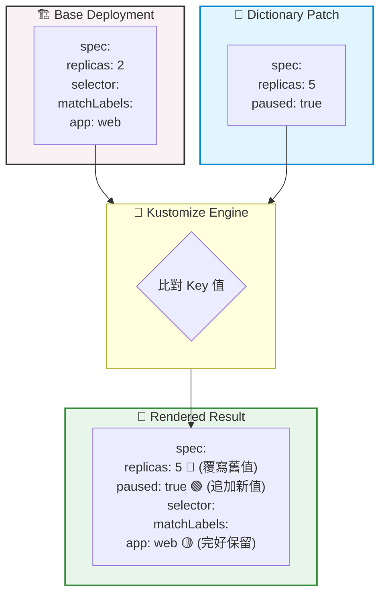

# 278. Patches Dictionary (字典補丁合併機制)

## 🎯 核心觀念

- **無損合併 (Non-destructive Merge) 機制**：Kustomize 在處理 Dictionary（如 `metadata.labels` 這種 `key: value` 結構）時，會將 Patch 聰明地融入 Base 中，就像在原有表單上貼上新的「便利貼」。
- **存在即覆寫 (Override)**：如果 Base 原本就有這個鍵值（Key），Patch 的新值會直接覆寫它。就像更新便利貼上的數字（如 `replicas` 由 2 變 5）。
- **不存在即追加 (Append)**：如果 Patch 帶來了 Base 沒有的新欄位，會安全地新增進去，就像在表單空白處補上新資訊（如新增 `paused: true`）。
- **未提及即保留 (Retain)**：Base 中沒有被 Patch 點名的欄位會完好無缺，絕不遺失。
- **限制：無法直接刪除**：Strategic Merge Patch 原生只能「新增」或「修改」。若要徹底拔除某個 Key，必須動用 JSON 6902 Patch 的 `op: remove` 手術刀。

## 📊 視覺化重現：字典欄位合併邏輯



## 💻 必考實戰指令

```bash
# 👁️ 檢查 Kustomize 字典補丁的渲染結果 (預覽合併是否如預期)
kubectl kustomize ./

# ⚡ CKA 考場神技：使用 Strategic Merge 補丁快速修改 Dictionary 欄位 (如副本數與狀態)
# 考場上若被要求臨時調整某 Deployment 的配置，這招比用 edit 還快！
kubectl patch deployment web-deployment --type='strategic' -p '{"spec":{"replicas":5,"paused":true}}'

# 🛑 考場救命技：使用 JSON 6902 補丁強制「刪除」Dictionary 中的特定 Key
# 當題目要求你移除某個不合規的 annotation 或 label 時使用
kubectl patch deployment web-deployment --type='json' -p='[{"op": "remove", "path": "/metadata/annotations/old-annotation"}]'
```

> [!WARNING] 
> **備份與驗證 SOP**
> 在執行任何破壞性或修改指令（如 `kubectl patch` 或 apply）前，強烈建議先匯出目前的 YAML 作為備份：
> `kubectl get deployment web-deployment -o yaml > web-deployment-bak.yaml`
> 修改完成後，立即使用 `kubectl describe deployment web-deployment` 確認結果。

## 📝 YAML 骨架範例

**kustomization.yaml**
```yaml
apiVersion: kustomize.config.k8s.io/v1beta1
kind: Kustomization

resources:
  - deployment.yaml

patches:
  - target:
      kind: Deployment
      name: web-deployment
    patch: |-
      apiVersion: apps/v1
      kind: Deployment
      metadata:
        name: web-deployment
      spec:
        replicas: 5           # 🔴 覆寫原本的值
        paused: true          # 🟢 加上原本沒有的欄位
```

> [!IMPORTANT]
> **資料型態陷阱**
> 在為 Dictionary 打補丁時，請嚴格遵守 Schema 的資料型態。例如 `replicas` 必須是數字 `5`，若誤寫成字串 `"5"`，雖然 Kustomize 語法檢查會過，但送交 API Server 時會被拒絕部署 (Schema validation failed)。

> [!TIP]
> **Troubleshooting：補丁報錯解析**
> **錯誤**：`error: Json patch replaces a non-existent object path`
> **原因**：你正使用 JSON 6902 Patch 的 `replace` 動作去修改 Base 裡一個「根本不存在」的父層結構。
> **解法**：若要修改的欄位原本不存在，應將操作改為 `"op": "add"`，它會自動為你建立該路徑。

## 🧠 自我測驗

<details>
<summary>在 CKA 考場上，環境中有一個執行中的微服務 Deployment，題目要求你將 resources.limits.cpu 調整為 500m，並且將 resources.requests.memory 調整為 256Mi。你會如何快速達成？（假設不使用 edit）</summary>

可以透過 `kubectl patch` 使用 Strategic Merge 快速覆寫（Override）這些 Dictionary 欄位。指令如下（請替換對應的 deployment 與 container 名稱）：

```bash
kubectl patch deployment <deployment-name> --type='strategic' -p '{"spec":{"template":{"spec":{"containers":[{"name":"<container-name>","resources":{"limits":{"cpu":"500m"},"requests":{"memory":"256Mi"}}}]}}}}'
```
*註：若題目指定使用 Kustomize，則建立 `kustomization.yaml` 並將上述資源變化寫入 `patches` 中再執行 `kubectl apply -k .`。*
</details>
