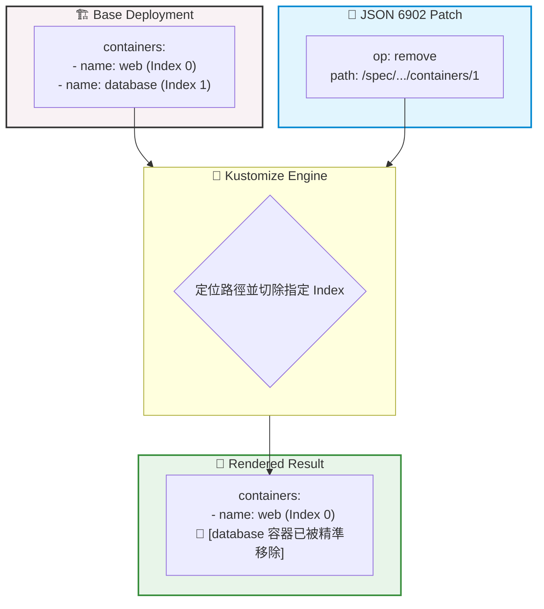

# 279. Patches List (陣列補丁元素切除)

## 🎯 核心觀念

- **List 結構的刪除痛點**：K8s 的 `containers`、`volumes` 等資源都屬於陣列 (List)。原生的 Strategic Merge Patch 天性是「修改」或「追加」，就像在火車上加掛車廂，但它沒有任何語法能向系統表達「請幫我拆掉特定這節車廂」。
- **`op: remove` 魔法**：當需要強行介入陣列並刪除特定成員時，必須改用 **JSON 6902 補丁** 的 `op: remove` 動作，並搭配以斜線劃分的絕對路徑（如 `/spec/.../containers/1`），進行精準的外科手術切除。
- **索引脆弱性 (Index Fragility) 的致命傷**：這項技術完全依賴「數字順序」（Index）進行盲狙。萬一哪天其他工程師修改了 Base YAML，把容器的宣告順序對調了，Kustomize 依然會去刪除指定順位的容器，引發誤刪核心容器的「醫療事故」。因此，在生產環境中應極其謹慎使用。

## 📊 視覺化重現：JSON 6902 精準切除邏輯



## 💻 必考實戰指令

```bash
# 1. 👁️ 考場安全第一步：預覽 List 元素被刪除後的純 YAML 結構 (避免誤切)
kubectl kustomize ./

# 2. ⚡ CKA 考場神技：使用 Imperative 指令直接切除 Deployment 的第二個容器 (Index 1)
# 當考題限時且不要求寫 kustomization.yaml 時，這行是免開編輯器的救命神招
kubectl patch deployment api-deployment --type='json' -p='[{"op": "remove", "path": "/spec/template/spec/containers/1"}]'

# 3. 🔍 驗證實際叢集中的 Pod 容器數量是否確實降為 1
kubectl get deployment api-deployment -o jsonpath='{.spec.template.spec.containers[*].name}'
```

> [!CAUTION]
> **程式界的地獄 — 從 0 開始計數**
> 千萬不要把「第二個容器」當成 `/containers/2`。在 Kubernetes 與 JSON 結構中，索引值是從 `0` 開始的！第一個容器為 `0`，第二個為 `1`。考場上一旦數錯並切錯容器，會直接導致 Pod 無法正常啟動崩潰！

## 📝 YAML 骨架範例

**kustomization.yaml 搭配 JSON 6902 Patch**
```yaml
apiVersion: kustomize.config.k8s.io/v1beta1
kind: Kustomization

resources:
  - deployment.yaml

patches:
  # 注意：JSON 6902 的寫法與 Strategic Merge 字典補丁完全不同
  - target:
      kind: Deployment
      name: api-deployment
    patch: |-
      - op: remove
        path: /spec/template/spec/containers/1
```

> [!TIP]
> **Troubleshooting 技巧：陣列越界報錯解析**
> **錯誤**：`error: Out of bounds: index 1`
> **原因排查**：這代表你的補丁試圖去刪除 Index 1（第二個）的元素，但是你的 Base YAML 裡面實際上只有一個容器（Index 0）。請立刻檢查 Base 檔案，確認陣列長度與你的補丁索引是否匹配。

## 🧠 自我測驗

<details>
<summary>在考場中，考官要求你使用 JSON 6902 補丁移除 deployment `frontend` 內部宣告的「第一個容器」，你該如何確保路徑撰寫正確且不會報錯？</summary>

1. **確認 Index**：第一個容器的索引必須寫 `0`。
2. **完整路徑**：容器深藏在 `PodTemplate` 內，精準的絕對路徑應為 `/spec/template/spec/containers/0`。
3. **實作方式**：
如果題目允許使用指令，可以一鍵執行：
```bash
kubectl patch deployment frontend --type='json' -p='[{"op": "remove", "path": "/spec/template/spec/containers/0"}]'
```
如果必須寫 `kustomization.yaml`，請套用上述 YAML 骨架，將 `path` 改為結尾是 `0` 的路徑。
</details>
