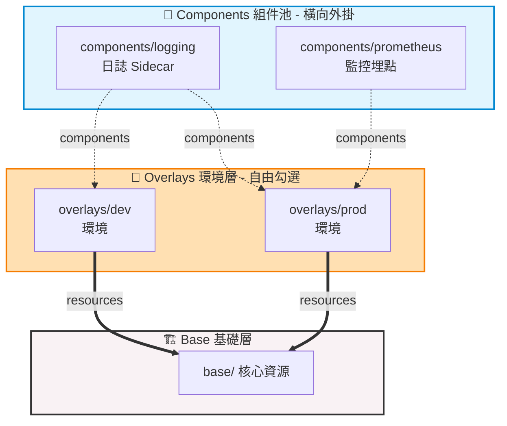

# 283. Components (組件化橫向外掛架構)

## 🎯 核心觀念

- **傳統垂直架構的極限 (The Dilemma)**：傳統的 Base/Overlay 屬於「垂直繼承」。當面對複雜需求時（如 Dev 要 A 功能，Stg 要 B 功能，Prod 要 A+B），垂直繼承會迫使維運人員複製大量重複的 Base 配置，最終演變成維護災難。
- **「樂高積木」式的橫向外掛 (Mix-ins)**：Components (組件) 徹底打破了垂直繼承的限制。它允許將特定功能（如：監控 Sidecar、日誌收集設定）封裝成獨立模組，像樂高積木一樣，讓各個環境自由地「橫向」拼裝與選配。
- **獨立的組件宣告**：每個組件都有自己的獨立目錄，在該目錄下的主控檔必須明確使用特定的 API 版本與 `kind: Component` 來宣告。它本質上是一個微型的 Kustomization。
- **消費端的專屬掛載通道**：當 Overlay（環境層）想要引入這些組件功能時，**絕不能**把組件路徑塞進傳統的 `resources:` 中，而是必須使用專屬的 `components:` 欄位通道來掛載。

## 📊 視覺化重現：功能混搭 (Mix and Match) 架構



## 💻 必考實戰指令

```bash
# 1. 👁️ 綜合渲染預覽：確認組件（如 Prometheus 註解或 Sidecar）是否順利混入特定的 Overlay
kubectl kustomize ./overlays/prod/

# 2. 🚀 部署已注入多個組件的特定環境
kubectl apply -k ./overlays/prod/

# 3. 🔍 驗證該環境部署後的 Pod 內，是否成功長出 Component 所附加的容器或配置
kubectl get deployment -n production -o jsonpath='{.spec.template.spec.containers[*].name}'
```

> [!CAUTION]
> **最致命雷區：欄位放錯地方**
> 很多考生習慣把所有的路徑都往 `resources:` 裡面塞。如果在 Overlay 的設定中，錯把組件目錄的相對路徑寫在了 `resources:` 裡，Kustomize 會將其當作一般資源解析並直接彈出錯誤！導入組件**一律要認明專屬的** `components:` 欄位。

> [!IMPORTANT]
> **API 版本與 Kind 的嚴謹度**
> 在自定義組件的宣告檔中，`kind: Component` 的開頭 `C` 必須為**大寫**，且 API 版本通常為較新的 `kustomize.config.k8s.io/v1alpha1`。拼錯會導致 Kustomize 完全無法識別此目錄為一個合法的組件。

## 📝 YAML 骨架範例

**1. 組件自身的宣告 (`components/prometheus/kustomization.yaml`)**
```yaml
apiVersion: kustomize.config.k8s.io/v1alpha1
kind: Component  # 🔴 關鍵差異：宣告為 Component 而非 Kustomization

patches:
  - path: prometheus-patch.yaml
```

**2. 消費端導入組件 (`overlays/prod/kustomization.yaml`)**
```yaml
apiVersion: kustomize.config.k8s.io/v1beta1
kind: Kustomization

# 繼承標準 Base
resources:
  - ../../base

# 🟢 透過專屬通道引入組件池中的功能
components:
  - ../../components/logging
  - ../../components/prometheus
```

> [!TIP]
> **Troubleshooting 技巧：不支援的欄位報錯**
> 若執行 `kubectl kustomize` 時出現 `error: ... unrecognized field "components"`
> **原因排查**：這通常發生在較舊版本的 Kubernetes / kubectl 內建 Kustomize 元件中（Components 屬較新功能）。考場若遇到此錯，請先確認 `apiVersion` 是否正確。若環境過舊無法支援，只能改用傳統 patch 手法。如果單純是路徑讀不到，請重新審視 `../` 層次是否精準。

## 🧠 自我測驗

<details>
<summary>考場情境：考官提供了一個基礎微服務環境，並在 <code>components/monitoring</code> 目錄下已備妥一個 <code>kind: Component</code> 監控外掛。請說明你如何編輯生產環境的設定檔 <code>overlays/prod/kustomization.yaml</code>，以便在不改動 Base 的前提下為 Prod 啟用該監控組件？</summary>

在編輯 `overlays/prod/kustomization.yaml` 時，必須保留原本指向 Base 的 `resources:` 屬性，並在其下方新增 `components:` 列表，填入正確的相對路徑：

```yaml
apiVersion: kustomize.config.k8s.io/v1beta1
kind: Kustomization

resources:
  - ../../base

components:
  - ../../components/monitoring
```

完成後，先透過 `kubectl kustomize overlays/prod/` 進行渲染預覽，確保監控外掛的設定有正確疊加後再行部署。
</details>
