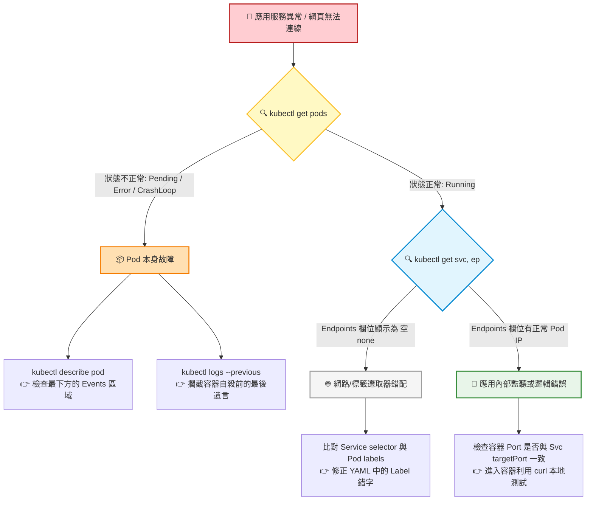

# 286. Application Failure (應用層故障排除)

## 🎯 核心觀念

- **第一道防線：Pod 生死簿診斷**：
  - `ImagePullBackOff`：通常是映像檔名稱拼錯，或是拉取私有庫時缺乏正確的 `imagePullSecrets`。
  - `CrashLoopBackOff`：容器能順利啟動但瞬間崩潰或異常退出。主因多為內部應用程式拋出異常（如 DB 連不上）或映像檔內缺乏常駐型背景程序（執行完即退出的腳本）。
  - `Pending`：Pod 連出生都辦不到。主要因為排程器找不到合適節點，原因包含節點資源耗盡（無法滿足 `requests`）或碰上不匹配的 `Taints`、`nodeSelector`。
- **向上追查 Deployment**：若預期長出 3 個 Pod 但實際數量卻是 0，代表 Pod Template 本身的 Schema 有語法或縮排錯誤，導致 Controller 根本無法產生 Pod 物件。
- **Service 導流網路死穴 (核心考點 🌟)**：
  - **標籤就像鑰匙與鎖**：Service 的 `selector` 與 Pod 的 `labels` 必須完全吻合。只要差一個字，Service 就會找不到後盾，此時 `Endpoints` 會顯示 `<none>`，外部流量就會徹底斷線。
  - **Port 錯配**：Service 的 `targetPort` 必須與容器內真實監聽的 port 完全對齊（如前端聽 8080，`targetPort` 就必須是 8080）。

## 📊 視覺化重現：應用層排查分流樹 (Application Triage Tree)



## 💻 必考實戰指令 (應用層除錯四部曲)

在時間分秒必爭的 CKA 考場中，請將以下指令形成肌肉記憶：

```bash
# 1. 🔍 第一步：全域掃描 Pod 狀態，並顯示 Labels 以利後續比對
kubectl get pods -A -o wide --show-labels

# 2. 📝 第二步：若狀態為 Pending/ImagePull，立即查看 Events (直接滑到最下方)
kubectl describe pod <pod-name> -n <namespace>

# 3. 🪵 第三步：若狀態為 CrashLoopBackOff，祭出此救命參數強行調閱「上一世」崩潰日誌
kubectl logs <pod-name> -n <namespace> -p

# 4. 🌐 第四步：若 Pod 皆正常運行但仍斷線，立刻檢查 Service 的端點狀態
kubectl get svc,endpoints -n <namespace>
```

> [!CAUTION]
> **多容器 Pod 的日誌地雷**
> 如果出問題的 Pod 內包含多個容器（例如主應用與微型 Sidecar 同處一室），直接打 `kubectl logs` 會直接噴錯。你必須加上 `-c <container-name>` 參數指定要看哪一個容器的日誌，否則在考場上會因為指令語法錯誤而嚴重卡關！

> [!IMPORTANT]
> **名稱與數字錯配陷阱**
> 如果 Service 的 `targetPort` 寫的是文字名稱（例如 `targetPort: web-port`），請務必回頭檢查 Deployment 的 Pod Template 內，容器的 `ports.name` 是否真的有宣告 `name: web-port`。

> [!TIP]
> **除錯終極心法**
> 遇到應用程式故障，**絕不要一開始就盲目重蓋整個 Deployment**。遵循 「**Get**（看狀態） ➡️ **Describe**（看事件） ➡️ **Logs**（看程式碼報錯） ➡️ **Endpoints**（驗證網路管線）」 的嚴密漏斗型排查步驟，就能在 3 分鐘內精準破題！

## 📝 YAML 骨架範例 (標籤對接標準示範)

此處示範標準且完美的 Service 與 Deployment 標籤 (`app: web-frontend`) 對接架構，考場上任何字母大小寫或拼字差異都會導致服務癱瘓：

```yaml
---
apiVersion: apps/v1
kind: Deployment
metadata:
  name: web-app
spec:
  replicas: 2
  selector:
    matchLabels:
      app: web-frontend  # 🔴 控制器選取器：必須與下方 Pod 標籤一致
  template:
    metadata:
      labels:
        app: web-frontend  # 🟢 Pod 真正貼上的標籤
    spec:
      containers:
      - name: nginx
        image: nginx:alpine
        ports:
        - containerPort: 80
---
apiVersion: v1
kind: Service
metadata:
  name: web-svc
spec:
  selector:
    app: web-frontend  # 🎯 服務選取器：必須與上方 Pod 標籤完全一致，Endpoints 才會生成
  ports:
    - port: 8080
      targetPort: 80   # 🎯 必須對齊容器真實的 containerPort
```

## 🧠 自我測驗

<details>
<summary>題型模擬：題目告知「目前某個網頁前端無法成功存取後端資料庫，請修復使其正常通信」。但你檢查後端資料庫的 Pod 發現全部都是 <code>Running</code> 狀態。請說明你的破題路徑與可能原因？</summary>

**破題路徑：**
1. 先執行 `kubectl get svc,ep` 檢查後端資料庫 Service 的 Endpoints 狀態。
2. **情況 A**：如果 Endpoints 欄位顯示為空 (`<none>`)，代表 Service 的 Selector 標籤寫錯了，流量無法到達 Pod。此時使用 `kubectl edit svc <svc-name>` 修正標籤即可。
3. **情況 B**：如果 Endpoints 正常顯示有 IP，代表網路暢通，是後端 Pod 的內部邏輯崩潰或連線拒絕。此時立刻使用 `kubectl logs <pod-name> -p` 檢查是否環境變數（如 DB 密碼）配置錯誤。
</details>
