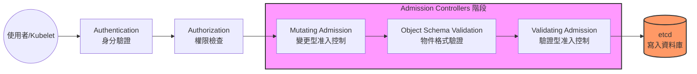

# 准入控制器 (Admission Controllers)

它是 API 請求進入 K8s 的「守門員」。當請求通過身分驗證 (Authentication) 和權限檢查 (Authorization) 後，必須通過 Admission Controllers 才能被寫入 etcd。

- **主要功能**：
    - **安全性 (Security)**：限制容器不能以 Root 身分執行、強制檢查 Image 來源。
    - **治理 (Governance)**：強制所有 Pod 必須帶有特定的 Labels。
    - **自動填充 (Default Values)**：例如當你沒設定 Resource Limits 時，自動幫你補上預設值。
- **兩種類型**：
    - **Mutating (變更型)**：在請求執行前「修改」內容（例如補上預設標籤）。
    - **Validating (驗證型)**：判斷請求是否「合規」，不合規就直接拒絕。
- **執行順序**：永遠是 **Mutating 先執行**，接著才是 Validating。

### 請求生命週期流程圖



### 必考指令

```bash
# 1. 檢查目前 API Server 啟用了哪些 Admission Controllers
# 在控制平面節點上尋找 --enable-admission-plugins 參數
ps -ef | grep kube-apiserver | grep admission-plugins

# 2. 如果是 kubeadm 部署，查看靜態 Pod 設定檔 (Static Pod Manifest)
# 修改此文件後 API Server 會自動重啟
cat /etc/kubernetes/manifests/kube-apiserver.yaml | grep admission-plugins

# 3. 常用插件清單：
# AlwaysPullImages, DefaultStorageClass, NamespaceExists, NodeRestriction

# 4. 如何查找目前版本支持的所有插件？
# 在控制平面節點執行 (或是查看官方文件)
kube-apiserver --help | grep admission-plugins
```

> [!TIP]
> **配置建議**：修改 `--enable-admission-plugins` 時，應使用**逗號分隔且不留空格**。由於此參數會「覆蓋」預設值，建議先查出當前已啟用的插件，再將新插件累加進去，避免停用了預設的關鍵控制器（如 `NodeRestriction`）。


### 實戰：如何更新 Admission Plugins (kubeadm)

在 `kubeadm` 環境中，API Server 是以 **Static Pod** 形式運行的，其設定檔位於 `/etc/kubernetes/manifests/kube-apiserver.yaml`。

#### 更新步驟 (最佳實踐)：
1.  **備份 YAML (極重要)**：
    ```bash
    cp /etc/kubernetes/manifests/kube-apiserver.yaml ~/kube-apiserver.yaml.bak
    ```
2.  **修改配置**：
    編輯 `/etc/kubernetes/manifests/kube-apiserver.yaml`，尋找 `--enable-admission-plugins`。
3.  **等待自動重啟**：
    Kubelet 會偵測到文件修改並自動重新啟動 API Server Pod。
4.  **驗證結果**：
    ```bash
    # 檢查 Pod 是否重新啟動成功
    kubectl get pods -n kube-system | grep apiserver
    # 檢查參數是否生效
    ps -ef | grep kube-apiserver | grep admission-plugins
    ```

#### 故障排除 (Troubleshooting)：
如果修改後 `kubectl` 指令無回應，表示 API Server 啟動失敗：
- 查看系統日誌：`journalctl -u kubelet -f`
- 檢查容器日誌：`docker ps -a` (或 `crictl ps -a`) 找到失敗的容器並查看日誌。
- **快速恢復**：將備份的 YAML 移回原位：`cp ~/kube-apiserver.yaml.bak /etc/kubernetes/manifests/kube-apiserver.yaml`

---

### YAML 骨架

#### 在 kube-apiserver.yaml 中啟用或禁用插件
```yaml
spec:
  containers:
  - command:
    - kube-apiserver
    - --enable-admission-plugins=NodeRestriction,NamespaceExists,AlwaysPullImages
    - --disable-admission-plugins=DefaultStorageClass
    image: registry.k8s.io/kube-apiserver:v1.31.0
    name: kube-apiserver
```

### 自我測驗

<details>
<summary>Q：為什麼「NamespaceExists」這個控制器很重要？</summary>

**解答：** 
它確保當你嘗試在一個不存在的 Namespace 中建立資源時，API Server 會直接拒絕該請求，避免產生孤兒資源或系統錯誤。
</details>

<details>
<summary>Q：如果我想在 API Server 啟動時新增一個名為 AlwaysPullImages 的插件，該修改哪個設定？</summary>

**解答：** 
修改 kube-apiserver 的啟動參數 `--enable-admission-plugins`，並將該插件名稱加入以逗號分隔的列表中。
</details>

> [!WARNING]
> **備份提醒**：這部分的內容涉及修改 kube-apiserver 的靜態 Pod 配置。在修改前**務必先備份 YAML 檔**，因為一旦語法錯誤，API Server 會掛掉導致整個集群無法連線（kubectl 無回應）。
