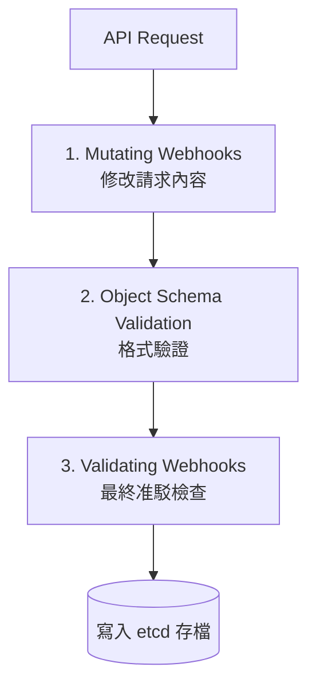

# 變更型與驗證型准入控制器 (Validating and Mutating Admission Controllers)

當 K8s 內建的控制器（如 NamespaceExists）無法滿足特定企業規範時（例如：強制檢查 Image 來源），可透過 Admission Webhooks 來擴展自定義准入邏輯。

- **自定義擴展的需求**：透過 Webhook 服務擴展 K8s 邏輯。
- **Mutating Admission Webhook (變更型)**：
    - **作用**：在物件被儲存前「修改」其內容。
    - **實務例子**：自動注入 Sidecar 容器、補上預設 Labels 或 Resource Limits。
- **Validating Admission Webhook (驗證型)**：
    - **作用**：只做「准許」或「拒絕」，不修改內容。
    - **實務例子**：拒絕使用 `latest` 標籤的鏡像、確保不違反安全性原則。
- **外部 Webhook 服務**：邏輯運行在 K8s 之外的 Web Server 上。API Server 會發送 **AdmissionReview** JSON 請求，Server 處理後回傳 **AdmissionResponse**。

### 運作原理：插槽與插頭 (Socket & Plug)
Kubernetes 提供的是**「插槽 (Socket)」**，而 Webhook 服務則是**「插頭 (Plug)」**。插頭上的邏輯（如：檢查標籤、注入容器）必須由使用者根據業務需求自行開發並部署。

#### 詳細溝通流程：
1.  **請求發起**：使用者執行 `kubectl apply`。
2.  **攔截偵測**：API Server 發現該資源類型有配置對應的 Webhook。
3.  **轉發請求**：API Server 將物件內容包裝成 JSON，轉發給 **「你建立的 Service」**。
4.  **邏輯處理**：**「你建立的 Pod (Webhook Server)」** 進行運算（如：檢查 Image 來源）。
5.  **結果回傳**：Webhook Server 回傳核准或拒絕的結果給 API Server。
6.  **最終動作**：API Server 根據結果決定寫入 etcd 或返回錯誤。

---

### 請求生命週期流程圖


### 必考指令

```bash
# 1. 檢查 API Server 是否啟用了兩大 Webhook 插件
kubectl describe pod kube-apiserver-master -n kube-system | grep admission-plugins
# 應確認包含：MutatingAdmissionWebhook, ValidatingAdmissionWebhook

# 2. 查看集群中目前配置的 Webhook
kubectl get mutatingwebhookconfigurations
kubectl get validatingwebhookconfigurations
```

### YAML 骨架
這是定義 Webhook 配置的標準範例，重點在於 `clientConfig` 如何連接 Webhook Server。

```yaml
apiVersion: admissionregistration.k8s.io/v1
kind: ValidatingWebhookConfiguration
metadata:
  name: "external-validation-webhook"
webhooks:
  - name: "webhook.example.com"
    rules:
      - apiGroups: [""]
        apiVersions: ["v1"]
        operations: ["CREATE"]
        resources: ["pods"]
    clientConfig:
      service: # 指向處理該邏輯的 Service
        namespace: "webhook-namespace"
        name: "webhook-service"
      caBundle: "LS0tLS1CRUdJTi..." # 必填！用於與 Webhook Server 進行 TLS 安全通訊
    admissionReviewVersions: ["v1"]
    sideEffects: None
```

### 自我測驗

<details>
<summary>Q：Mutating Webhook 與 Validating Webhook 的執行順序為何？</summary>

**解答：** 
**Mutating 永遠先執行**。因為物件被修改後，最終的版本才需要交給 Validating 做最後的安全與合規檢查。
</details>

<details>
<summary>Q：在配置 Webhook 時，caBundle 扮演什麼角色？</summary>

**解答：** 
因為 API Server 與 Webhook Server 之間的連線必須強制加密 (HTTPS)，`caBundle` 是用來驗證 Webhook Server 憑證的根證書，確保通訊安全。
</details>

> [!TIP]
> **提示**：這部分內容與 **TLS 憑證 (Certificates)** 高度相關，實作時需確保 Webhook Server 具備有效的證書。
