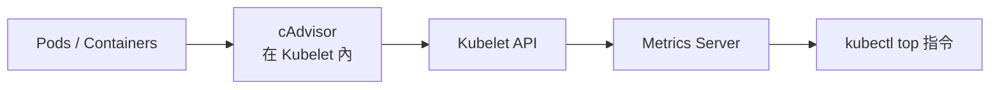

# 監控集群組件 (Monitor Cluster Components)

Kubernetes 需要監控節點與 Pod 層級的資源消耗狀況，以確保集群的穩定性與效能。

- **監控對象**：
    - **Node 節點層級**：監控 CPU、記憶體、硬碟空間與網路頻寬。
    - **Pod 容器層級**：監控單一 Pod 或容器的資源消耗。
- **Metrics Server (守門員比喻：它是即時的計分板)**：
    - 官方提供的輕量級解決方案。
    - **注意**：它是 **In-memory** 存儲，不支援歷史數據 (Historical Data)，僅提供即時數據。
- **運作架構**：
    - **cAdvisor (Container Advisor)**：內嵌在 Kubelet 中，負責收集容器性能數據。
    - **數據流**：cAdvisor -> Kubelet API -> Metrics Server -> kubectl top。

### 核心觀念：cAdvisor vs. Metrics Server (超市比喻)

您可以將 K8s 的監控架構想像成一個**「連鎖超市報告系統」**：

- **cAdvisor (店員)**：內建於 Kubelet。負責在每間分店（節點）巡邏，記錄每個貨架（容器）的使用量。
- **Kubelet (店長)**：把店員整理好的報告放在櫃檯。
- **Metrics Server (總公司)**：負責定期打電話給每間分店的店長，把所有報告收錄起來，整理成 `metrics.k8s.io` API。
- **kubectl top (查詢系統)**：你想看報表時，直接問總公司，不需要跑遍所有分店。

#### 快速比較表
| 特性 | cAdvisor (採集者) | Metrics Server (聚合者) |
| :--- | :--- | :--- |
| **角色** | 數據原始來源 | 集群數據中心 |
| **範圍** | 單一節點 | 整個集群 |
| **位置** | **內建於 Kubelet** | 獨立 Deployment (需安裝) |
| **主要任務** | 從 Linux 核心 (cgroups) 抓取原始數據 | 透過 API 採集數據並供他人查詢 |
| **服務對象** | Kubelet, Metrics Server | `kubectl top`, **HPA** |

---

### 監控架構數據流向圖


### 必考指令
這組指令是 CKA 考試中診斷效能瓶頸的「必備大招」：

```bash
# 1. 安裝 Metrics Server (若考試環境未安裝)
kubectl apply -f https://github.com/kubernetes-sigs/metrics-server/releases/latest/download/components.yaml

# 2. 查找當前性能數據
kubectl top node                      # 查看所有節點使用狀況
kubectl top pod -n <namespace>        # 查看特定命名空間中的 Pod
kubectl top pod --sort-by=cpu         # 依 CPU 使用率排序

# 3. 故障排除：檢查 Metrics Server Pod 狀態
kubectl get pods -n kube-system | grep metrics-server
```

#### 為什麼 CKA 考試中要分清楚？
- **故障排查**：如果你發現 `kubectl top` 沒反應，但 Pod 正常運行，通常是 **Metrics Server (總公司)** 掛了或沒裝，而不是 cAdvisor (店員) 掛了。
- **自動伸縮 (HPA)**：**Horizontal Pod Autoscaler** 強烈依賴 Metrics Server。沒有它，Pod 就不會根據負載自動增加副本數量。

### 實戰：CKA 常見坑點與最佳實踐

在某些環境下安裝 Metrics Server 時，常會遇到憑證驗證失敗的問題導致 `kubectl top` 無法運作。

#### 修正步驟 (Best Practice)：
1.  **修改 Deployment**：
    ```bash
    kubectl edit deployment metrics-server -n kube-system
    ```
2.  **加入不安全憑證參數**：在 `args` 中新增 `--kubelet-insecure-tls`。

#### YAML 骨架範例：
```yaml
spec:
  template:
    spec:
      containers:
      - args:
        - --kubelet-insecure-tls # 忽略憑證檢查 (CKA 常見解決方案)
        - --kubelet-preferred-address-types=InternalIP
```

### 自我測驗

<details>
<summary>Q：如果 kubectl top pod 指令報錯 "Metrics API not available"，最可能的原因是什麼？</summary>

**解答：** 
代表集群中尚未安裝或啟動 Metrics Server，或是 API Server 無法透過聚合層 (Aggregation Layer) 與 Metrics Server 通訊。
</details>

<details>
<summary>Q：Metrics Server 是否能告訴你兩天前 Pod 的 CPU 使用量？</summary>

**解答：** 
**不行**。Metrics Server 只提供當下即時數據。若要查看歷史趨勢，需要使用 Prometheus 或 ELK 等第三方工具。
</details>

> [!IMPORTANT]
> **考試提醒**：如果題目要求查找「使用資源最多的 Pod」，請務必記得使用 `--sort-by=cpu` 或 `--sort-by=memory` 參數來快速定位。
