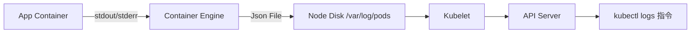

# 管理應用程式日誌 (Managing Application Logs)

核心介紹如何透過 `kubectl logs` 存取應用程式的標準輸出 (stdout) 與標準錯誤 (stderr)，特別是在多容器 Pod 環境下的操作。

- **單容器 Pod 日誌**：最簡單的情況，直接指定 Pod 名稱即可。
- **多容器 Pod 日誌 (Multi-container Pods)**：
    - **身分證 vs. 座位比喻**：指令格式為 `kubectl logs <Pod名稱> <容器名稱>`。
        - **Pod 名稱**：如同「身分證字號」或「車牌」，定位唯一的 Pod。
        - **容器名稱**：如同「座位編號」或「乘客名」，定位 Pod 內部的特定組件。
    - **規則**：當容器數量 $> 1$ 時，必須「指名道姓」，否則 K8s 會因不知道要抓取哪個 stdout 串流而報錯。
    - **情境**：常見於 Sidecar 模式（如：應用容器 + 日誌蒐集器）。
- **持續監控 (-f)**：使用 Streaming 模式即時觀察日誌流，適合觀察啟動過程或除錯。
- **排查崩潰 (-p)**：查看前一個 (Previous) 已崩潰容器的日誌，是排查重啟原因的關鍵。

### 核心觀念：照片 vs. 直播 (一次性 vs. 持續串流)

理解 `kubectl logs` 的兩種模式：

- **「照片」模式 (`kubectl logs podname`)**：
    - 行為：一次性印出當下所有日誌後立即結束。
    - 場景：適合查看「剛才發生了什麼事」或使用 `grep` 搜尋。
- **「直播」模式 (`kubectl logs -f podname`)**：
    - 行為：印出舊日誌後保持連線，即時更新新產生的日誌。
    - 場景：適合「開發除錯中」，邊操作邊看錯誤訊息。

#### 快速對比表
| 特性 | 一次性 (不加 -f) | 持續串流 (加上 -f) |
| :--- | :--- | :--- |
| **結束時機** | 顯示完現有日誌後立即結束 | 需按 `Ctrl+C` 才會結束 |
| **日誌時效** | 靜態、過去的數據 | 動態、即時的直播 |
| **多容器處理** | 若不指定名稱，多容器 Pod 會報錯 | 建議明確指定容器名稱 |

---

### 日誌數據流向圖
這展示了日誌從應用程式產出到您下達指令後顯示出來的過程：


### 必考指令
這些指令在 CKA 考試的 Troubleshooting 題型中幾乎是必用的：

```bash
# 1. 查看單容器 Pod 的日誌
kubectl logs event-simulator-pod

# 2. 查看多容器 Pod 中的「特定容器」日誌
# 格式：kubectl logs -f <pod-名稱> <容器-名稱>
kubectl logs -f event-simulator-pod event-simulator

# 3. 查看多容器 Pod 中的另一個容器
kubectl logs event-simulator-pod image-processor

# 4. 查看先前崩潰 (Crashed) 容器的最後日誌 (排查重啟原因)
kubectl logs event-simulator-pod -p

# 5. 【進階】懶人包：查看 Pod 內所有容器的日誌
# 缺點：所有容器的日誌會混在一起，較難分辨來源
kubectl logs event-simulator-pod --all-containers

# 6. 【精準排查】加入時間戳記
# 輔助跨容器的時間對齊分析
kubectl logs event-simulator-pod --timestamps
```

### 實戰進階技巧：多容器日誌監控建議

雖然 `kubectl logs` 是基礎工具，但在管理大型微服務或多容器 Pod 時，建議輔以下列工具：

- **輔助參數**：
    - `--timestamps`：為日誌補上時間點，方便對齊分析不同容器間的事件發生順序。
- **第三方推薦工具 (工作環境推薦)**：
    - **Stern**：支援正規表示式匹配，並能用不同顏色自動區分不同 Pod/容器的日誌。
    - **K9s**：互動式 UI 介面，支援在多個容器日誌間快速切換。
- **CKA 考試策略**：
    - 考試中不支援第三方工具，建議熟練使用 **Tmux 分割視窗** 同時監控多個容器，這是排查 Sidecar 同步行為最有效的方式。

---

### YAML 骨架
多容器 Pod 結構範例。**注意：** 執行 `kubectl logs` 時指定的容器名稱，必須與 YAML 中 `spec.containers[].name` 的字串完全一致。

```yaml
apiVersion: v1
kind: Pod
metadata:
  name: event-simulator-pod
spec:
  containers:
  - name: event-simulator           # 容器 A
    image: kodekloud/event-simulator
  - name: image-processor           # 容器 B
    image: some-image-processor
```

### 自我測驗

<details>
<summary>Q：當下達 kubectl logs <pod-name> 卻出現錯誤提示 "a container name must be specified" 時，代表什麼？</summary>

**解答：** 
代表該 Pod 中包含多個容器，系統不知道你要看哪一個，因此你必須在指令後面補上特定的容器名稱。
</details>

<details>
<summary>Q：如何即時追蹤 (Follow) 一個正在運行中的 Pod 日誌？</summary>

**解答：** 
在指令中加入 `-f` 參數，例如：`kubectl logs -f <pod-name>`。
</details>

> [!TIP]
> **考試秘訣**：如果一個 Pod 頻繁重啟 (CrashLoopBackOff)，請務必第一時間使用 `kubectl logs <pod-name> -p` 來查看「上一版」容器死掉前的最後留言。
