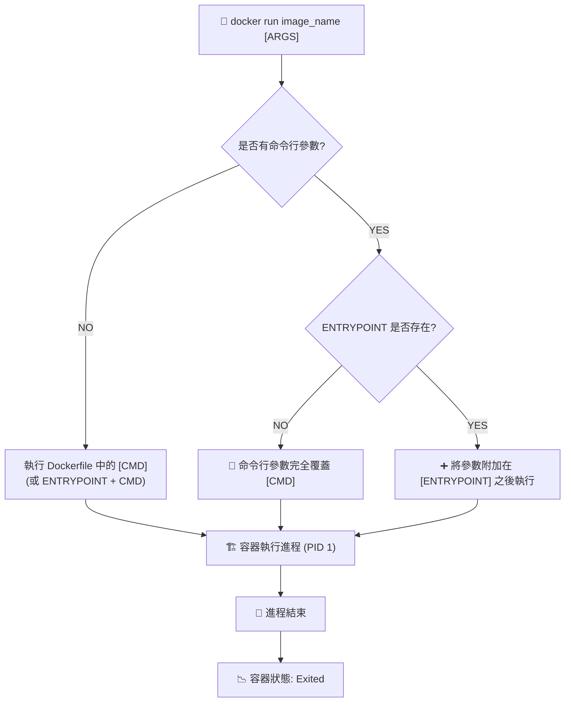

# 100. Commands and Arguments in Docker 筆記

## 1. 🏷️ 課程定位
- **章節編號與名稱**：第 5 節：Application Lifecycle Management
- **影片標題**：100. Commands and Arguments in Docker

## 2. 📌 核心概念摘要
理解容器啟動時的指令執行機制，特別是 `CMD` 與 `ENTRYPOINT` 的差異，是管理容器生命週期的基礎。在 Kubernetes 中，這直接對應到 Pod 定義中的 `command` 與 `args`，決定了容器啟動時執行的程序及其參數。

## 3. 📊 流程圖與視覺化重現 (Mermaid)



## 4. 🔑 知識點擷取 (Detailed Notes)

### 1. 容器的本質與生命週期
- **進程導向**：容器是為了執行特定進程而存在的隔離環境。
- **壽命定義**：容器的生命週期與其主進程（PID 1）綁定。當主進程結束（如 `ls` 執行完畢或 `exit`），容器即刻停止。

### 2. CMD (預設參數/指令)
- **定義**：指定容器啟動時的**預設執行內容**。
- **覆蓋機制**：若在 `docker run`時提供任何參數，Dockerfile 中的 `CMD` 將被**完全忽略**。
- **範例**：
  - `CMD ["sleep", "5"]`
  - 執行 `docker run image` ➡️ `sleep 5`
  - 執行 `docker run image sleep 10` ➡️ `sleep 10` (完全替換)

### 3. ENTRYPOINT (固定執行程序)
- **定義**：指定容器啟動時**固定執行的執行檔**。
- **行為**：命令行傳入的參數會被「附加」在 `ENTRYPOINT` 之後。
- **範例**：
  - `ENTRYPOINT ["sleep"]`
  - 執行 `docker run image 10` ➡️ `sleep 10`

### 4. 最佳實務：ENTRYPOINT + CMD 組合
- **設計模式**：使用 `ENTRYPOINT` 定義指令，用 `CMD` 定義預設參數。
- **優點**：兼具固定性與彈性，使用者可直接運行（用預設值）或僅傳入參數來修改行為。

## 5. 💻 CKA 必備實作指令

### Docker 基礎操作
```bash
# 1. 覆蓋 CMD 指令
docker run ubuntu-sleeper sleep 10

# 2. 傳遞參數給 ENTRYPOINT
docker run ubuntu-sleeper 15

# 3. 強制覆蓋 ENTRYPOINT (常用於 Debug)
# 使用 --entrypoint 旗標來更換主執行程序
docker run -it --entrypoint /bin/bash ubuntu-sleeper

# 4. 檢查鏡像配置 (查看預設 CMD/ENTRYPOINT)
docker inspect [IMAGE_ID] | grep -A 15 "Config"
```

### Kubernetes YAML 對應關係
在 CKA 考試中，必須記住 Docker 與 K8s 欄位的映射關係：

| Docker 術語 | K8s YAML 欄位 | 說明 |
| :--- | :--- | :--- |
| **ENTRYPOINT** | `command` | 容器啟動的主指令 |
| **CMD** | `args` | 傳遞給指令的參數 |

```yaml
# K8s Pod 定義範例
apiVersion: v1
kind: Pod
metadata:
  name: ubuntu-sleeper
spec:
  containers:
  - name: ubuntu-sleeper
    image: ubuntu-sleeper
    command: ["sleep"]   # 覆蓋 Docker ENTRYPOINT
    args: ["10"]         # 覆蓋 Docker CMD
```

## 6. 🚀 CKA 考試延伸與 Troubleshooting

### 💡 考試情境預測
1. **YAML 覆蓋測試**：題目可能會給出一個 Dockerfile 內容，要求你寫一個 Pod YAML 來修改其運行時間。請務必記得 K8s 的 `args` 會覆蓋 Docker 的 `CMD`。
2. **靜態 Pod 配置**：在設定 Kubelet 靜態 Pod 時，若路徑或指令錯誤，容器將無法啟動。

### ⚠️ 避坑指南 (Common Pitfalls)
- **Shell vs Exec 形式**：
  - **Shell 形式** (`CMD sleep 5`)：會啟動 `/bin/sh -c`，導致應用程式不是 PID 1，無法接收 `SIGTERM` 訊號，造成 K8s 刪除 Pod 時需等待 30 秒後強制殺死。
  - **Exec 形式** (`CMD ["sleep", "5"]`)：**推薦做法**，應用程式直接獲得 PID 1。
- **路徑問題**：若 `command` 找不到執行檔，容器會報 `CreateContainerError` 或 `OCI runtime create failed`。

### 🔍 Troubleshooting
- **容器秒退 (CrashLoopBackOff)**：
  - 原因：執行的指令是非持續性的（例如 `echo "hello"`）。
  - 對策：檢查 `command` 是否為背景程序，若是，需改為前景執行或加入長駐參數（如 `tail -f /dev/null`）。
- **參數檢查**：
  - 使用 `kubectl logs [POD_NAME]` 查看輸出報錯。
  - 使用 `kubectl describe pod [POD_NAME]` 查看 `Events` 部分的錯誤訊息。
