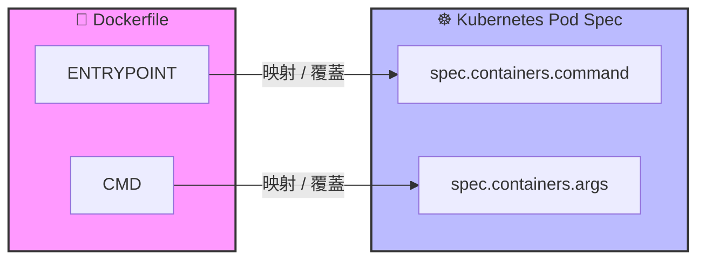
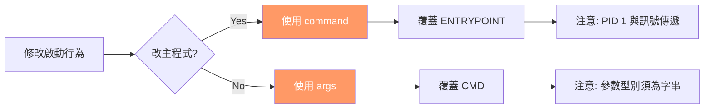

# 101. Commands and Arguments in Kubernetes 筆記

## 1. 🏷️ 課程定位
- **章節編號與名稱**：第 5 節：Application Lifecycle Management
- **影片標題**：101. Commands and Arguments in Kubernetes

## 2. 📌 核心概念摘要
本課核心在於掌握如何在 Kubernetes Pod 資源清單中覆蓋 Docker 鏡像的啟動行為。重點在於區分 `command` 與 `args` 兩個欄位，並理解它們與 Dockerfile 中指令的映射關係。這是 CKA 考試中頻率極高的基礎知識點。

## 3. 📊 流程圖與映射關係 (Mermaid)



### 映射總結表
| Docker 術語 | Kubernetes 術語 | 作用 |
| :--- | :--- | :--- |
| **ENTRYPOINT** | `command` | 執行程式本身 |
| **CMD** | `args` | 傳遞給程式的參數 |

---

## 4. 🔑 知識點擷取 (Detailed Notes)

### 1. 欄位映射 (關鍵考點)
在 Kubernetes Pod 的定義中，名稱的定義方式與 Docker 不同：
- **`command`**: 覆蓋 Dockerfile 中的 `ENTRYPOINT`。
- **`args`**: 覆蓋 Dockerfile 中的 `CMD`。

### 2. 執行模式：Shell Mode vs. Exec Mode
寫法會直接影響進程（Process）的處理方式：
- **Exec Mode (推薦)**：`command: ["executable", "param1"]`
  - **行為**：直接啟動該程式，該程式成為 **PID 1**。
  - **優點**：容器能正確接收到 `SIGTERM` 訊號，實現優雅關閉（Graceful Shutdown）。
- **Shell Mode**：`command: ["sh", "-c", "executable param1"]`
  - **行為**：啟動一個 Shell，再由 Shell 啟動程式。
  - **缺點**：Shell 變成 PID 1，主程式變成子進程。K8s 停止 Pod 時主程式收不到訊號，會被強制砍掉 (`SIGKILL`)。

### 3. YAML 定義格式
- **陣列格式 (推薦)**：`command: ["sleep", "3600"]`
- **條列格式**：
  ```yaml
  command:
    - sleep
    - "3600"
  ```

---

## 5. 🏗️ 實戰延伸：Init Containers 的配合
這是 `command` 最常發揮舞台的地方。主容器啟動前需要先「預熱」。
```yaml
initContainers:
- name: install
  image: busybox
  command: ["wget", "-O", "/work-dir/index.html", "http://info.com"] # 下載內容
  volumeMounts:
  - name: workdir
    mountPath: /work-dir
```
> [!IMPORTANT]
> **CKA 點撥**：Init Container 必須成功執行完畢 (Exit Code 0)，主容器才會啟動。

---

## 6. 💻 CKA 必備實作指令 (Imperative Commands)

```bash
# 1. 產生一個帶有自定義參數 (args) 的 Pod YAML
kubectl run web-server --image=nginx --dry-run=client -o yaml -- "arg1" "arg2" > pod.yaml

# 2. 產生一個覆蓋 ENTRYPOINT (command) 的 Pod 檔案
kubectl run busybox --image=busybox --command --dry-run=client -o yaml -- sleep 1000 > pod.yaml

# 3. 檢查執行中的 Pod 實際指令
kubectl get pod [POD_NAME] -o jsonpath='{.spec.containers[0].command}'
```

---

## 7. 🚀 CKA 考試延伸與 Troubleshooting

### 💡 技巧：環境變數與指令結合
若指令需要動態帶入變數，必須使用 `$(VAR_NAME)` 格式：
```yaml
env:
- name: MESSAGE
  value: "hello world"
command: ["/bin/sh"]
args: ["-c", "echo $(MESSAGE)"] # 正確引用變數
```

### ⚠️ Pod 的不可變性 (Immutable)
**注意**：Pod 的 `command` 和 `args` 在啟動後是**不可以直接編輯修改**的。若需修改，標準 SOP 為：
1. `kubectl get pod x -o yaml > x.yaml`
2. 修改 `x.yaml` 內容。
3. `kubectl delete pod x --force` 並 `kubectl apply -f x.yaml`。

### 🔍 Troubleshooting 延伸表
當 `command` 寫錯時，Pod 會進入以下狀態：

| 狀態 (Status) | 可能原因 | 檢查動作 |
| :--- | :--- | :--- |
| **CreateContainerConfigError** | YAML 格式錯誤或參數類型不對 | `kubectl describe pod` |
| **CrashLoopBackOff** | 指令執行完就結束了（如非持續運行） | `kubectl logs` |
| **CreateContainerError** | 鏡像內找不到 command 指定的執行檔 | `kubectl describe pod` |

---

## 8. 🎯 CKA 考前衝刺總結圖 (Mermaid)


