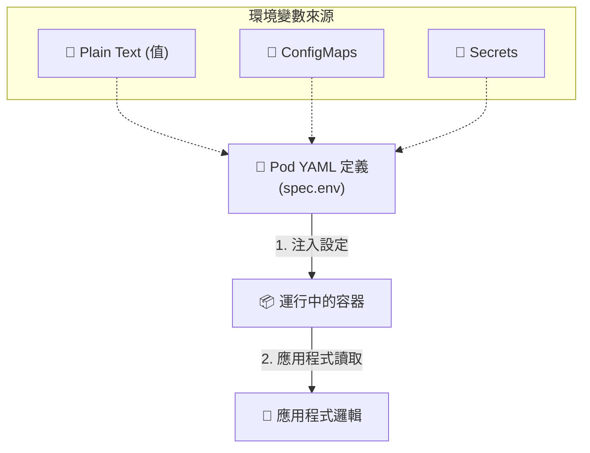

# 104. Configure Environment Variables in Applications 筆記

## 1. 🏷️ 課程定位
- **章節編號與名稱**：第 5 節：Application Lifecycle Management
- **影片標題**：104. Configure Environment Variables in Applications

## 2. 📌 核心概念摘要
本課探討如何在 Kubernetes Pod 中注入環境變數，實現**配置與鏡像解耦**。這使得同一份鏡像（Image）能根據不同環境（如 Dev, Test, Prod）切換不同配置（如資料庫連線、API Key），而無需重新打包鏡像，是應用程式生命週期管理的關鍵。

## 3. 📊 流程圖與資料流 (Mermaid)



---

## 4. 🔑 知識點擷取 (Detailed Notes)

### 1. 環境變數的三種主要來源
在 Kubernetes 中，環境變數（`env`）可以來自多個對象：
- **Plain Text (直接給值)**：直接在 Pod YAML 裡定義 `value`（適合非機密且簡單的設定）。
- **ConfigMaps**：從外部配置物件引入（適用於大規模非敏感資訊）。
- **Secrets**：從加密物件引入（適用於密碼、Token、憑證）。

### 2. YAML 語法結構
環境變數定義在 `spec.containers` 下層，是一個 **List (列表)** 結構。
每個元素包含兩個關鍵欄位：
- **`name`**: 環境變數的名稱。
- **`value`**: 環境變數的值（注意：必須是字串格式）。

### 3. 與指令結合的使用
如果容器的 `command` 或 `args` 需要動態引用這些環境變數，語法為：**`$(VAR_NAME)`**。

---

## 5. 💻 CKA 必備實作指令 (Imperative Commands)

在考試中，快速建立帶有環境變數的 Pod 是基本功：

```bash
# 1. 建立帶有環境變數的 Pod (快速指令)
# 使用 --env 參數
kubectl run web-color --image=kodekloud/webapp-color --env="APP_COLOR=pink"

# 2. 檢查 Pod 內的環境變數是否生效 (驗證手段)
kubectl exec web-color -- env | grep APP_COLOR

# 3. 產生帶有變數的 YAML 範本 (考試常用)
kubectl run web-color --image=nginx --env="VAR=VAL" --dry-run=client -o yaml > pod-env.yaml
```

---

## 6. 🚀 CKA 考試延伸與 Troubleshooting

### 💡 考試情境預測
1. **多變數注入**：題目要求建立一個 Pod 並注入 `DB_Host` 與 `DB_User` 兩個變數。
2. **動態更新**：要求修改現有 Deployment 的環境變數，並確保觸發**滾動更新 (Rolling Update)**。

### ⚠️ 避坑指南 (Common Pitfalls)
- **數值型別報錯 (重要)**：YAML 對純數字類型很敏感。如果你的 `value` 是 `123`，**務必加上雙引號** `"123"`，否則 K8s 會報 `is not a string` 的類型錯誤。
- **大小寫敏感**：Linux 環境變數通常慣用大寫（如 `APP_COLOR`），請務必檢查題目要求的精確拼寫，多一個空格或大小寫錯誤都會導致應用程式讀取失敗。

### 🔍 Troubleshooting
- **變數沒生效**：
  - 動作：`kubectl describe pod [POD_NAME]`
  - 檢查位置：`Containers` -> `Environment` 區塊，確認 K8s 實際讀取的內容。
- **Pod 卡在 CreateContainerConfigError**：
  - 原因：通常是因為環境變數是從 `ConfigMap` 或 `Secret` 引用，但**該資源對象在命名空間中不存在**。
  - 對策：`kubectl get cm,secret` 確認資源是否已建立。

---

> [!TIP]
> **下一階段預告**：影片 105 會進入 **ConfigMaps**。當環境變數數量眾多時，全部寫在 Pod YAML 會非常混亂，屆時我們將學習如何將變數「外掛」出來進行集中管理。
