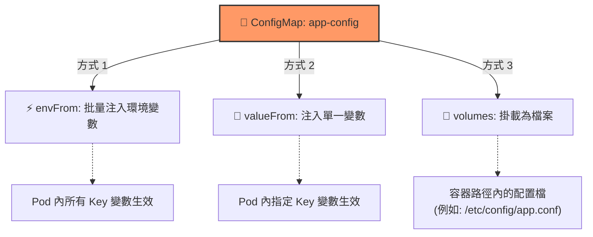

# 105. Configuring ConfigMaps in Applications 筆記

## 1. 🏷️ 課程定位
- **章節編號與名稱**：第 5 節：Application Lifecycle Management
- **影片標題**：105. Configuring ConfigMaps in Applications

## 2. 📌 核心概念摘要
ConfigMap 用於儲存非機密性的配置資料（如環境變數、標籤、主機名等）。它允許將配置從 Pod 定義中抽離，達成 **"Decouple" (解耦)**，使同一個鏡像能在不更動程式碼的情況下，透過掛載不同的 ConfigMap 運行於開發、測試或正式環境。

## 3. 📊 ConfigMap 掛載三種方式 (Mermaid)



---

## 4. 🔑 知識點擷取 (Detailed Notes)

### 1. ConfigMap 的建立與使用流程 (兩階段)
1. **建立 ConfigMap**：定義 Key-Value 對（資料來源可以是字串、檔案或目錄）。
2. **注入 Pod**：在 PodSpec 定義中引用該 ConfigMap。

### 2. 三種注入模式詳解

#### A. envFrom (批量注入)
- **特點**：最快的方法。將 ConfigMap 裡所有的 Key-Value 一次性全部轉換為容器內的環境變數。
- **YAML 結構**：
  ```yaml
  envFrom:
  - configMapRef:
      name: app-config
  ```

#### B. valueFrom (單一/精確引用)
- **特點**：精確控制。只從某個 ConfigMap 中挑選特定的 Key 注入為特定的環境變數名稱。
- **YAML 結構**：
  ```yaml
  env:
  - name: APP_COLOR
    valueFrom:
      configMapKeyRef:
        name: app-config
        key: APP_COLOR
  ```

#### C. Volumes (檔案掛載)
- **特點**：將 ConfigMap 內容映射為容器內的檔案。適用於需要讀取實體配置檔（如 `.conf`, `.properties`）的應用程式（如 Nginx, Redis）。
- **優點**：支援自動更新（無需重啟 Pod），但有延遲。

---

## 5. 💻 CKA 必備實作指令 (Imperative Commands)

考試中強烈建議使用命令行建立 ConfigMap 以節省時間：

```bash
# 1. 從字串建立 (Literal) - 最常用
kubectl create configmap app-config --from-literal=APP_COLOR=blue --from-literal=APP_MODE=prod

# 2. 從檔案建立 (File)
kubectl create configmap app-config --from-file=app_config.properties

# 3. 快速查看 ConfigMap 內容與結構
kubectl describe configmap app-config
kubectl get configmap app-config -o yaml
```

---

## 6. 🚀 CKA 考試延伸與 Troubleshooting

### 💡 考試情境預測
- **情境**：題目會給予一個 `.properties` 檔案，要求建立 ConfigMap 並將其掛載到指定的 Deployment 中作為環境變數。
- **關鍵點**：務必確認 ConfigMap 的 `metadata.name` 與 Pod YAML 裡的 `configMapRef.name` 完全一致。

### ⚠️ 避坑指南 (Common Pitfalls)
- **Immutable 屬性**：較新版本支援 `immutable: true`。若啟用，ConfigMap 將無法更新，必須刪除重建。
- **掛載遮蓋 (Volume Overlap)**：使用 Volume 掛載時，若目標資料夾（如 `/etc`）內已有檔案，掛載動作會「遮蓋」掉原本目錄下的所有檔案。若只需掛載單一檔案，應使用 `subPath`。

### 🔍 Troubleshooting
- **CreateContainerConfigError**：
  - **診斷**：90% 是因為 YAML 裡寫的 ConfigMap 名字拼錯，或該物件根本尚未建立。
- **環境變數未更新**：
  - **注意**：透過 `env` 或 `envFrom` 注入的變數**不會自動更新**（需刪除並重啟 Pod）；僅透過 **Volume 掛載的檔案**會在一段時間後由 kubelet 自動同步更新。
