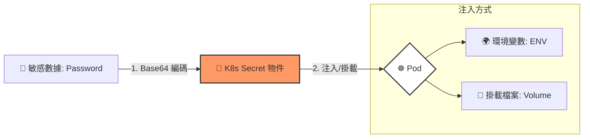

# 108. Secrets 筆記

## 1. 🏷️ 課程定位
- **章節編號與名稱**：第 5 節：Application Lifecycle Management
- **影片標題**：108. Secrets

## 2. 📌 核心概念摘要
Secret 物件用於加密（Base64 編碼）儲存敏感數據，如密碼、Token 或金鑰。其目標是避免將明文資訊直接寫在 Pod YAML 或 Container Image 中。雖然 Base64 僅是編碼而非真正的加密，但它能有效防止數據在螢幕顯示或日誌記錄中意外洩漏。

## 3. 📊 Secret 運作流程 (Mermaid)



---

## 4. 🔑 知識點擷取 (Detailed Notes)

### 1. Secret 的核心特點
- **編碼方式**：數據以 **Base64** 格式儲存。
- **安全性侷限**：Base64 只是編碼而非加密。實務上需配合 **RBAC**（限制存取權限）和 **Encryption at Rest**（靜態加密，需在 etcd 層級配置）來確保真正的安全性。
- **記憶體儲存**：在節點上，Secret 預設存儲在 **tmpfs**（記憶體檔案系統）中，不會寫入硬碟磁區，大幅降低資料遺留的風險。

### 2. 建立方式
- **Imperative (指令式)**：使用 `kubectl create secret generic ...` (最推薦考試使用)。
- **Declarative (宣告式)**：撰寫 YAML 檔。注意：`data` 欄位的值必須先手動完成 Base64 轉換；若使用 `stringData` 欄位則可直接寫入明文，K8s 會自動幫你編碼。

### 3. 注入 Pod 的方式（與 ConfigMap 相同）
- **`envFrom`**：將 Secret 內所有 Key 一次性轉為環境變數。
- **`valueFrom`**：選取特定 Key 注入到指定的環境變數。
- **`Volume`**：將 Secret 掛載為容器內的檔案，**容器內讀取到的內容會自動解碼回明文**。

---

## 5. 💻 CKA 必備實作指令 (Imperative Commands)

```bash
# 1. 從字串建立 (Literal) - CKA 最常用
kubectl create secret generic db-secret --from-literal=DB_Password=password123

# 2. 從檔案建立 (如 SSH Key)
kubectl create secret generic ssh-key --from-file=id_rsa

# 3. 手動 Base64 編碼 (寫 YAML 時需要)
echo -n 'password123' | base64

# 4. 解碼 Secret 查看明文 (Debug 常用)
kubectl get secret db-secret -o jsonpath='{.data.DB_Password}' | base64 --decode

# 5. 建立私有倉庫憑證 (docker-registry 類型)
kubectl create secret docker-registry regcred \
  --docker-server=https://index.docker.io/v1/ \
  --docker-username=myuser \
  --docker-password=mypass \
  --docker-email=myemail@example.com
```

---

## 6. 🚀 CKA 考試延伸與 Troubleshooting

### 💡 考試情境預測
- **情境 A**：建立一個 Secret 並掛載到 Pod，要求應用程式能在 `/etc/secret-volume/password` 讀取到明文密碼。
- **情境 B**：配置 Pod 使用私有鏡像庫，此時必須建立 `docker-registry` 類型的 Secret，並在 Pod 中加入 `imagePullSecrets` 欄位。

### ⚠️ 避坑指南 (Common Pitfalls)
- **Base64 換行符 (致命傷)**：使用 `echo` 編碼時，**務必加上 `-n` 參數**。否則會把隱藏的「換行符」也編碼進去，導致驗證失敗。
- **唯讀性**：透過 Volume 掛載的 Secret 在容器內部預設是**唯讀**的。

### 🔍 Troubleshooting
- **CreateContainerConfigError**：檢查 `secretName` 拼寫。
- **權限問題**：檢查 **ServiceAccount** 的 RBAC 權限。

---

## 7. 🌐 地端實務維運延伸：Secret 與外部資料庫

在地端環境維運（如半年定期修改密碼、對接非容器化資料庫）時，建議採取以下進階策略：

### 1. 網路連線解耦：ExternalName Service
- **問題**：地端 DB IP 寫死在程式裡難以維護。
- **解決方案**：建立 `ExternalName` 類型的 Service，將內部網域名稱（如 `my-db-svc`）映射到實體機 IP。應用程式僅需連接該 Service 即可。

### 2. 生命周期管理：自動化同步
- **問題**：密碼定期更新導致 K8s Secret 與實體 DB 不同步。
- **解決方案**：
  - **GitOps**：將 Secret 更新納入 CI/CD 流。
  - **Vault 整合**：使用 **HashiCorp Vault**。其可自動修改實體 DB 密碼，並同步更新 K8s 內的 Secret，實現無人值守的密碼輪轉。

### 3. 零停機更新策略
- **問題**：滾動更新時新舊 Pod 並存，可能超出 DB 連線數限制。
- **解決方案**：
  - **控制併發比例**：設定 `maxSurge: 1` 確保一次只增加一個新連線。
  - **DB 寬限期**：DBA 更新密碼後應保留舊密碼 5-10 分鐘，讓舊 Pod 完成交易。

### 4. 預防性檢查：Readiness Probe
- **解決方案**：在 Pod 加入 **Readiness Probe**。程式碼內嘗試 `SELECT 1` 連線測試。若新密碼錯誤，Probe 失敗，K8s 將停止刪除舊 Pod，避免全面斷線。

### 📊 地端維運建議總結表
| 關注點 | 實作做法 | 核心目的 |
| :--- | :--- | :--- |
| **連線解耦** | 使用 `ExternalName` Service | 方便 DB 移機，不寫死實體機 IP |
| **自動化** | Secret 更新搭配 `rollout restart` | 降低人為操作錯誤風險 |
| **穩定性** | 設定 `Readiness Probe` | 密碼錯時舊服務不會斷，自動回滾 |
| **安全性** | 限制 Secret 讀取權限 (RBAC) | 最小權限原則，防止機密外洩 |
