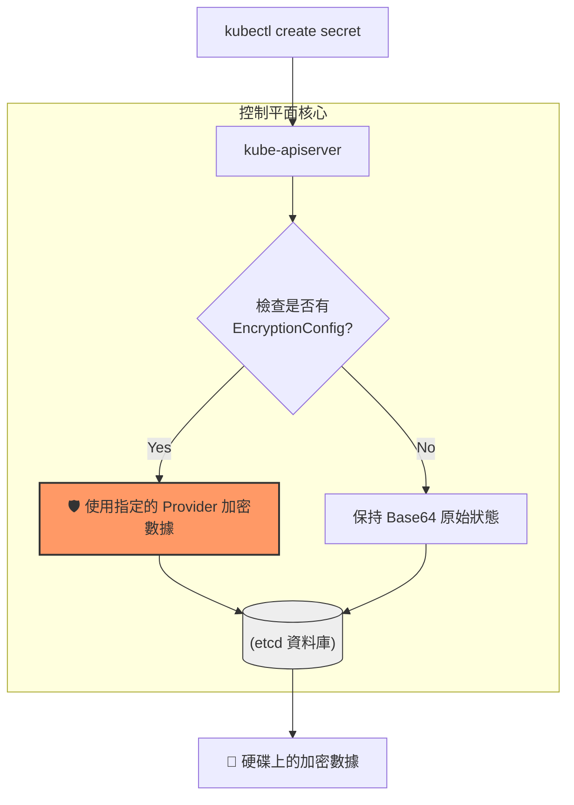

# 112. Demo - Encrypting Secret Data at Rest 筆記

## 1. 🏷️ 課程定位
- **章節編號與名稱**：第 5 節：Application Lifecycle Management
- **影片標題**：112. Demo - Encrypting Secret Data at Rest

## 2. 📌 核心概念摘要
預設情況下，Kubernetes Secret 僅以 Base64 編碼儲存於 etcd。若攻擊者獲取 etcd 備份或存取權，即可輕易獲取明文。本課目標是配置 **EncryptionConfiguration**，讓 `kube-apiserver` 在資料寫入 etcd 前先進行加密（At Rest Encryption），提升叢集的資安等級。

## 3. 📊 加密流程圖 (Mermaid)



---

## 4. 🔑 知識點擷取 (Detailed Notes)

### 1. 如何檢查 etcd 中的原始資料
若要確認加密是否生效，可進入 etcd 容器內部，使用 `etcdctl` 讀取內容：
- **加密前**：在 hex dump 中可直接看到明文密碼。
- **加密後**：內容會變成亂碼，並帶有特定的加密標籤（如 `k8s:enc:aescbc:v1:key1`）。

**查詢指令範例：**
```bash
ETCDCTL_API=3 etcdctl \
  --cacert=/etc/kubernetes/pki/etcd/ca.crt \
  --cert=/etc/kubernetes/pki/etcd/server.crt \
  --key=/etc/kubernetes/pki/etcd/server.key \
  get /registry/secrets/default/my-secret | hexdump -C
```

### 2. EncryptionConfiguration 物件
這是一個特殊的設定檔，包含兩個核心部分：
- **Resources**: 指定要加密的資源類型（通常是 `secrets`）。
- **Providers**: 指定加密演算法及其順序。常用順序：
  1. `aescbc` (推薦，強大且快)
  2. `secretbox`
  3. `identity` (即不加密，必須放在最後作為後備，否則舊有未加密資料將無法讀取)。

### 3. 金鑰 (Key) 的產生
加密需要一個 32 位元的隨機 Base64 字串作為金鑰：
```bash
head -c 32 /dev/urandom | base64
```

---

## 5. 💻 CKA 必備實作步驟 (Imperative Steps)

這是一個連鎖操作，若 API Server 設定出錯，整個叢集會斷線，考試時請務必謹慎：

### 步驟 1：建立加密設定檔
路徑通常設為 `/etc/kubernetes/enc/enc.yaml`：
```yaml
apiVersion: apiserver.config.k8s.io/v1
kind: EncryptionConfiguration
resources:
  - resources:
      - secrets
    providers:
      - aescbc:
          keys:
            - name: key1
              secret: <YOUR_BASE64_KEY>
      - identity: {}
```

### 步驟 2：修改 kube-apiserver 靜態 Pod
編輯 `/etc/kubernetes/manifests/kube-apiserver.yaml`：
1. **新增參數**：`--encryption-provider-config=/etc/kubernetes/enc/enc.yaml`
2. **掛載目錄**：必須將宿主機的 `/etc/kubernetes/enc` 目錄透過 `hostPath` Volume 掛載進容器。

### 步驟 3：重新加密現有資料
**重要**：開啟加密後，舊有的 Secret 不會自動回溯加密。必須手動觸發更新：
```bash
# 重新儲存所有 Secret 以觸發 API Server 的加密動作
kubectl get secrets --all-namespaces -o json | kubectl replace -f -
```

---

## 6. 🚀 CKA 考試延伸與 Troubleshooting

### 💡 考試情境預測
- **題目要求**：啟用 `aescbc` 加密，並確保所有的 Secret 都已經被加密存入 etcd。
- **關鍵細節**：必須同時處理「設定檔建立」、「參數修改」、「Volume 掛載」以及「舊資料重新加密」四個環節。

### ⚠️ 避坑指南 (Common Pitfalls)
- **備份第一**：修改 `kube-apiserver.yaml` 前務必先備份。若改錯導致 API Server 掛掉，`kubectl` 將完全失效。
- **YAML 格式陷阱**：`enc.yaml` 的縮排錯誤是 API Server 啟動失敗的主因。

### 🔍 Troubleshooting 流程
若 API Server 無法啟動：
1. **檢查日誌**：查看 `/var/log/pods/` 下的 API Server 容器日誌。
2. **檢查掛載**：確認 `volumeMounts` 與 `volumes` 兩處的路徑是否精確對應。
3. **還原設定**：若無法排除，先將 `kube-apiserver.yaml` 還原至備份版本。

---

> [!NOTE]
> **🛡️ 安全建議 (地端 VKS)**
> 在您提到的 VMware Kubernetes Service (VKS) 環境中，雖然底層儲存（如 vSAN）可能有磁碟加密，但在 K8s 應用層級配置 At Rest Encryption 是通過**資安合規 (Compliance)** 的必經之路，能有效防止備份檔案遭竊取後的數據外洩。
