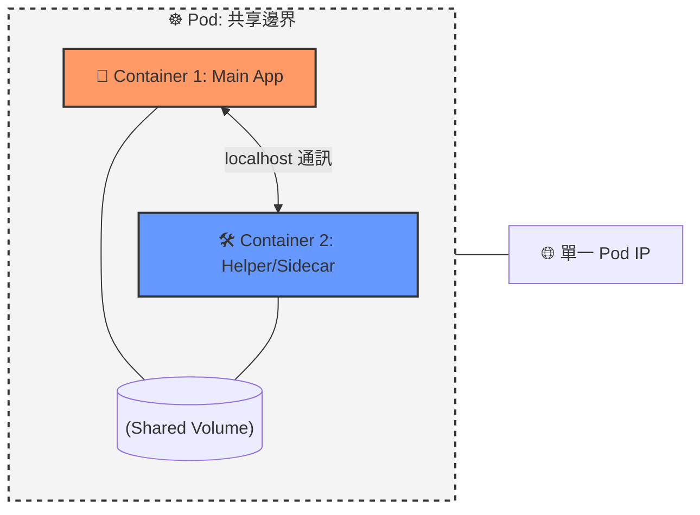

# 115. Multi Container Pods 筆記

## 1. 🏷️ 課程定位
- **章節編號與名稱**：第 5 節：Application Lifecycle Management
- **影片標題**：115. Multi Container Pods

## 2. 📌 核心概念摘要
**Multi-Container Pod** 指在同一個 Pod 定義中包含多個容器。這些容器被視為一個單一的調度單元，必須同時在同一個節點（Node）上啟動、運行與銷毀。此模式適用於兩個程式之間有「極度緊密耦合」需求的情境，通常由主程式與其輔助程式（Sidecar）組成。

## 3. 📊 Multi-Container Pod 結構 (Mermaid)



---

## 4. 🔑 知識點擷取 (Detailed Notes)

### 1. 共享資源特性 (Shared Resources)
在同一個 Pod 裡的多個容器具備以下關鍵特性：
- **共享網路 (Network)**：所有容器共享同一個網路空間（IP 位址）。容器間可以使用 `localhost` 互相連線，通訊速度極快。
- **共享儲存 (Storage)**：可以掛載同一個 **Volume**。這對資料交換非常有用，例如：主程式寫入日誌檔，輔助程式讀取並傳送到外部監控系統。

### 2. 適用情境：為什麼不拆成兩個 Pod？
如果兩個程式「同生共死」且頻繁透過本地檔案系統或網路互動，放在同一個 Pod 可以：
- 降低網路延遲。
- 簡化管理邏輯（確保輔助程式一定跟隨主程式部署）。

### 3. YAML 定義方式
在 `spec.containers` 欄位下，以「列表 (List)」方式定義多個容器項目：
```yaml
spec:
  containers:
  - name: web-app
    image: nginx
  - name: log-agent
    image: log-driver
```

---

## 5. 💻 CKA 必備實作指令 (Imperative Commands)

在考試中，通常需要手動修改 YAML 來新增第二個容器：

```bash
# 1. 產生基礎 YAML 範本 (先產生單容器版本)
kubectl run multi-pod --image=nginx --dry-run=client -o yaml > multi-pod.yaml

# 2. 編輯 YAML：在 containers 區塊下新增第二個容器設定
# vi multi-pod.yaml

# 3. 檢查 Pod 狀態
# READY 欄位會顯示 2/2，代表兩個容器皆已就緒
kubectl get pods

# 4. 針對特定容器執行指令 (必須指定 -c 參數)
kubectl exec multi-pod -c log-agent -- ls /var/log
```

---

## 6. 🚀 CKA 考試延伸與 Troubleshooting

### 💡 考試情境預測
- **題目要求**：建立一個名為 `citadel` 的 Pod，包含兩個容器：`nginx` 和 `busybox`，並要求 `busybox` 在啟動後執行特定的 `sleep` 或下載指令。

### ⚠️ 避坑指南 (Common Pitfalls)
- **Port 衝突 (重要)**：因為容器共享同一個 IP，兩個容器**不能監聽同一個 Port**。例如：若 Container A 已經監聽 80，Container B 也想監聽 80 就會啟動失敗。
- **生命週期關聯**：Pod 的重啟策略 (`restartPolicy`) 是針對整個 Pod 的。若其中一個容器 Crash，K8s 會嘗試重啟該容器（除非設定為 `Never`）。

### 🔍 Troubleshooting
- **查看特定容器日誌**：多容器 Pod 必須指定 `-c` 參數，否則 K8s 不知道要顯示哪一個：
  `kubectl logs <pod-name> -c <container-name>`
- **描述狀態細節**：
  `kubectl describe pod <pod-name>`
  在輸出中可以分段看到各個容器的 `Container ID`、`State`、`Ready` 狀態以及個別的事件訊息。
