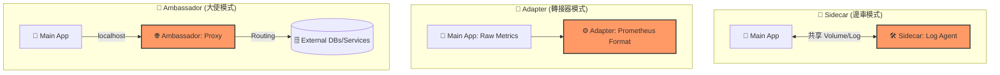

# 116. Multi container Pods Design Pattern 筆記

## 1. 🏷️ 課程定位
- **章節編號與名稱**：第 5 節：Application Lifecycle Management
- **影片標題**：116. Multi container Pods Design Pattern

## 2. 📌 核心概念摘要
多容器 Pod (Multi-container Pod) 的設計核心在於將**「主應用程式」**與**「輔助任務」**解耦。透過讓這些容器共享相同的網路命名空間（可用 `localhost` 通訊）與儲存空間，確保它們運作時如同在同一台機器上的不同進程，從而實現高效的協作與擴充。

## 3. 📊 三大設計模式對照 (Mermaid)



---

## 4. 🔑 知識點擷取 (Detailed Notes)

### 1. Sidecar Pattern (邊車模式) - **最常見**
- **用途**：增強或擴展主容器的功能，而無需修改主程式碼。
- **經典案例**：**日誌收集器**。主程式將 Log 寫到共享 Volume，Sidecar 容器負責將該 Log 讀取並轉傳到遠端伺服器（如 Elasticsearch 或 Splunk）。

### 2. Adapter Pattern (轉接器模式)
- **用途**：**標準化輸出**。當多個不同應用程式產出的日誌或監控數據格式不一時，透過 Adapter 容器將其轉換為一致的標準格式。
- **經典案例**：將舊型 App 產出的特殊數據格式轉換為 **Prometheus** 能夠理解的 Metrics 格式。

### 3. Ambassador Pattern (大使模式)
- **用途**：負責處理**外部通訊與連線邏輯**。主程式只需要簡單地連向 `localhost`，所有複雜的路由、斷路器（Circuit Breaking）或安全性驗證都交由 Ambassador 處理。
- **經典案例**：根據環境（Dev/Prod）自動將資料庫請求導向不同的分片（Sharding）或實體資料庫。

---

## 5. 💻 CKA 必備實作語法 (YAML 結構)

在 CKA 考試中，必須熟練如何在單一 Pod 內定義多個容器並掛載共享卷：

```yaml
apiVersion: v1
kind: Pod
metadata:
  name: multi-container-pod
spec:
  containers:
  - name: main-app
    image: nginx
    volumeMounts:
    - name: shared-logs
      mountPath: /var/log/nginx
  - name: sidecar-log-collector
    image: busybox
    command: ["sh", "-c", "while true; do cat /var/log/nginx/access.log; sleep 5; done"]
    volumeMounts:
    - name: shared-logs
      mountPath: /var/log/nginx
  volumes:
  - name: shared-logs
    emptyDir: {}  # 關鍵：生命週期與 Pod 綁定的臨時共享目錄
```

---

## 6. 🚀 CKA 考試延伸與 Troubleshooting

### 💡 考試情境預測
- **題目要求**：給予一個現有的 Pod 定義，要求新增一個 Sidecar 容器來處理日誌，並確保兩者掛載同一個 `emptyDir` 卷以實現數據共享。

### ⚠️ 避坑指南 (Common Pitfalls)
- **Port 衝突**：因為共享網路空間，兩個容器**不能監聽同一個 Port**。
- **資源限制總和**：Pod 的資源請求 (`Requests`) 是**所有容器的總和**。若容器過多或設定太高，可能導致 Node 資源不足而無法排程（Pending 狀態）。

### 🔍 Troubleshooting
- **精確診斷**：若 Pod 狀態為 `CrashLoopBackOff`，必須分別檢查日誌：
  `kubectl logs <pod-name> -c <container-name>`
- **卷掛載檢查**：若 Sidecar 讀不到檔案，請務必確認 `volumeMounts` 的名稱是否與 `volumes` 下定義的名稱**完全一致**（大小寫敏感）。
